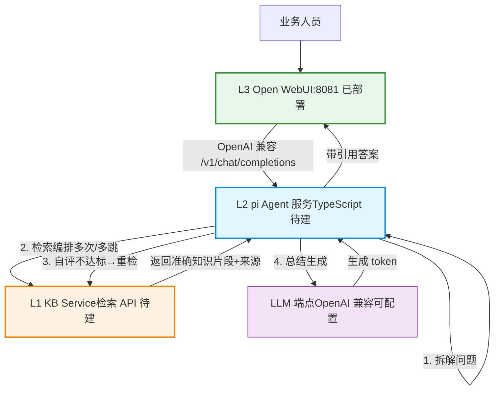
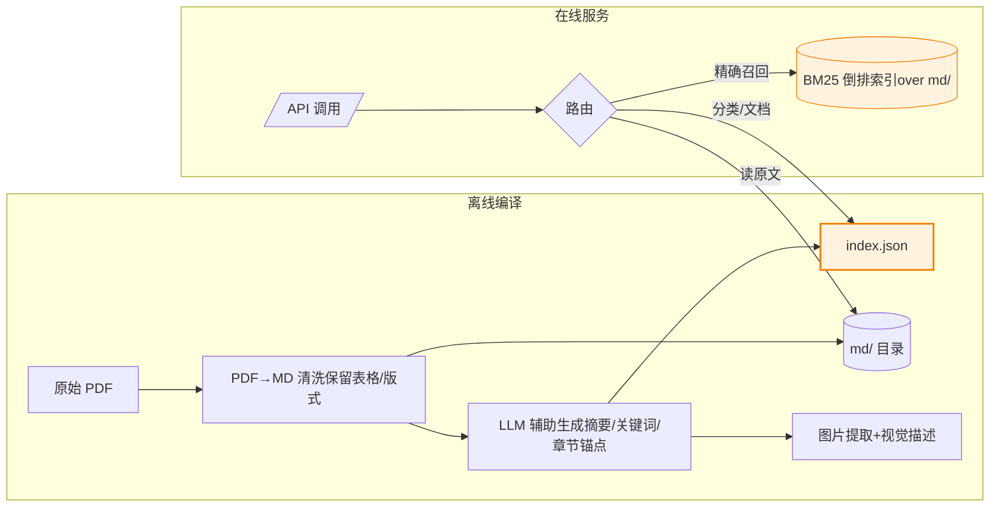
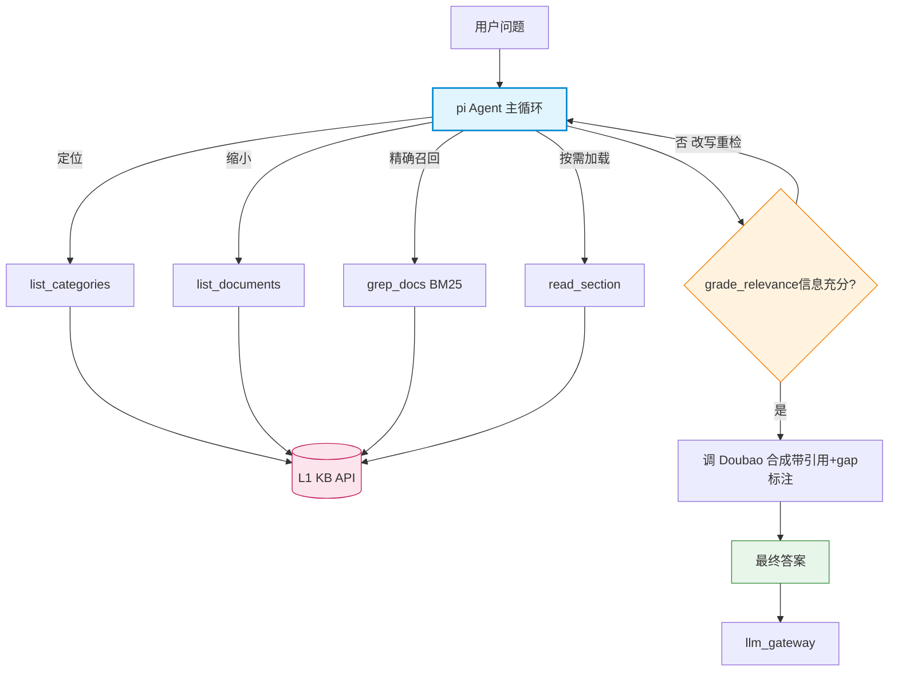
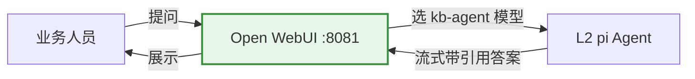
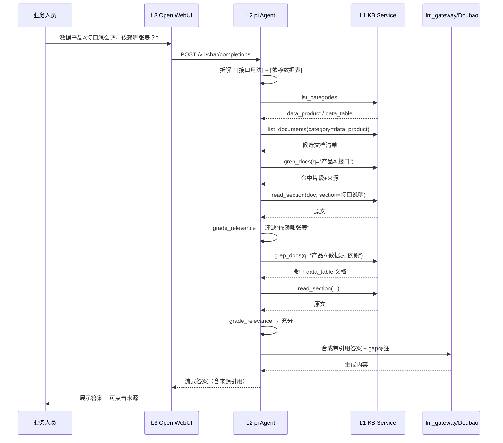

# 企业知识库 Agent 三层架构设计

> 面向：内部知识库智能体（业务人员对话查询 ~1000 份 PDF）
> 设计原则：**三层解耦**——知识库（数据）· Agent（推理）· UI（交互）各司其职，靠稳定契约连接
> 自包含：本项目独立，L1/L2/L3 全部在本目录内搭建；LLM 端点可配置（OpenAI 兼容，如 Doubao）
> 关联文档：[kb_retrieval_solutions.md](kb_retrieval_solutions.md)（检索方案调研与选型）

---

## 一、三层总览

| 层   | 职责  | 本项目实现 | 状态  |
| --- | --- | --- | --- |
| **L3 交互层** | 用户提问、对话、展示带来源引用的答案 | **Open WebUI**（本项目 docker-compose 部署） | 📦 待接入 |
| **L2 Agent 层** | 拆解问题、多跳检索编排、自评重试、总结带引用返回 | **pi Agent 服务**（TypeScript，暴露 OpenAI 兼容端点） | 🔨 待建 |
| **L1 知识库层** | 公司业务知识的归纳整理 + 对外提供准确检索 API/CLI | **KB Service**（TypeScript/Node 服务 + Python 摄入脚本；PDF→MD + index.json + 检索 API） | 🔨 待建 |

**核心解耦思想**：L2 不直接读文件，只调 L1 的 API；L1 内部检索机制可演进（BM25→混合→+ColPali）而 L2 不变；L3 不感知 L1/L2 内部，只把 L2 当成一个"会查公司知识库的模型"。



---

## 二、L1 知识库层（公司基础知识库）

### 2.1 定位

**L1 是唯一的知识真相源（single source of truth）。** 公司业务知识在此归纳、整理、结构化，对外只暴露稳定的检索 API 和 CLI。L2 Agent 永远通过 L1 取知识，不绕过它直接碰文件——这样知识的准确性、版本、权限都收口在 L1。

借鉴 Karpathy / llm_wiki 的"三层编译"思想：原始资料（不可变）→ 整理后的 Wiki/索引（LLM 辅助生成）→ 对外 API。

### 2.2 数据模型

```
knowledge_base/
├── raw/                          # 原始 PDF（不可变，只读，真相源）
│   ├── data_product/             # 数据产品：接口文档 / 产品介绍
│   ├── process/                  # 公司流程制度
│   └── data_table/               # 数据表字段说明
├── md/                           # PDF→MD 清洗结果（按目录结构保留）
│   ├── data_product/{api_docs,intro}/
│   ├── process/
│   └── data_table/
├── index.json                    # 全局目录：标题/摘要/关键词/章节锚点/路径
└── assets/                       # 提取的内嵌图片 + 视觉模型生成的描述（借鉴 llm_wiki）
```

`index.json` 是 L1 的导航核心——Karpathy 原话"中等规模 index 出奇好用，可不需要向量库"。1000 份规模，Agent 先读 index 定位再下钻原文。

### 2.3 对外 API 契约（L2 调用）

L1 暴露一组 HTTP 端点（也提供等价 CLI 便于人工/运维排查）：

| 端点  | 方法  | 对应能力 | 返回  |
| --- | --- | --- | --- |
| `/categories` | GET | list_categories 浏览分类 | `[{id,name,doc_count}]` |
| `/documents?category=&kw=` | GET | list_documents 列候选文档 | `[{id,title,summary,path}]` |
| `/documents/{id}` | GET | read_document / read_section 加载原文（支持 `?section=`） | markdown 全文/章节 |
| `/search?q=&top_k=` | GET | grep_docs BM25 精确召回 | `[{doc_id,title,snippet,score}]` |
| `/index` | GET | 取全局 index.json | index 对象 |
| `/health` | GET | 健康检查 | `{status,doc_count,indexed_at}` |

**关键设计**：

- **检索机制对 L2 透明**：`/search` 当前实现为 BM25，未来换成混合检索（BM25+向量+RRF）甚至挂 ColPali，L2 调用不变——契约稳定，内部演进。
- **权限隔离**（借鉴 gbrain 的 source/scope 思路）：`/categories` 等端点按调用方身份（API key / 部门标签）过滤可见分类，实现多部门数据隔离。
- **只读边界**：L1 对 L2 只暴露查询，**不暴露写入/执行**——守住"仅查文档、不执行动作"的硬约束。

### 2.4 L1 内部流程



---

## 三、L2 Agent 层（pi 驱动）

### 3.1 定位

**L2 是"大脑"：拆问题 → 取全量知识 → 自评 → 总结。** 它不持有知识，只持有"怎么找知识、找够了没、怎么答"的推理能力。用 pi（TypeScript agent toolkit）实现，对外暴露成 OpenAI 兼容端点，让 L3 Open WebUI 把它当成一个模型来调。

### 3.2 三件事（对应你的描述）

1. **拆分问题**：把用户口语化问题拆成可检索的子任务（"数据产品 A 的接口怎么调 + 它依赖哪张数据表"→两个检索子目标）。
2. **取全量知识**：通过 L1 API 多跳检索编排——先 `list_categories` 定位、`list_documents` 缩小、`grep_docs` 精确召回、`read_section` 按需加载原文；多跳场景下跨文档反复取，直到信息充分。
3. **总结返回**：自评相关性（grade_relevance），不达标改写重检；达标后调 llm_gateway/Doubao 合成**带来源引用**的答案，并标注"知识库未覆盖什么"（借鉴 gbrain 的 gap analysis）。

### 3.3 工具循环（pi tool-use loop）

pi Agent 配 5 个工具（薄封装 L1 API）+ 1 个自评判断：



### 3.4 对外暴露

pi Agent 服务暴露 `POST /v1/chat/completions`（OpenAI 兼容，支持流式），L3 Open WebUI 在"连接"里加一个指向它的 base URL 即可。内部生成推理调 llm_gateway（Doubao）。这样 L3 完全无感，复用现有 OpenAI 兼容接入模式。

> **替代方案**：也可把 pi 逻辑改写成 Open WebUI Pipeline（Python，已有 :9099 容器）。但 pi 是 TS，跨语言重写成本高；推荐 pi 独立服务 + OpenAI 兼容端点，与 llm_gateway 同构。

---

## 四、L3 交互层（Open WebUI）

### 4.1 现状复用

本项目通过 docker-compose 部署 Open WebUI，并配置一个 OpenAI 兼容 LLM 端点（如 Doubao）。部署后在**管理后台 → 连接**新增一个 OpenAI 兼容连接，base URL 指向 L2 pi Agent 服务，模型名如 `kb-agent`。业务人员选这个模型提问即可。

### 4.2 L3 的职责边界

- 输入问题、多轮对话、展示流式答案
- 渲染 L2 返回的**来源引用**（Open WebUI 原生支持 markdown 引用块）
- **不承担**检索/推理逻辑——保持薄



---

## 五、层间契约总表

| 方向  | 协议  | 契约要点 |
| --- | --- | --- |
| L3 → L2 | OpenAI 兼容 HTTP（流式） | 标准 `/v1/chat/completions`；L2 像个模型 |
| L2 → L1 | HTTP JSON（自定义 REST） | 见 2.3 端点表；只读查询，无写入/执行 |
| L2 → LLM | OpenAI 兼容（经 llm_gateway） | 推理与生成都走 Doubao 网关 |
| L1 内部 | 文件系统 + BM25 索引 | md/ 目录 + index.json + 倒排索引 |

**演进不破坏契约**：L1 检索升级（BM25→混合→ColPali）只动内部，L2 调用不变；L2 换 agent 框架只动自己，L3/L1 不变；L3 换前端（Open WebUI→自研）只动 UI，L2 不变。

---

## 六、端到端一次查询的完整流



---

## 七、三大思想来源如何落到三层

| 借鉴点 | 来源  | 落到哪层 |
| --- | --- | --- |
| 三层编译（raw→wiki→schema）+ Ingest/Query/Lint | Karpathy / llm_wiki | L1（离线编译 + index.json） |
| index 导航 + 按需加载原文 | Karpathy / llm_wiki | L1 API + L2 工具 |
| 答案带引用 + gap analysis（标注未覆盖） | gbrain | L2 合成阶段 |
| 权限按 source/scope 隔离 | gbrain | L1 API 按身份过滤 |
| 多模态图片提取+视觉描述 | llm_wiki | L1 assets/（数据表/产品介绍文档） |
| Agent 自主规划+自评重试 | Agentic RAG / 你的需求 | L2 pi 主循环 |

---

## 八、分层落地顺序

- **P0｜L1 知识库层**（先建，最自包含、可独立验证）
  - PDF→MD 清洗 pipeline（保留表格/版式）+ index.json 生成
  - KB Service：`/categories` `/documents` `/search`(BM25) `/documents/{id}` `/index`
  - 验收：CLI 能对 1000 份文档精准召回字段名/流程编号
- **P1｜L2 pi Agent**（依赖 L1 API）
  - pi 工具循环 + 5 工具（薄封装 L1）+ grade_relevance 自评重试
  - 暴露 OpenAI 兼容 `/v1/chat/completions`，接 llm_gateway 生成
  - 验收：多跳问题能跨文档取全、带引用返回
- **P2｜L3 集成 + 打磨**
  - Open WebUI 加 kb-agent 连接；流式 + 引用渲染
  - L1 挂 ColPali（图表密集文档可选增强）
  - 验收：业务人员真实提问端到端走通

**为什么 L1 先行**：L1 是地基，契约一旦定下，L2/L3 可并行设计；且 L1 能用 CLI 独立验证检索质量，不依赖 Agent 成熟度——风险最低、回报最早。

---

## 九、一句话

三层 = **L1 收口知识准确性（KB API/CLI）· L2 收口推理编排（pi Agent 多跳自评）· L3 收口交互（Open WebUI）**，靠 OpenAI 兼容 + REST 两套稳定契约串起来。L3 用 Open WebUI、LLM 端点可配置（OpenAI 兼容）；重点投入 L1 和 L2；L1 先行可独立验证，是整个系统的地基。
