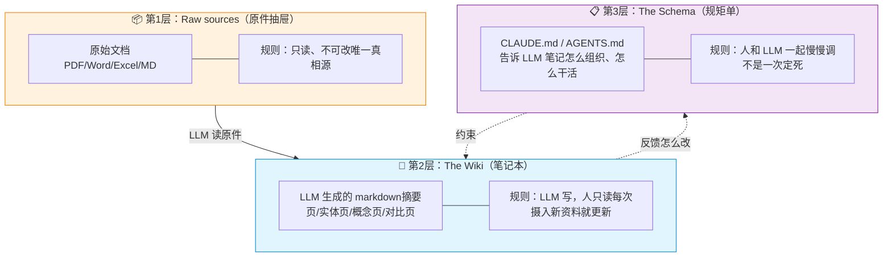
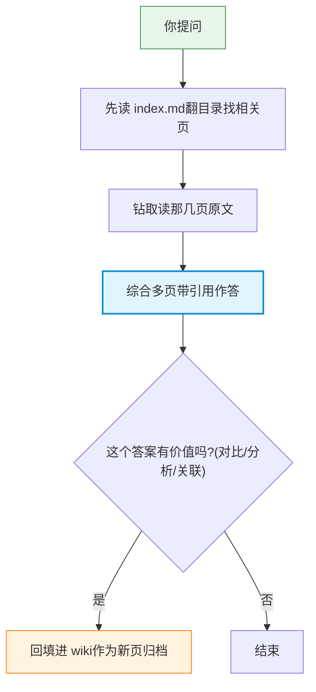
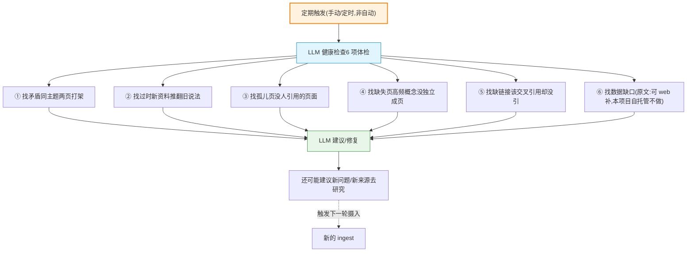
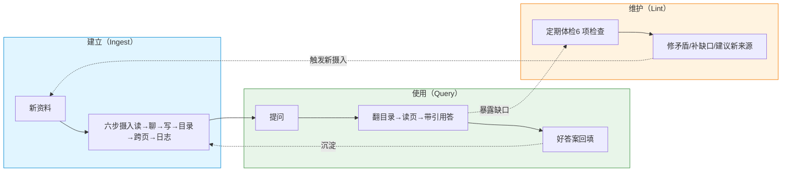

# 自建 Karpathy 知识库体系实施调研报告

> 面向：内部知识库智能体（业务人员对话查询 ~1000 份纯文档：PDF/Word/Excel/MD，**无图片**）
> 主题：**如何从零自建一套 Karpathy LLM-Wiki 知识库体系**——思想源头精读 + 开源实践对比 + 本项目落地设计
> 关联文档：[kb_retrieval_solutions.md](kb_retrieval_solutions.md)（检索底座与控制层选型，本文不重复其 7 大底座对比）、[architecture_3layer.md](architecture_3layer.md)（三层架构）
> 调研时间：2026 年 7 月

---

## 〇、本文与已有文档的分工

| 文档  | 已覆盖 | 职责  |
| --- | --- | --- |
| `kb_retrieval_solutions.md` | 7 大检索底座 + 5 类控制层 + Karpathy/llm_wiki/gbrain **横向对比** + 选型总表 | "选哪种检索方案" |
| `architecture_3layer.md` | L1/L2/L3 三层架构 + 层间契约 + 落地顺序 | "系统怎么分层" |
| **本文** | Karpathy gist **原文精读** + "自建"实操设计 + 针对本项目场景的具体化 | "如何照搬/落地 Karpathy 这套体系" |

本文不重复选型结论（方案 6 = Agent 文件导航 = 最优），而是回答用户的核心问题：**"我自己开发一套 Karpathy 知识库体系怎么做"**——把抽象方法论具体化到本项目"1000 份纯文档、无图片、自托管、Agent 驱动"场景。

---

## 一、Karpathy LLM-Wiki 方法论原文精读

> 来源：Andrej Karpathy [llm-wiki.md gist](https://gist.github.com/karpathy/442a6bf555914893e9891c11519de94f)（2026.04.04，44k+ stars）。以下关键论断尽量引用原文原话。

### 1.1 一句话核心

> 传统 RAG 每次查询都从原始文档"临时重新发现"知识，**没有积累**；Karpathy 主张让 LLM **增量构建并维护一个持久化的 Wiki**——知识编译一次、持续更新，而非每次重新推导。**Wiki 是一个会复利的产物（compounding artifact）。**

反碎片化的核心论点原文：

> "the LLM is rediscovering knowledge from scratch on every question. There's no accumulation."（RAG 的弱点）
> "the wiki is a persistent, compounding artifact."
> "The cross-references are already there. The contradictions have already been flagged. The synthesis already reflects everything you've read."（Wiki 的解法）

### 1.2 三层架构（Raw sources → Wiki → Schema）

Karpathy 把体系明确分成三层，分工极硬：

| 层   | 原文定义 | 要点  |
| --- | --- | --- |
| **Raw sources（原始资料）** | "your curated collection of source documents... These are immutable — the LLM reads from them but never modifies them. This is your source of truth." | 不可变、只读、唯一真相源；LLM 只读不写 |
| **The wiki** | "a directory of LLM-generated markdown files. Summaries, entity pages, concept pages, comparisons, an overview, a synthesis. The LLM owns this layer entirely." | 整层 LLM 完全拥有并写入，人类只读 |
| **The schema** | "a document (e.g. CLAUDE.md for Claude Code or AGENTS.md for Codex) that tells the LLM how the wiki is structured, what the conventions are, and what workflows to follow..." | 关键配置文件，让 LLM 从"通用聊天机器人"变"有纪律的 wiki 维护者" |

**核心分工原话**：

> "It creates pages, updates them when new sources arrive, maintains cross-references, and keeps everything consistent. **You read it; the LLM writes it.**"

**Schema 是人机共演进的**：

> "You and the LLM co-evolve this over time as you figure out what works for your domain."

**目录结构刻意不规定**：

> "This document is intentionally abstract. It describes the idea, not a specific implementation."
> "The exact directory structure, the schema conventions, the page formats, the tooling — all of that will depend on your domain."

实操工具栈：Obsidian + Git：

> "Obsidian is the IDE; the LLM is the programmer; the wiki is the codebase."
> "The wiki is just a git repo of markdown files. You get version history, branching, and collaboration for free."

### 1.3 三大操作：Ingest / Query / Lint

**Ingest（摄入）** 完整流程原文：

> "the LLM reads the source, discusses key takeaways with you, writes a summary page in the wiki, updates the index, updates relevant entity and concept pages across the wiki, and appends an entry to the log."

拆为六步：① 读源 → ② 与人讨论关键要点（LLM 介入做理解+提炼）→ ③ 写 summary page → ④ 更新 index → ⑤ **跨 wiki 更新相关 entity/concept 页** → ⑥ 追加 log。

**一份资料触及多页**（核心原话）：

> "A single source might touch 10-15 wiki pages."

摄入方式：Karpathy 自己偏好逐份介入式，但允许批量低监督：

> "I prefer to ingest sources one at a time and stay involved... you could also batch-ingest many sources at once with less supervision."

**Query（查询）** 原文：

> "You ask questions against the wiki. The LLM searches for relevant pages, reads them, and synthesizes an answer with citations."

关键：答题前先读 index 找相关页，再钻取读页，最后带引用综合作答。答案形式不限于文字（markdown / 对比表 / Marp 幻灯 / matplotlib 图 / canvas）。

**知识复利设计**——好答案要回填进 wiki：

> "good answers can be filed back into the wiki as new pages."
> "your explorations compound in the knowledge base just like ingested sources do."

**Lint（健康检查）** 原文：

> "Periodically, ask the LLM to health-check the wiki."

六项检查清单原文：

> "Look for: contradictions between pages, stale claims that newer sources have superseded, orphan pages with no inbound links, important concepts mentioned but lacking their own page, missing cross-references, data gaps that could be filled with a web search."

LLM 在此还有生成性角色：

> "The LLM is good at suggesting new questions to investigate and new sources to look for."

> ⚠️ **重要纠偏**：Lint 在原文中是"periodically"（手动周期触发），**不是自动自维护**。最接近"自维护"的机制是 Query→Wiki 回填闭环。社区扩展：@xXgordonXx 在团队规模上用定时器跑 lint；@frankchu91 做了 `/mb:lint` 命令。这些都是衍生，非原文。

### 1.4 两大元文件：index.md 与 log.md

**index.md（面向内容，是"目录"）** 原文：

> "index.md is content-oriented. It's a catalog of everything in the wiki — each page listed with a link, a one-line summary, and optionally metadata like date or source count."

格式：按类别组织（entities / concepts / sources 等），每页一条 = 链接 + 一行摘要 + 可选元数据。每次 ingest 都更新；查询时 LLM 先读 index 再钻取。

**"中等规模不需要向量库"原话**：

> "This works surprisingly well at moderate scale (~100 sources, ~hundreds of pages) and avoids the need for embedding-based RAG infrastructure."

何时升级工具：

> "at small scale the index file is enough, but as the wiki grows you want proper search."
> "[qmd](https://github.com/tobi/qmd) is a good option: it's a local search engine for markdown files with hybrid BM25/vector search and LLM re-ranking, all on-device."

**log.md（面向时间，是"日志"）** 原文：

> "log.md is chronological. It's an append-only record of what happened and when — ingests, queries, lint passes."

只追加不修改。格式约定：

> `## [2026-04-02] ingest | Article Title`

好处是可被 unix 工具直接解析：

> `grep "^## \[" log.md | tail -5` gives you the last 5 entries

作用：

> "The log gives you a timeline of the wiki's evolution and helps the LLM understand what's been done recently."

### 1.5 页面约定

**页面类型**（原文明确）：Summaries / entity pages / concept pages / comparisons / an overview / a synthesis。

**[[wikilink]]**：wiki 是 "structured, interlinked collection of markdown files"，LLM 维护 cross-references。Obsidian graph view：

> "the best way to see the shape of your wiki — what's connected to what, which pages are hubs, which are orphans."

**YAML frontmatter**：可选项（tags/dates/source counts），配 Dataview 做动态表，非强制。

**新页 vs 更新**：原文无显式规则，但 ingest 描述隐含模式——新资料生成新 summary 页 + 更新已有 entity/concept 页；lint 兜底"应独立成页却没成页"的概念。评论区 @xXgordonXx 启发式（衍生）：新页 = 你会从别处链接过来的独立实体/概念；原地更新 = 已有实体的属性或更新。

**哲学**：

> "Everything mentioned above is optional and modular — pick what's useful, ignore what isn't."

### 1.6 为什么 LLM 能让 wiki 维护可持续

> "Humans abandon wikis because the maintenance burden grows faster than the value."
> "LLMs don't get bored, don't forget to update a cross-reference, and can touch 15 files in one pass. The wiki stays maintained because the cost of maintenance is near zero."

历史脉络（Memex）：

> "The idea is related in spirit to Vannevar Bush's Memex (1945) — a personal, curated knowledge store with associative trails between documents."
> "The part he couldn't solve was who does the maintenance. The LLM handles that."

### 1.7 从零实现必须照搬的核心设计点清单（20 条）

**A. 三层分离**

1. Raw sources 层不可变：LLM 只读不写，唯一真相源
2. Wiki 层完全由 LLM 拥有写入："You read it; the LLM writes it"
3. Schema 层（CLAUDE.md/AGENTS.md）显式声明结构/约定/Ingest-Query-Lint 工作流，人机共演进

**B. 两大元文件**
4. index.md：全 wiki 目录，每页一条（链接+一行摘要+可选元数据），按类别组织，每次 ingest 必更新，查询入口
5. log.md：append-only 时间线，格式 `## [YYYY-MM-DD] 类型 | 标题`，记录 ingest/query/lint，可 grep 解析

**C. 三大操作流程**
6. Ingest 六步：读源→讨论→写 summary→更新 index→跨页更新 entity/concept→追加 log
7. Ingest 必须触及多页：一份资料预期触及 10-15 页
8. Query：读 index 找页→读页→带引用作答
9. Query 答案回填：有价值对比/分析/关联作为新页归档
10. Lint 定期健康检查：6 项（矛盾/过时/孤儿页/缺独立页概念/缺交叉引用/可补数据缺口）

**D. 页面与链接**
11. 页面类型：summary/entity/concept/comparison/overview-synthesis
12. [[wikilink]] 交叉引用：LLM 维护，ingest 同步更新，lint 查缺漏
13. YAML frontmatter 可选
14. 新页 vs 更新判断：新资料生成 summary 页 + 更新已有页；lint 兜底

**E. 关键哲学**
15. 中等规模不用向量库：~100 源/几百页内 index+钻取即可
16. 规模增大再上搜索引擎（如 qmd：本地 BM25+向量+LLM 重排）
17. 维护成本近零是可持续关键
18. 知识复利 vs RAG 从零重发现
19. Git 版本化
20. Schema 刻意抽象、按领域具体化

### 1.8 通俗解读：这套知识体系好在哪，怎么搭、怎么养

> 本节面向**不写代码的读者**（业务人员、管理者）。前面 1.1–1.7 是原话精读，这里用大白话把"为什么值得做、怎么建、怎么维护"讲清楚，并配流程图。

#### 1.8.1 一句话先说透

传统 RAG 就像**每次考试都临时翻书**——翻完就忘，下次还得重新翻；Karpathy 的 Wiki 就像**请了个不知疲倦的助理，把书读完后整理成一本带目录、带交叉引用、还会自己更新的笔记本**。你以后问它，它翻自己整理好的笔记，而不是从原材料里临时扒。

#### 1.8.2 为什么这套体系"越用越值"（五大优势）

用一个比喻串起来：**Wiki 是一个会复利（compounding）的产物——你喂进去的每一份资料，都不会白费，它会沉淀成结构、变成下次答题的台阶。**

| 优势  | 大白话 | 对应原文 |
| --- | --- | --- |
| **① 知识会积累，不重头来** | 传统 RAG 每问一次都从原始文档重新"发现"知识，问 100 次还是原地踏步；Wiki 是"编译一次、持续复用"，第 100 次问能站在前 99 次整理的成果上 | "the LLM is rediscovering knowledge from scratch on every question. There's no accumulation." |
| **② 维护成本接近零，所以不会烂尾** | 人放弃 wiki 是因为"维护太累，越积越乱"；LLM 不嫌烦、不忘更新交叉引用、能一次顺手改 15 个文件——**笔记永远干净** | "LLMs don't get bored... cost of maintenance is near zero" |
| **③ 矛盾和缺口提前暴露** | 同一个字段两份文档说法打架？LLM 在整理时就标记了；哪个概念老被提到却没有专门一页？lint 会提示补上——**坏数据不会一直藏着** | "The contradictions have already been flagged" |
| **④ 中等规模不用上向量库** | ~100 份来源、几百页以内，一个 `index.md` 目录 + 按需翻原文，**比搞一套 embedding/向量库基础设施省太多**——正好命中本项目规模 | "avoids the need for embedding-based RAG infrastructure" |
| **⑤ 答案带引用、可追溯、可审计** | 每个回答都标明来自哪一页，错了能查、能改——企业场景这点尤其重要 | "synthesizes an answer with citations" |

#### 1.8.3 三层架构长什么样（一图看懂）

把 Karpathy 的三层比作**档案室的三个抽屉**：



- **第 1 层是"原件"**：你给的 1000 份 PDF/Word/Excel 原封不动放这儿，谁都不许改——它是唯一的事实来源。
- **第 2 层是"笔记本"**：LLM 读完原件后，自己写出来的摘要、整理出来的实体页、做的对比表——这层 LLM 完全负责，人只看不动手。
- **第 3 层是"规矩单"**：一份配置文件（本项目就是 `CLAUDE.md` + L2 系统提示），告诉 LLM"笔记本要分几类、页面长什么样、新资料来了按什么流程处理"。这份规矩单是人和 LLM 一起慢慢调出来的，不是一次定死。

#### 1.8.4 怎么建：Ingest（摄入）六步（建库主线）

新来一份资料，LLM 不是简单存个档，而是走一遍**六步**——这就是知识"沉淀"的过程：


通俗讲：

1. **读**：LLM 把这份资料从头读到尾。
2. **聊**：跟人确认"这份资料的重点是什么、它跟哪些已有内容相关"——也可以批量处理少监督。
3. **写摘要**：在笔记本里新建一页，写这份资料的精华。
4. **更新目录**：在 `index.md` 里加一条，标明这页叫啥、讲啥。
5. **跨页更新**（最关键、也最体现"复利"）：这份资料可能牵涉到笔记本里已有的好几个实体/概念页，LLM 要把这些页都顺手更新一遍——原文一句话："**一份资料可能触及 10-15 个页面**"。这一步是知识"连成网"的核心。
6. **记日志**：在 `log.md` 追加一行 `## [日期] ingest | 标题`，留下"哪天干了啥"的时间线。

#### 1.8.5 怎么用：Query（查询）——答题先翻目录



跟传统 RAG 的区别：传统 RAG 是"问题→临时检索→答"，答完就丢；这里多了一步**"好答案回填进 wiki"**——你问出来的好对比、好分析，会变成笔记的一部分，下次别人问同样的东西直接用。**这就是知识复利**：连你的"探索过程"都在给知识库添砖加瓦。

#### 1.8.6 怎么养：Lint（健康检查）+ 回填闭环——让笔记不腐烂

笔记本用久了会出问题：两页说法打架、有过时信息、有些页没人引用成了"孤儿"、有些概念老被提却没有专门一页……**Lint 就是定期给笔记本做体检**：



> ⚠️ **重要纠偏（再说一遍）**：原文里 Lint 是"periodically"（定期手动触发），**不是 wiki 自动保养**。最接近"自维护"的，其实是上面 1.8.5 的"好答案回填"闭环。社区有人加定时器跑 lint（衍生），但不是 Karpathy 原版。

**完整的"建立 + 维护"闭环**长这样（三操作如何咬合）：



三步咬成一个**自我强化的循环**：

- **建立**产生结构化的笔记本；
- **使用**不仅答了题，还把好答案回填，让笔记本更厚；
- **维护**定期体检，找出矛盾和缺口，反过来又触发新的摄入去补。

这个循环转起来，笔记本就**越用越准、越用越全**——而驱动它转的，主要是 LLM 那接近零成本的维护能力。这正是传统 RAG 缺的"积累"。

#### 1.8.7 一句话总结（给非技术读者）

> Karpathy 这套知识体系，本质是**让 LLM 当一个不知疲倦的资料员**：你只管把原件丢进去、提问题、定方向；它负责读、整理、写摘要、维护交叉引用、定期体检——**知识编译一次、持续复利，维护成本接近零**。对你这个"1000 份纯文档、无图片、自托管"的场景，它的"中等规模不用向量库"原话尤其对路——我们不必照搬它的 Obsidian 桌面形态，但把"三层 + Ingest/Query/Lint"这三板斧嵌进我们的 L1/L2 服务里，就能吃到知识复利的好处（详见第三节落地设计）。

---

## 二、开源实践：谁在照搬 Karpathy，走向了什么路线

`kb_retrieval_solutions.md` 第 4 节已做 llm_wiki vs gbrain 横向对比，此处只补"自建视角"的关键判断，不重复表格。

### 2.1 llm_wiki（nashsu）— Karpathy 原教旨桌面实现

- **照搬点**：三层架构 + Ingest/Query/Lint 闭环 + index.md/log.md/[[wikilink]] + markdown 文件即知识库 + 多模态图片摄入。
- **自建视角结论**：**不适合直接用作企业底座**。三个硬伤：① GPL v3（copyleft 传染性，法务会卡）；② Tauri 桌面应用形态（非服务端，全公司业务人员要每人装或改造为 Web）；③ 单用户无权限隔离。MCP server 只是桌面 API 代理，必须桌面应用常驻。
- **可借鉴**：多模态摄入思路、index.md 导航、markdown+frontmatter+wikilink 的文件约定。

### 2.2 gbrain（Garry Tan / YC）— 生产级 company-brain

- **照搬点**：精神相近但不直接引用 Karpathy；CLI+MCP 无头部署；Postgres+pgvector；零 LLM 调用实体图谱；Synthesis+Gap Analysis；24/7 dream cycle 夜间整合。
- **自建视角结论**：**太重、定位偏 CRM**。需 Postgres+pgvector+OpenAI embeddings+LLM API；55 skills 学习曲线陡；默认 typed edges（attended/works_at/invested_in）面向人-公司-交易，与"接口/字段/流程"本体不匹配。MIT 许可、生产级、多用户权限是其亮点。
- **可借鉴**：多用户权限隔离（per-user OAuth+source scope）、Synthesis 带引用+Gap Analysis、零 LLM 图谱（规则抽实体）、定期自维护（dream cycle ≈ 定时 lint）。

### 2.3 18 个 Karpathy 风格 wiki 开源仓库（社区实现生态）

调研中发现一批社区实现，体现"自建"路线的多样性，按实现策略归类：

| 策略  | 代表仓库 | 特点  | 对自建的启示 |
| --- | --- | --- | --- |
| **确定性/零 LLM 编译** | Emmimal/wiki-compiler（纯 Python，零依赖零 LLM）、MetamusicX/zissa-wiki（确定性 wiki-lint）、asakin/llm-context-base | 编译/lint 用规则脚本而非 LLM | lint 可做成确定性脚本（孤儿页/缺链接/格式校验），不必每次烧 token |
| **两层 Lint** | cablate/llm-atomic-wiki（atom 层 + 两层 Lint） | 在 Karpathy 单层 lint 上加原子层 | 结构化文档可加"原子事实"层，lint 更精细 |
| **Claude Code skill 化** | win4r/llm-wiki-claude-skill、SantiagoBobrik/llm-wiki-kit（5 skills: init/compile/search/save/lint）、sonjh919/LLM-Wiki-Skills、KerberosClaw/kc_llm_wiki_starter | 把 Ingest/Query/Lint 封装成可复用 skill | 本项目 L2 用 pi，但 skill 化思路可借鉴：三大操作 = 三个可复用模块 |
| **Agent 驱动** | regexp-lin/llm-wiki-agent、varunyn/wiki-langGraph、the-spirit-realm/llm-codebase-wiki | 用 agent 框架驱动 ingest/query | 与本项目"Agent 驱动"高度契合 |
| **Boilerplate/起步模板** | xiaoyuze88/karpathy-llm-wiki-boilerplate、l3gz/llm-wiki-starter、Astro-Han/karpathy-llm-wiki、ndjordjevic/pin-llm-wiki、KevinYoung-Kw/robust-llm-wiki、rvk7895/llm-knowledge-bases、formin/spec-kit-wiki | 提供目录骨架+schema 模板 | 可参考其目录约定快速搭骨架 |

**关键启示**：社区已分化出"纯 LLM 派"和"确定性脚本派"。**混合最稳**：理解/生成/矛盾判断用 LLM（不可规则化），孤儿页/缺链接/格式/grep-parseable 用确定性脚本（便宜可重复）。

### 2.4 fs-explorer（LlamaIndex）— Agent 文件系统导航的实测背书

LlamaIndex 2026.01 实验 *"Did Filesystem Tools Kill Vector Search?"* + 开源 `fs-explorer`，工具集：read_file / grep_file_content / describe_dir_content / glob_paths / parse_file。

基准（5 篇论文测试集）：

- RAG：correctness 6.4 / relevance 8.0 / 7.36s
- fs-explorer：correctness 8.4 / relevance 9.6 / 11.17s

结论：**小数据集（全文进 1M 窗口）agentic 胜**；100-1000 篇规模 RAG 在速度上胜、correctness 相当。这正是本项目"1000 份、Agent 文件导航 + BM25"选型的实测依据——agentic 在结构化文档上质量更高，速度劣势用 BM25 精确召回弥补。

---

## 三、针对本项目场景的"自建"设计

> 场景硬约束（来自 CLAUDE.md）：1000 份纯文档（PDF/Word/Excel/MD，**无图片**）、自托管、Agent 驱动非工作流、框架=pi、工具边界严格"只读查询"。

### 3.1 Karpathy 三层 → 本项目三层映射

Karpathy 方法论是"个人 Obsidian + LLM"的单机范式；本项目是"企业多用户 + 三层服务架构"。两者不是替换关系，而是**把 Karpathy 的思想嵌入 L1/L2**：

| Karpathy 层/操作 | 本项目落点 | 具体化 |
| --- | --- | --- |
| Raw sources（不可变） | L1 `knowledge_base/raw/` | PDF/Word/Excel/MD 原件，按 data_product/process/data_table 三分类 |
| The wiki（LLM 生成 markdown） | L1 `knowledge_base/md/` + `index.json` | PDF→MD 清洗结果 + LLM 生成的摘要/关键词/章节锚点 |
| index.md（目录导航） | L1 `index.json` | 全局目录：标题/摘要/关键词/章节锚点/路径，Agent 查询入口 |
| log.md（时序日志） | L1 `ingest_log.jsonl`（新增建议） | append-only，每行 `## [YYYY-MM-DD] ingest \\| 文档标题`，可 grep |
| Schema（CLAUDE.md） | 本项目 `CLAUDE.md` + L2 系统提示 | 已存在；补充 ingest/query/lint 工作流约定 |
| Ingest 操作 | L1 离线摄入 pipeline | PDF/Word/Excel→MD + LLM 两步生成 index 条目 |
| Query 操作 | L2 pi Agent 工具循环 | list_categories/list_documents/grep_docs/read_section/grade_relevance |
| Lint 操作 | L1 离线 lint 脚本（新增建议） | 确定性检查 + 周期 LLM 检查 |
| [[wikilink]] 交叉引用 | `index.json` 内的 `related_docs` 字段 | 用文档 ID 关联，非 Obsidian wikilink |
| 答案回填 | 暂不实现（P3 可选） | 企业场景需权限审计，回填需人工审核，非自动 |

### 3.2 无图片场景的简化（关键优势）

用户的文档**只有 PDF/Word/Excel/MD，无图片**。这大幅简化设计——相对 `architecture_3layer.md` 现有规划，应做以下调整：

| 现有规划（含图片） | 无图片简化后 |
| --- | --- |
| `knowledge_base/assets/`（提取内嵌图+视觉描述） | **删除**，不需要 |
| ColPali/VLM 视觉检索（P2 可选增强） | **删除**，无图表密集文档 |
| llm_wiki 多模态摄入借鉴 | **删除**多模态部分，只保留文本摄入 |
| L1 内部流程图"图片提取+视觉描述"分支 | **删除** |

**简化后的 L1 数据模型**：

```
knowledge_base/
├── raw/                          # 原始文档（不可变，只读，真相源）
│   ├── data_product/             # 数据产品：接口文档/产品介绍
│   ├── process/                  # 公司流程制度
│   └── data_table/               # 数据表字段说明
├── md/                           # 文档→MD 清洗结果（保留表格/版式）
│   ├── data_product/{api_docs,intro}/
│   ├── process/
│   └── data_table/
├── index.json                    # 全局目录：标题/摘要/关键词/章节锚点/路径/related_docs
└── ingest_log.jsonl              # 摄入时序日志（append-only，可 grep）
```

（注：`architecture_3layer.md` 第 63 行的 `assets/` 目录应据此移除；第 235 行"多模态图片提取+视觉描述"借鉴点应删除。这是已知待修的不一致。）

### 3.3 文档→MD 清洗工具选型（无图片场景）

无图片 = 纯文本结构化文档，工具选型聚焦"表格/版式保留"和"Excel 字段名精准召回"：

| 文档类型 | 推荐工具 | 关键能力 | 选型理由 |
| --- | --- | --- | --- |
| **PDF** | PyMuPDF4LLM（`to_markdown`）/ pdfplumber（`extract_tables`） | 保留表格→markdown 表；BLOCKS/WORDS 精细控制 | 表格是数据表/接口文档核心，必须完整转 markdown 表 |
| **Word (.docx)** | python-docx + Pandoc | 段落/Run/Table/_Cell；Pandoc 转 markdown（ATX 标题+pipe 表） | 流程制度文档，保留标题层级 |
| **Excel (.xlsx)** | openpyxl + pandas（`read_excel(sheet_name=None)` → `to_markdown`） | **每个 sheet → 完整 markdown 表** | **关键**：字段说明表必须整表转 markdown，BM25 才能精准召回字段名 |
| **Markdown** | 原样保留 | —   | 已是目标格式 |

> **Excel 是无图片场景的重中之重**：数据表字段说明常以 Excel 形式存在。必须把每个 sheet 转成**完整 markdown 表**（含表头），这样 BM25 既能召回表名也能召回字段名，符合 P0 验收"精准召回字段名"。

### 3.4 Ingest pipeline 具体化（LLM 两步生成）

借鉴 llm_wiki 的"LLM 第1步分析 → 第2步生成"，针对纯文档：

```
离线摄入（对每份 raw 文档）:
  1. 文档→MD 清洗（PyMuPDF4LLM/pdfplumber/python-docx/openpyxl，按类型分发）
       → 写入 md/{category}/{doc_id}.md
  2. LLM 第1步 分析：识别 文档类型 / 关键实体 / 所属分类 / 涉及其他文档的关联
  3. LLM 第2步 生成：摘要 / 关键词 / 章节锚点（section→行号范围）/ related_docs
       → 更新 index.json（追加一条）
  4. 追加 ingest_log.jsonl: ## [YYYY-MM-DD] ingest | 文档标题
```

**关键**：第3步的"章节锚点"是 `read_section` 工具能按需加载的基础——index.json 里记每个 section 的标题+行号范围，Agent 调 `read_section(doc_id, section)` 时 L1 只返回该段，避免全文进上下文。

### 3.5 Lint 体系具体化（混合：确定性脚本 + 周期 LLM）

借鉴社区"确定性脚本派"思路，把 Karpathy 6 项 lint 分两类：

**确定性脚本（便宜、可重复、CI 跑）**：

- 孤儿页：`index.json` 中无任何 `related_docs` 指向的文档
- 缺交叉引用：两文档关键词高度重叠但互无 `related_docs`
- 格式校验：`ingest_log.jsonl` 每行可 grep 解析；index.json schema 合法
- 数据缺口：某分类下文档数异常少（如 data_table 只有 3 份）

**周期 LLM 检查（贵、人工触发或定时）**：

- 矛盾检测：跨文档同一字段/流程编号描述不一致
- 过时论断：同主题 newer 文档与 older 文档冲突
- 缺独立概念页：高频出现但无独立说明的术语

> ⚠️ 与硬约束一致：lint 是**离线运维操作**，不是 Agent 在线工具。Agent 工具边界严格"只读查询"，lint 不暴露给 L2。

### 3.6 不照搬 Karpathy 的部分（企业场景差异）

| Karpathy 原文 | 本项目不照搬 | 原因  |
| --- | --- | --- |
| Obsidian 桌面交互 | 不用 Obsidian | 企业多用户，L3 用 Open WebUI |
| "You read it; LLM writes it"（人类只读 wiki） | 摄入需人工审核 | 企业知识准确性要求高，LLM 生成需人审 |
| 答案自动回填 wiki | 暂不自动回填 | 权限/审计要求，回填需人工审核（P3 可选） |
| Lint 手动周期触发 | 拆确定性+LLM 两类 | 企业需可重复的 CI 检查 |
| 单用户无权限 | L1 API 按身份过滤 | 多部门数据隔离（gbrain 借鉴） |
| Web search 补数据缺口 | 不做  | 自托管硬约束，不依赖外部 SaaS |

---

## 四、推荐技术栈与落地步骤

### 4.1 推荐技术栈

| 层   | 技术  | 说明  |
| --- | --- | --- |
| L1 摄入脚本 | **Python**（PyMuPDF4LLM / pdfplumber / python-docx / openpyxl / pandas） | 文档清洗生态最成熟；项目 memory 已确认 Python |
| L1 服务 | **FastAPI**（Python） | 与摄入同语言，复用清洗逻辑；暴露只读 REST |
| L1 检索 | **BM25**（rank-bm25 或自建倒排） | 精确召回字段名/流程编号；中等规模 index.json+BM25 够用 |
| L1 Lint | Python 脚本（确定性）+ LLM 调用（周期） | 确定性部分 CI 跑 |
| L2 Agent | **pi**（TypeScript） | 硬约束框架=pi；暴露 OpenAI 兼容端点 |
| L2→L1 | HTTP REST（只读） | 层间契约稳定 |
| L2→LLM | OpenAI 兼容端点（可配置 base URL/key/model） | 自托管，走公司内部服务 |
| L3  | Open WebUI | docker-compose 部署 |

> **L1 语言决策**：推荐 **Python**。理由：① 文档清洗库（PyMuPDF/pdfplumber/python-docx/openpyxl）Python 生态最成熟；② 项目 memory 已记录 Python|FastAPI、test=pytest、lint=ruff；③ L1/L2 经 HTTP 解耦，跨语言无影响（L2 用 TS/pi 不变）。`architecture_3layer.md` 现写"TypeScript/Node 服务 + Python 摄入脚本"，建议明确为**L1 服务也用 Python（FastAPI）**，摄入与服务同语言复用清洗逻辑。

### 4.2 落地步骤（P0→P1→P2，对齐 architecture_3layer.md）

**P0｜L1 知识库层（先建，最自包含）**

1. 搭 `l1_kb/ingest/`：文档→MD 清洗 pipeline（按 PDF/Word/Excel/MD 分发，**Excel 每 sheet→完整 markdown 表**）
2. 搭 LLM 两步生成：摘要/关键词/章节锚点/related_docs → `index.json`
3. 写 `ingest_log.jsonl`（append-only，可 grep）
4. 搭 `l1_kb/service/`（FastAPI）：`/categories` `/documents` `/search`(BM25) `/documents/{id}`(支持`?section=`) `/index` `/health`
5. 写确定性 lint 脚本（孤儿页/缺交叉引用/格式校验）
6. **验收**：CLI 对 1000 份文档精准召回字段名/流程编号；lint 脚本零误报

**P1｜L2 pi Agent（依赖 L1 API）**

1. pi 工具循环 + 5 工具（薄封装 L1 API）：list_categories/list_documents/grep_docs/read_section/grade_relevance
2. 系统提示内嵌 Self-RAG 自评 + CRAG 重检（grade_relevance 不达标改写重检）
3. 暴露 OpenAI 兼容 `/v1/chat/completions`（流式），接内部 LLM 端点生成
4. **验收**：多跳问题跨文档取全、带引用返回、标注未覆盖

**P2｜L3 集成 + 打磨**

1. Open WebUI 加 kb-agent 连接（base URL 指 L2）
2. 流式 + 引用渲染
3. 周期 LLM lint（矛盾/过时/缺概念页）定时跑
4. **验收**：业务人员真实提问端到端走通

### 4.3 待用户确认的开放决策

1. **L1 服务语言**：推荐 Python(FastAPI)，需用户确认是否接受将 `architecture_3layer.md` 的"TS/Node 服务"改为"Python/FastAPI 服务"。
2. **是否引入 `ingest_log.jsonl`**：Karpathy 原版 log.md 在企业服务化后是否值得保留为 jsonl（vs 只用数据库记录摄入历史）。
3. **lint 是否做周期 LLM 检查**：还是只做确定性脚本（更省、更安全）。

---

## 五、一句话结论

Karpathy LLM-Wiki 的核心价值是"**知识编译一次、持久复利、LLM 维护成本近零**"，其"中等规模不用向量库、index 出奇好用"原话恰好印证本项目"Agent 文件导航 + BM25"选型。但 Karpathy 原版是"个人 Obsidian + LLM"单机范式——**自建企业版要做三件事**：① 把三层/三操作嵌入 L1(L1 摄入+index.json+log) 与 L2(pi 工具循环) 而非照搬 Obsidian；② 借社区"确定性脚本派"把 lint 拆成便宜可重复的 CI 检查 + 周期 LLM 检查；③ 用"无图片"优势砍掉 ColPali/VLM/assets 全部多模态复杂度，把精力集中在 Excel→完整 markdown 表（字段名精准召回）和章节锚点（按需加载）。llm_wiki 太个人+GPL 太重、gbrain 太重+偏 CRM，**自建的 pi Agent + FastAPI L1 + 文件系统导航主干，是三者之间最合身的中间路线**。

---

## 参考资料

- Andrej Karpathy — [llm-wiki.md gist](https://gist.github.com/karpathy/442a6bf555914893e9891c11519de94f)（LLM Wiki 方法论原始设计模式，2026.04）
- nashsu/llm_wiki — https://github.com/nashsu/llm_wiki（Karpathy 原教旨桌面实现，GPL v3）
- garrytan/gbrain — https://github.com/garrytan/gbrain（YC company-brain 生产级实现，MIT）
- LlamaIndex — *Did Filesystem Tools Kill Vector Search?*（2026.01，fs-explorer 开源）
- tobi/qmd — https://github.com/tobi/qmd（本地 markdown 混合 BM25/向量+LLM 重排搜索引擎，Karpathy 推荐）
- 社区 Karpathy-wiki 实现：Emmimal/wiki-compiler、cablate/llm-atomic-wiki、MetamusicX/zissa-wiki、SantiagoBobrik/llm-wiki-kit、win4r/llm-wiki-claude-skill、regexp-lin/llm-wiki-agent 等（确定性编译 / 两层 Lint / skill 化 / Agent 驱动 四类路线）
- PDF/Word/Excel 清洗工具：PyMuPDF4LLM、pdfplumber、python-docx、openpyxl、pandas、Pandoc
