# 知识库检索系统方案全集与选型对比

> 面向：内部知识库智能体（业务人员对话查询）
> 语料规模：约 1000 份 PDF（数据产品接口文档/产品介绍、公司流程制度、数据表字段说明）
> 核心约束：**Agent 调用检索**（非工作流编排）、自托管、复杂问题多跳、自我判断重试
> 调研时间：2026 年 7 月（Tavily 联网调研）

---

## 一、先理清一个关键认知：检索方式 ≠ 检索架构

很多人把"RAG"等同于"向量检索 + LLM"，这是 2023 年的认知。2026 年的共识是：

> **RAG 是一个设计空间（design space），不是一个单一模式。** 不同业务问题需要不同检索策略。

检索方案可以从两个正交维度切分：

| 维度  | 含义  |
| --- | --- |
| **检索底座（去哪找）** | 向量库 / 关键词索引 / 知识图谱 / 文件系统目录 / 多模态视觉索引 / 长上下文全量 |
| **检索控制（怎么找）** | 静态流水线 / Self-RAG 反思 / CRAG 纠错 / Adaptive 路由 / Agent 自主规划 |

你的需求"Agent 驱动检索"属于**检索控制 = Agent 自主规划**那一层；而"按目录分类 + 按需加载原文"属于**检索底座 = 文件系统目录**。两者是组合关系，下面分两块展开。

---

## 二、检索底座方案全集（7 大类）

### 方案 1：向量检索（Vector / Dense Retrieval）— 传统 RAG

**原理**：文档切块 → embedding → 向量库（Qdrant/Milvus/pgvector）→ 查询时 top-K 余弦相似度召回。

**优点**：成熟、生态完善、适合语义模糊查询（口语化提问 ↔ 文档术语）、可扩展到超大语料。

**致命缺陷（恰好命中你的痛点）**：

- 切片切断上下文：表格表头与数据行被分到不同 chunk，接口文档的字段说明与示例分离。
- 语义漂移：业务口语与文档术语对不上时召回偏差大。
- 阿里云 2026 测试显示：Dify 等工作流平台在表格/结构化文档上准确率低，主因就是切片 + 弱检索。

**适合**：非结构化长文、大规模（GB 级）语料、跨语言/同义查询。**不适合**：你这种表格密集的结构化内部文档作为唯一底座。

#### 知识体系建立与维护

**建立流程与原理**：① 文档清洗（PDF/Word/Excel→文本，表格转 markdown 表）→ ② **切块（Chunking）**——按固定 token 窗口（如 512 token，overlap 50）滑窗切，或按结构切（段落/标题）→ ③ 每块过 **embedding 模型**（如 bge-m3 / text-embedding-3）生成稠密向量 → ④ 向量 + 原文片段写入向量库（Qdrant/Milvus/pgvector），建 HNSW 索引。**原理**：把语义相近的文本映射到向量空间相近位置，靠余弦距离找"语义邻居"。建立是**一次性批处理**，~1000 份文档数小时内可跑完。

**维护流程与原理**：新增文档→同样切块+embedding→**增量写入**向量库（append-only，无需重建）。删除/更新文档→按 ID 删旧向量再插新向量（向量库需支持 upsert）。embedding 模型升级（如换更强模型）→**全量重算重灌**（成本高，需停服或灰度切换）。**原理痛点**：切块是无状态的，新文档不影响已有向量，但**无法自动发现跨文档矛盾/关联**——两份文档说同一字段不同值，向量库不会告诉你，矛盾要靠人 or LLM 单独查。维护是**纯增量、无自愈**，知识不"沉淀"成结构，每次查询仍从切片临时召回。

**维护成本**：中。embedding 计算 + 向量库运维；模型升级需全量重算。

---

### 方案 2：关键词检索（BM25 / Sparse）— Lexical

**原理**：倒排索引 + TF-IDF 打分，精确词项匹配。

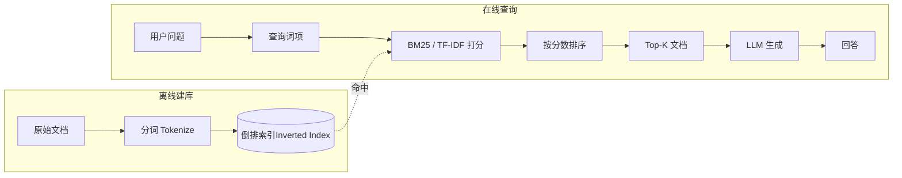

**优点**：精确、可解释、零训练成本、对专有名词/字段名/编号命中精准。2026 年实测：在 BlockchainSolana（精确术语匹配）数据集上 agentic 关键词检索达 **99.97%**。

**缺陷**：不理解同义/ paraphrase；纯 BM25 在语义模糊查询上召回不足。

**适合**：你的接口文档字段名、数据表列名、流程编号这类**精确术语**场景。**通常作为混合检索的一路**，而非单独使用。

#### 知识体系建立与维护

**建立流程与原理**：① 文档清洗为纯文本/markdown → ② **分词（Tokenize）**——中文需分词（jieba/HanLP）或字粒度，英文按空格+词干化 → ③ 建 **倒排索引（Inverted Index）**：词项 → 文档ID + 词频 + 位置。**原理**：TF-IDF/BM25 打分 = 词频（TF）× 逆文档频率（IDF）+ 文档长度归一化，**精确词项匹配**。建立是**确定性批处理**，无模型、无训练，~1000 份文档几分钟内可建完。

**维护流程与原理**：新增文档→分词后**增量插入倒排索引**（append）。删除/更新→删旧 posting list 条目再插新。**关键优势**：BM25 倒排是**可解释、可重建**的纯数据结构——索引坏了能从原文 100% 重建，无"模型漂移"。但 BM25 **不理解语义**：同义词/口语化查询召回不足（如用户问"接口怎么调"，文档写"调用方法"，BM25 召不回）。维护层面同样**无自愈、无知识沉淀**——它是个检索器，不是知识库，矛盾/关联要靠外层发现。

**维护成本**：低。纯脚本+倒排索引，无 GPU、无模型升级问题，可重复构建。

---

### 方案 3：混合检索 + 重排序（Hybrid + Rerank）— 2026 工程标配

**原理**：BM25（稀疏）+ 向量（稠密）双路召回 → RRF（Reciprocal Rank Fusion）融合 → Cross-Encoder 重排序（Cohere/Voyage/bge-reranker）。

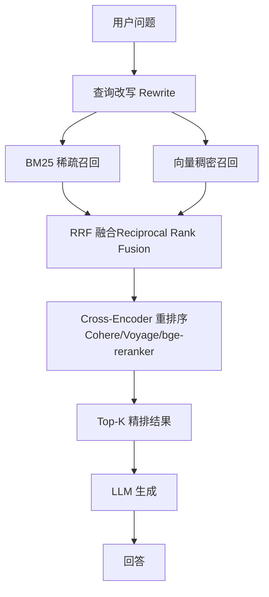

**优点**：兼顾精确匹配与语义理解；NDCG@3 提升约 +22；业界公认"如果你还在用 RAG，就该用混合检索"。

**缺陷**：仍是切片范式，未解决表格切断问题；需维护两套索引 + reranker。

**适合**：作为 Agent 的一个工具（`search_docs` 内部用混合检索），给 Agent 提供高质量候选。

#### 知识体系建立与维护

**建立流程与原理**：① 文档清洗+切块 → ② **并行建两套索引**：BM25 倒排（稀疏）+ embedding 向量库（稠密）→ ③ 可选建 Reranker（Cross-Encoder，如 bge-reranker）。**原理**：稀疏路管"精确术语命中"（字段名/编号），稠密路管"语义模糊匹配"（口语↔术语），RRF 把两路排名倒数加权融合，Cross-Encoder 再对候选对做精排。建立 = 方案1 + 方案2 的并集，需维护两套索引 + 一个 reranker 模型。

**维护流程与原理**：新增文档→**两套索引分别增量更新**（BM25 增倒排、向量库增向量），reranker 无状态不需更新。删除/更新→两套同步。**痛点**：① 两套索引的一致性维护（一份文档删了，两套都得删干净，否则"幽灵命中"）；② embedding 模型升级需向量库全量重算（BM25 不受影响）；③ 切块问题原样存在——表格仍可能被切断，混合只是提升召回质量，不解决切片损失。维护仍是**增量无自愈**，矛盾/关联靠外层。

**维护成本**：中高。两套索引 + reranker 推理（查询时每候选过 Cross-Encoder，有延迟），运维复杂度高于单底座。

---

### 方案 4：知识图谱检索（GraphRAG）— 结构化关系推理

**原理**：离线抽取实体/关系构建知识图谱 → 查询时子图遍历 → 转文本喂 LLM。

**优点**：多跳关系推理强（实体间连接）；2026 基准：向量 RAG 复杂多跳 ~67% → GraphRAG ~81% → Agentic GraphRAG ~94%。

**致命缺陷**：

- 需要数周本体建模（entity schema 设计）。
- 1000 份文档规模 ROI 极低——图谱构建/维护成本远超收益。
- 你的文档（接口/流程/数据表）关系相对扁平，图谱优势发挥不出来。

**适合**：欺诈检测、实体关系密集型研究。**不适合**：你当前规模与文档类型。可作为 P3 远期可选。

#### 知识体系建立与维护

**建立流程与原理**（最重的建立流程）：① **本体 Schema 设计**——人工定义实体类型/关系类型（数周，需领域专家），这是最贵的一步；② 文档清洗 → ③ **LLM 实体/关系抽取**（每份文档过 LLM 抽 `(实体, 关系, 实体)` 三元组，烧 token）→ ④ 三元组入图库（Neo4j）→ ⑤ **社区检测**（Louvain/Leiden）聚簇 → ⑥ LLM 为每个社区生成摘要。**原理**：把文档里的隐性关系显式化成图结构，查询时子图遍历做多跳推理，社区摘要提供全局视角。建立周期**数周**，成本高。

**维护流程与原理**：新增文档→LLM 抽三元组→**增量入图 + 触发局部社区重算**。**痛点**：① **本体演进痛**——实体/关系类型一改，历史数据要回填重抽（Schema 锁死 vs 演进矛盾）；② 三元组抽取**不可靠**（LLM 幻觉抽错关系），错关系污染图，需人工校验；③ 社区结构随数据增大会变，需定期重跑社区检测（全图重算，贵）；④ 矛盾检测反而是 GraphRAG 的强项——同一实体多条冲突关系可在图上显式暴露，但修要人工裁定。gbrain 的改进：用**零 LLM 调用的规则抽实体**（写页面时正则抽 typed edges），大幅降低抽取成本。

**维护成本**：极高。本体建模 + LLM 抽取 token + 图库运维 + 周期社区重算 + 人工校验。1000 份文档 ROI 低。

---

### 方案 5：多模态视觉检索（Multimodal / ColPali）— 你说的"知识库图片"

这是你提到的"知识库图片"方向的正式技术名，2026 年已成生产级。三条路线：

| 子路线 | 代表模型 | 原理  | 存储/成本 |
| --- | --- | --- | --- |
| **Caption-and-Index** | VLM 生成图说 → 文本 embedding | 最简单，图说入库 | 低   |
| **统一视觉 embedding** | Cohere Embed 4 / voyage-multimodal-3.5 / SigLIP-2 | 文图同空间单向量 | 中，多数企业语料够用 |
| **页面即图像 + 晚交互** | **ColPali / ColQwen2.5 / ColNomic** | PDF 整页渲染成图 → VLM 生成 patch 级多向量 → MaxSim 晚交互匹配，**跳过 OCR/切片** | 高（每页 ~1030 向量，10K 页约 1.3GB） |

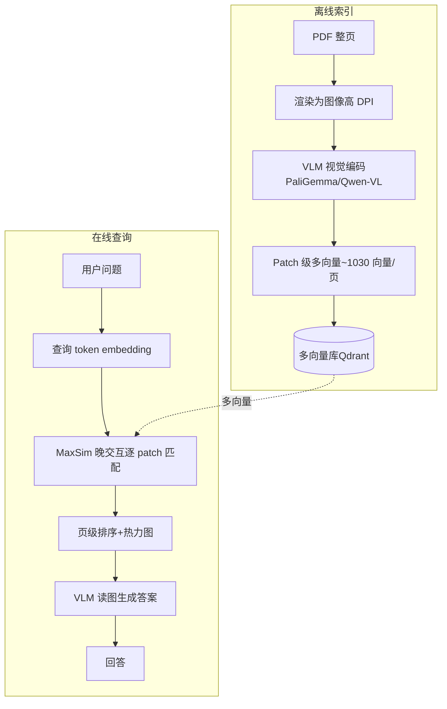

**ColPali 的颠覆点**：彻底跳过 OCR 和切片，把 PDF 页当图像，VLM"像人一样看页面"，保留表格/图表/版式的空间关系——正好解决向量切片切断表格的痛点。ViDoRe V2 排行榜上 ColQwen2.5 居首。

**缺陷**：存储/延迟高（100K 页 200-500ms）；需多向量库（Qdrant）；自托管需 GPU。

**适合你的场景**：数据表（字段说明常含表格截图）、产品介绍（含架构图/截图）。**建议作为 Agent 的可选工具**，对图表密集文档按需启用，而非全局底座。

> ⚠️ **本项目无图片**：用户的文档只有 PDF/Word/Excel/MD，**不含图片**。因此方案 5（ColPali/多模态视觉检索）在本项目**不采用**，本节仅作方案全集的完整性保留。无图片 = 无需 VLM/GPU/多向量库，设计与运维大幅简化（详见 [karpathy_wiki_selfbuild_research.md](karpathy_wiki_selfbuild_research.md) 3.2 节）。

#### 知识体系建立与维护

**建立流程与原理**：① PDF **整页渲染为高 DPI 图像** → ② **VLM 视觉编码**（PaliGemma/Qwen-VL）生成 patch 级多向量（每页 ~1030 向量）→ ③ 多向量写入多向量库（Qdrant）。**原理**：跳过 OCR 和文本切片，VLM"像人一样看页面"，把整页的视觉空间关系（表格/图表/版式）编码进 patch 多向量，查询时 MaxSim 晚交互逐 patch 匹配。建立需 **GPU**（VLM 推理）+ 多向量库。

**维护流程与原理**：新增/更新文档→整页重渲染+VLM 重编码+增量写入。**痛点**：① 存储高（10K 页约 1.3GB 多向量）；② VLM 模型升级需全量重编码（GPU 成本高）；③ 延迟高（100K 页 200-500ms/查询）；④ 自托管需常驻 GPU。**关键**：ColPali 只索引"页面图像"，**不抽取结构化知识**——它是检索器不是知识库，矛盾/关联仍靠外层；图片类内容更新（如截图改版）需重渲染重编码。

**维护成本**：高。GPU + 多向量库 + 重编码成本。本项目无图片故不适用。

---

### 方案 6：Agent 驱动检索 / 文件系统导航（Agentic / Vectorless RAG）— 你的主方案

**原理**：不给 Agent 配向量库，而是给一组文件系统/文档导航工具（`list_categories` / `list_documents` / `read_document` / `read_section` / `grep_docs` / `grade_relevance`），Agent 自主决定调什么、何时调、调几次，按需把原文档加载进上下文。

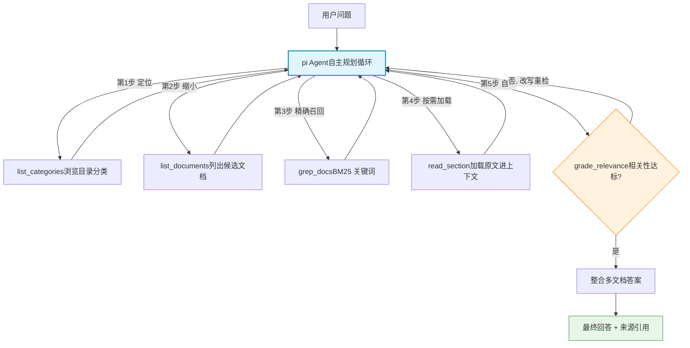

**2026 年现状（核心结论）**：这是当前明确主流趋势，多个名字指同一模式——agent-as-retriever / agentic search / vectorless RAG / just-in-time context loading / tool-use retrieval。Claude Code、Cursor、Devin、Cline、Sourcegraph Amp 全部采用此模式，**都不把语料塞进向量库**。

**学术/实测背书**：

- LlamaIndex 官方 2026.01 实验 *"Did Filesystem Tools Kill Vector Search?"* + 开源 `fs-explorer`（工具集：read_file/grep_file_content/describe_dir_content/glob_paths/parse_file）。
- FinanceBench（表格密集财务文档）：agentic 关键词检索 30.40% **反超** 向量 RAG 24.24%。
- Vercel：加文件系统工具后砍掉 80% 专用工具，准确率反升。
- "The Filesystem Is the Database"（Mintlify/Turso/Box/ByteDance 共识）：文件系统是最古老最被验证的接口，agent 用它最自然。

**优点**：不切片、保留全文上下文、可解释、可多跳回溯、零向量库基础设施。
**缺陷**：依赖 LLM 规划能力；token 消耗随加载文档增大（需配合长上下文模型 + 懒加载）；超大规模语料（GB 级）不如向量库。

**适合**：**正是你的场景**——1000 份结构化内部文档、按目录分类、多跳自评。

#### 知识体系建立与维护（本项目选型，最贴合 Karpathy 思想）

**建立流程与原理**（本项目 L1 离线 pipeline，详见 [karpathy_wiki_selfbuild_research.md](karpathy_wiki_selfbuild_research.md) 3.4）：① 文档清洗（PDF/Word/Excel→MD，**Excel 每 sheet→完整 markdown 表**）→ ② **LLM 两步生成 index**：第1步分析（文档类型/关键实体/分类/关联），第2步生成（摘要/关键词/**章节锚点**/related_docs）→ ③ 写 `index.json`（全局目录）+ `ingest_log.jsonl`（时序日志）+ `md/`（清洗原文）。**原理**：不切块、不向量化，保留文档**全文 + 结构**；`index.json` 是 Karpathy `index.md` 的服务化版——Agent 先读 index 定位再 `read_section` 按需加载原文段（靠章节锚点避免全文进上下文）。**这是"知识编译一次"的落点**：摘要/关键词/锚点一次生成，反复复用。

**维护流程与原理**：新增文档→清洗+LLM 两步→**追加 index 条目 + 追加 log**（增量，不动已有）。更新文档→删旧 index 条目+md，重灌新条目。**知识复利落点**：① `related_docs` 字段 = Karpathy `[[wikilink]]` 的服务化版，摄入时 LLM 自动建立文档间关联，新文档会触发关联文档的 related_docs 回填；② **lint 混合体系**（离线运维，非 Agent 工具）：确定性脚本查孤儿页/缺交叉引用/格式/数据缺口（便宜可重复，CI 跑），周期 LLM 查矛盾/过时/缺概念页（贵，人工触发）。**矛盾检测**靠 lint 的周期 LLM 检查跨文档同一字段/流程编号不一致——比向量/BM25 强，因 index 有关联结构。**关键差异**：方案1-5 是"检索器"，知识不沉淀；方案6 的 index.json + related_docs + log 让知识**结构化沉淀、可积累**，正是 Karpathy "compounding artifact" 的工程实现。

**维护成本**：低到中。无向量库/GPU/图库；主要是 LLM 两步 ingest 的 token + lint 脚本。index.json 纯 JSON 可重建、可 git 版本化。

---

### 方案 7（补充）：长上下文全量注入（Long-Context / "RAG 已死"派）

**原理**：模型上下文已达 1M-2M token（Claude Opus 4.6 / Gemini 3.1 Pro），直接把相关文档全量塞进 prompt，不做检索。

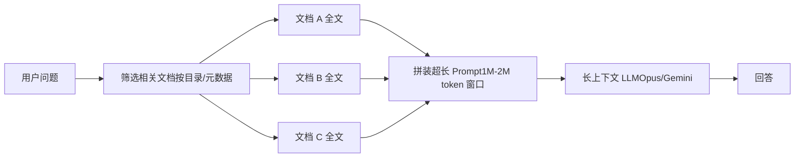

**优点**：零检索基础设施、零切片损失、全文上下文完整。
**缺陷**：成本高（每查询满窗 token）；1000 份文档不可能全塞；"lost in the middle"注意力衰减；无源追溯/审计。

**定位**：不是独立方案，而是**方案 6 的执行手段**——Agent 按需加载的文档进长上下文窗口供 LLM 推理。两者天然组合。

#### 知识体系建立与维护

**建立流程与原理**：① 文档清洗为 markdown（保持表格/结构）→ ② 按目录/元数据分类组织（如 `data_product/`、`process/`、`data_table/`）→ ③ **不建任何索引**——既不切块也不向量化，文档原文按目录躺在文件系统。**原理**：依赖现代 LLM 的超长上下文窗口（1M-2M token）一次性吞下相关文档全文，让模型"亲眼读全文"做推理，零切片损失、零检索基础设施。建立是**最轻的**：清洗 + 分类即可。

**维护流程与原理**：新增/更新文档→清洗后丢进对应目录，**无索引需更新**（这是最大优势——无"索引漂移/重算"问题）。查询时由 Agent（方案6）或人工按目录筛选相关文档→拼装进长上下文。**痛点**：① **筛选是难点**——1000 份不可能全塞，必须靠目录/元数据/Agent 先筛出相关的少数几份（所以它必须配合方案6，不能独立）；② **成本随加载量线性增长**——每次查询满窗 token，费用高；③ "lost in the middle"——超长上下文中间部分注意力衰减，关键信息放中段易漏；④ **无源追溯/审计结构**——全文塞进去，哪句来自哪份文档需模型自己标注引用（不如 index.json 的锚点精确）；⑤ 知识**不沉淀**——和方案1-5 一样是检索/注入器，不是知识库，矛盾/关联靠模型当场判断，不积累。

**维护成本**：建立极低（无索引）；但**运行成本高**（token），且无知识沉淀。适合作为方案6的执行手段，而非独立底座。

---

## 三、检索控制层方案全集（Agent 如何调度检索）

这层决定"检索到的东西要不要信、要不要再找"。它们可以叠加在任意底座之上：

| 方案  | 核心机制 | 一句话定位 |
| --- | --- | --- |
| **Standard RAG** | 固定流水线：检索→生成 | 基础，80% 生产系统仍在用 |
| **Self-RAG** | 生成后自评（IsREL/IsSUP/IsUSE 反思 token），决定是否重检索/重生成 | 批判**答案**是否 grounded |
| **Corrective RAG (CRAG)** | 检索后先评估文档质量（Correct/Ambiguous/Incorrect），差则改写查询或回退 web | 批判**上下文**质量，修复检索失败 |
| **Adaptive RAG** | 小分类器路由：简单问题跳过检索 / 中等单步 / 复杂多步 | 按**查询复杂度**动态选路径 |
| **Agentic RAG** | LLM 全自主规划：拆子任务、选工具、多步迭代、自评停止 | **你的选型**，能力上限最高 |

### 控制层流程对比图

**Standard RAG**（固定流水线，无反馈）：

**Self-RAG**（生成后反思答案）：

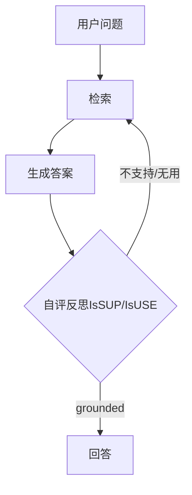

**Corrective RAG / CRAG**（检索后评估上下文）：

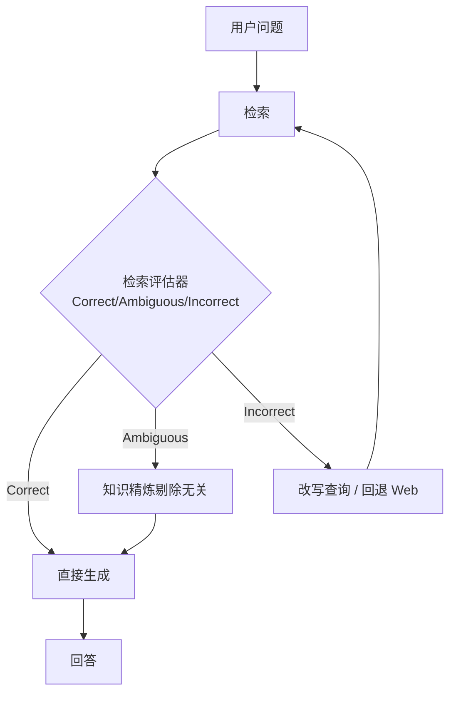

**Adaptive RAG**（按复杂度路由）：

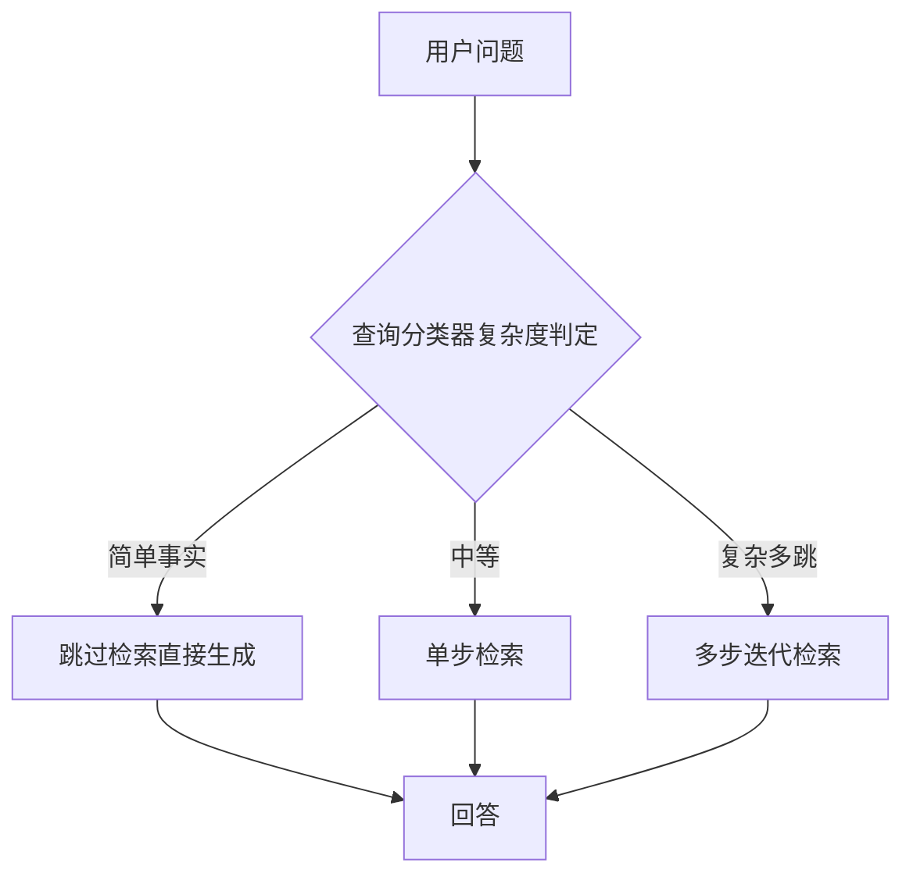

**Agentic RAG**（你的选型，全自主规划）：

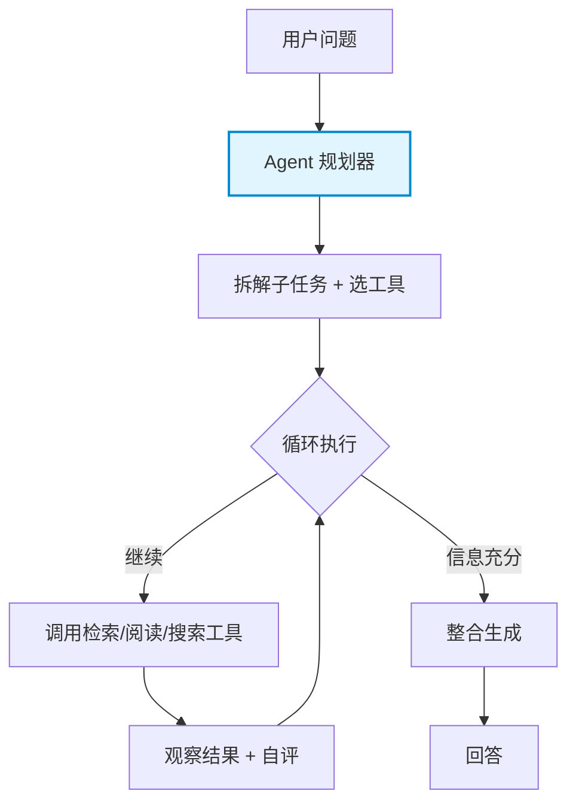

### 2026 成熟系统的分层叠加范式

**2026 成熟系统通常是分层叠加**（把上述控制层组合起来）：

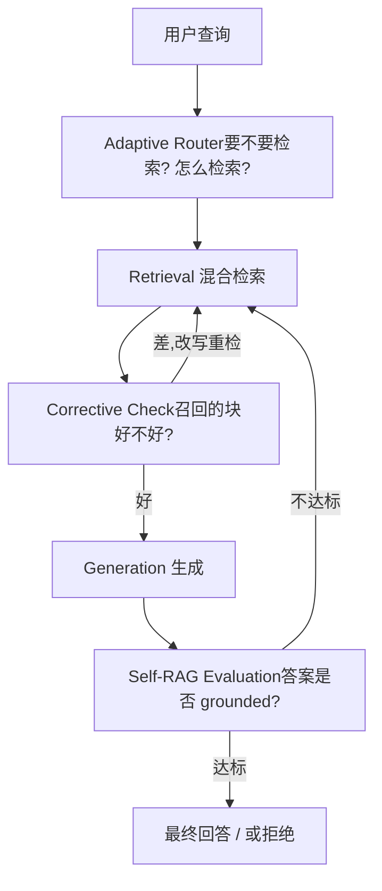

你的"多跳 + 自我判断重试"需求 = **Agentic RAG 主控 + 内嵌 CRAG 式相关性评分 + Self-RAG 式答案自评**。这在 pi Agent 里通过工具（`grade_relevance`）+ 系统提示（自评停止条件）即可实现，无需额外框架。

---

## 四、Karpathy LLM Wiki 理念与两大开源实践

前面二、三节讲的是"检索底座"和"检索控制层"这两个**零件**。这一节讲两个把零件组装成**完整系统**的开源仓库——它们都源自同一个思想源头，但走向了截然不同的工程路线。对你"1000 份 PDF + Agent 驱动 + 企业自托管"的需求，这两个是现成可借鉴/可改造的参考实现。

### 4.0 思想源头：Karpathy 的 LLM Wiki 方法论

Andrej Karpathy（前 Tesla AI 总监、OpenAI 创始成员）在 2026 年发表的 [llm-wiki.md gist](https://gist.github.com/karpathy/442a6bf555914893e9891c11519de94f) 提出了一套用 LLM 构建知识库的设计模式。**核心理念一句话**：

> 传统 RAG 每次查询都从原始文档里"临时重新发现"知识，没有积累；Karpathy 主张让 LLM **增量构建并维护一个持久化的 Wiki**——知识编译一次、持续更新，而非每次重新推导。**Wiki 是一个会复利的产物（compounding artifact）。**

三个关键设计：

| 要素  | 说明  |
| --- | --- |
| **三层架构** | 原始资料（不可变，只读）→ Wiki（LLM 生成的 markdown，LLM 拥有）→ Schema（CLAUDE.md/AGENTS.md，告诉 LLM 怎么结构化、怎么干活） |
| **三大操作** | **Ingest**（投入新资料→LLM 读、抽取、更新实体页/概念页/索引/日志，一份资料可触及 10-15 个页面）· **Query**（提问→LLM 搜相关页→带引用回答；好答案可回填进 Wiki）· **Lint**（定期健康检查：找矛盾、过时声明、孤儿页、缺失概念页、缺失交叉引用、数据缺口） |
| **角色分工** | 人类负责策展来源、提问、判断方向；**LLM 负责所有枯燥的维护工作**（摘要、交叉引用、归档、记账）——人类放弃 wiki 是因为维护成本增长快于价值，LLM 不嫌烦、不会忘、能一次改 15 个文件 |

导航靠两个特殊文件：`index.md`（内容目录，LLM 答题前先读它找页面）+ `log.md`（时序操作记录，可被 `grep` 解析）。Karpathy 原话："Obsidian 是 IDE，LLM 是程序员，Wiki 是代码库。"

**关键洞察**：index.md 在中等规模（~100 份来源、~数百页）"出奇地好用"，**可以完全不需要 embedding RAG 基础设施**——这恰恰印证了你"按目录分类 + 按需加载原文"的直觉。

### 4.1 两大开源实践对比

| 维度  | **llm_wiki**（nashsu） | **gbrain**（Garry Tan / YC） |
| --- | --- | --- |
| **与 Karpathy 关系** | ✅ **忠实实现**——README 明确致谢 Karpathy gist，三层架构/Ingest-Query-Lint/index.md/log.md/[[wikilink]] 全部照搬 | ⚠️ **精神相近但独立**——自称"brain 层"，对标 YC 的 [company-brain RFS](https://www.ycombinator.com/rfs#company-brain)，不直接引用 Karpathy |
| **产品形态** | 跨平台**桌面应用**（Tauri：Rust 后端 + React/Vite 前端，三栏布局） | **CLI + MCP server**（无 GUI，Bun 运行时，配套轻量 admin 后台） |
| **知识库存储** | **Markdown 文件**（Obsidian 兼容）+ YAML frontmatter + `[[wikilink]]`；文件即数据库 | **Postgres + pgvector 数据库**为主，markdown 仅作 git 版本控制的"人类策展层"（db_tracked），机器生成内容进 db_only |
| **检索底座** | 关键词/向量 hybrid（**LanceDB**）+ 四信号知识图谱（直接链接/来源重叠/Adamic-Adar/类型亲和）+ Louvain 社区检测 | hybrid search（tsvector/BM25 + pgvector HNSW）+ RRF 融合 + **零 LLM 调用的实体图谱**（写页面时自动抽 `attended/works_at/invested_in` typed edges） |
| **回答方式** | 返回检索结果 + Agent 生成（Rust 后端 Chat Agent，工具调用） | **Synthesis 层**——直接给"带引用的答案 + 明确指出 brain 还不知道什么"（gap analysis），而非返回 chunks |
| **Agent 能力** | MCP server 暴露 **10 个工具**（status/projects/set_project/files/read_file/reviews/search/chat/graph/rescan）；本地 SKILL.md skills；Rust Chat Agent 自带工具调用循环 | **55 个 Claude Code 风格 skills**（ingest/query/maintain/enrich/citation-fixer/cron-scheduler…）；MCP op；24/7 daemon（"dream cycle"夜间整合记忆、修引用） |
| **多用户/企业** | ❌ 单用户桌面应用，无权限隔离 | ✅ **多 source + per-user OAuth scope**，按登录隔离可见性，fuzz 测试零泄漏，明确支持 company brain |
| **自托管依赖** | 云端 LLM API（任意 OpenAI 兼容端点）+ 桌面应用常驻；MCP 必须桌面应用运行 | Postgres/Supabase（或 PGLite 零配置）+ OpenAI embeddings API + LLM API；Docker 部署 |
| **许可证** | ⚠️ **GPL v3**（copyleft，二次修改分发需开源——对企业有传染性） | ✅ **MIT**（企业友好，可闭源商用） |
| **成熟度/规模** | v0.6.6，有测试，4 语言 README，活跃开发；个人知识库定位 | v0.32.x，**生产级**：作者自部署 146,646 页/24,585 人/5,339 公司/66 cron；严格 evals（BrainBench/LongMemEval，P@5 49.1%/R@5 97.9%） |

### 4.2 llm_wiki 流程

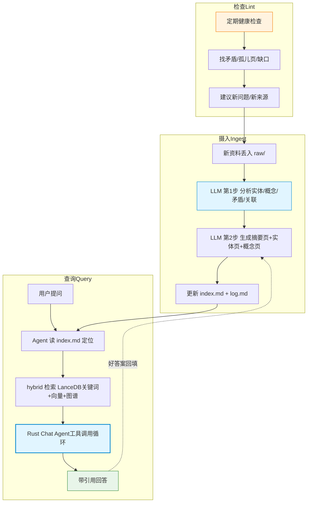

**llm_wiki 优势**：

- **Karpathy 原教旨**：三层架构 + Ingest/Query/Lint 完整闭环，markdown 文件即知识库，可读、可 git 版本控制、可 Obsidian 浏览。
- **多模态强**：自动提取 PDF 内嵌图片、视觉模型生成事实性描述、图文分区搜索——直接命中你"数据表/产品介绍含图表"的痛点。
- **index.md 导航**：中等规模无需向量库，与你"按目录分类"直觉一致。
- **MCP + Agent Skill 双接入**：既可作 Claude Code 的 MCP 工具，又有本地 skills。

**llm_wiki 劣势**：

- ⚠️ **GPL v3 许可证**——对企业是最大障碍：若二次开发并分发（含内部 SaaS 部署给多个业务部门），理论上需开源衍生作品。法务通常会卡。
- **桌面应用形态**：Tauri 桌面端，不是服务端部署；要给全公司业务人员用，需要每人装桌面应用或改造为 Web 服务——工程量大。
- **单用户**：无权限隔离，不适合多部门数据隔离（你的"数据产品/流程/数据表"可能涉不同密级）。
- MCP server 只是桌面 API 的代理，**必须桌面应用常驻运行**才能用，不适合服务器无头部署。

### 4.3 gbrain 流程

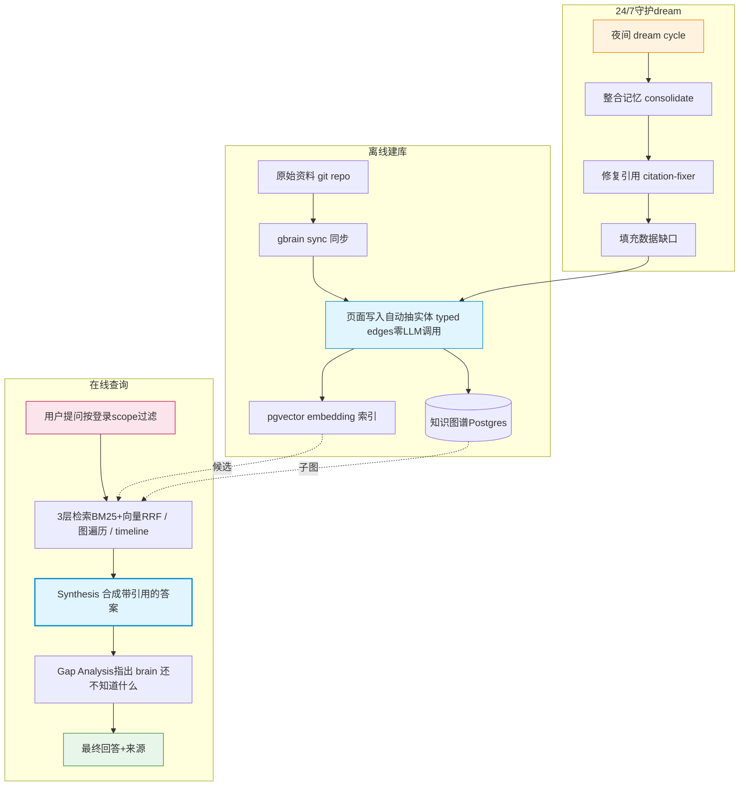

**gbrain 优势**：

- **企业级多用户**：per-user OAuth + source 隔离 + fuzz 测试零泄漏，天然支持你多部门数据隔离。
- **Synthesis + Gap Analysis**：不只返回 chunks，直接给答案并标注"知识缺口"——比纯检索更接近你要的"业务人员对话查询"。
- **零 LLM 调用图谱**：写页面时正则/规则抽实体关系，不烧 token，比 GraphRAG 的 LLM 抽取便宜得多。
- **24/7 dream cycle**：夜间自动整合、修引用、补缺口——知识库"自己保养"。
- **MIT 许可证**：企业可闭源商用，法务无压力。
- **生产验证**：14 万页实际跑通，evals 严格，P@5/R@5 有基准。
- **CLI + MCP 无头部署**：适合服务器，业务人员通过 Claude Code/Web 客户端访问。

**gbrain 劣势**：

- **重**：需 Postgres + pgvector（或 Supabase）+ OpenAI embeddings API + LLM API，基础设施和成本比纯文件方案高。
- **非 Karpathy 原教旨**：知识在数据库里，不是人眼可读的 markdown 文件目录，"可读性/可审计性"弱于 llm_wiki。
- **复杂度高**：55 个 skills、2MB CHANGELOG、364KB TODOS——学习曲线陡，二次定制门槛高。
- **依赖 OpenAI embeddings**：自托管若要完全离线，需换成自托管 embedding 模型（如 bge-m3），需改配置。
- **定位偏 CRM/人脉**：默认 typed edges（attended/works_at/invested_in）面向人-公司-交易，你的"接口文档/流程/数据表"需自定义本体。

### 4.4 如何应用到你的企业（1000 份 PDF 场景）

**结论先行**：两个都不建议"原样拿来用"，但**各取所长**最划算。

**路线 A（推荐）—— 以你自建 pi Agent 为主干，借鉴两者理念，不绑定任一仓库**：

| 借鉴点 | 来源  | 落到你的系统 |
| --- | --- | --- |
| 三层架构 + Ingest/Query/Lint | Karpathy / llm_wiki | PDF→MD 清洗进 `raw/`；LLM 生成 `wiki/` 摘要+实体页；`index.json` 当目录；定期跑 lint 找矛盾/缺口 |
| `index.md` 导航 + 按需加载 | Karpathy / llm_wiki | 你的 `list_categories`/`list_documents`/`read_section` 工具就是这套；1000 份规模 index 够用 |
| Gap Analysis + 答案带引用 | gbrain | `grade_relevance` 工具 + 系统提示要求标注"未覆盖什么" |
| 权限隔离思路 | gbrain | 按目录/部门做 source 切分（data_product/process/data_table 各一源），Agent 查询前按用户身份限定可访问源 |
| 多模态图片摄入 | llm_wiki | 对数据表/产品介绍 PDF，提取内嵌图→视觉模型生成描述→入库（比 ColPali 轻量） |

**路线 B（次选）—— 直接基于 gbrain 改造**：若你接受 Postgres+pgvector 重基础设施，且需要多部门权限隔离，gbrain 是更省事的起点（MIT 许可、生产级、company-brain 教程现成）。需做：① 自定义本体（接口/字段/流程而非人/公司）；② embedding 换自托管模型；③ PDF→MD 摄入 pipeline 接你的 1000 份语料；④ 砍掉用不上的 CRM 类 skills。

**路线 C（不推荐）—— 直接用 llm_wiki**：GPL v3 + 桌面应用形态 + 单用户，三点都和你"企业自托管多业务部门"冲突。除非你的场景就是少数分析师的个人研究库，否则法务和部署都会卡。

**一句话**：Karpathy 的"持久化编译 wiki + LLM 维护"思想值得吸收，但具体实现上——**llm_wiki 太个人、许可证太重；gbrain 太重、定位偏 CRM**。你自建的 pi Agent + 文件系统导航主干，恰好是两者之间最合身的中间路线（参考第五节推荐架构）。

---

## 五、方案选型对比总表

> 评分针对**你的场景**（1000 份结构化 PDF、Agent 调用、多跳自评、自托管）。⭐=契合度。

| 方案  | 检索底座 | 表格/结构化准确率 | 多跳能力 | 自托管成本 | 实施复杂度 | Agent 可调用 | 契合度 |
| --- | --- | --- | --- | --- | --- | --- | --- |
| 向量检索 | 向量库 | ❌ 切片切断 | 中   | 中   | 中   | ✅   | ⭐⭐  |
| 关键词 BM25 | 倒排索引 | ✅ 精确术语 | 弱   | 低   | 低   | ✅   | ⭐⭐⭐ |
| 混合+Rerank | 双索引 | 🟡 仍切片 | 中高  | 中高  | 中高  | ✅   | ⭐⭐⭐ |
| GraphRAG | 知识图谱 | 🟡  | ✅ 最强 | 高   | 极高（数周建模） | ✅   | ⭐   |
| 多模态 ColPali | 视觉多向量 | ✅ 保留版式 | 中   | 高（GPU+多向量库） | 高   | ✅   | ⭐⭐⭐（图表文档可选） |
| **Agent 文件导航** | **文件系统目录** | **✅ 全文不切片** | **✅ 可回溯多跳** | **低** | **中** | **✅ 原生** | **⭐⭐⭐⭐⭐** |
| 长上下文全量 | 无索引 | ✅   | 中   | 高（token） | 低   | —（执行手段） | ⭐⭐⭐（配合方案6） |

**控制层叠加**（均 Agent 可调用，自托管友好）：

| 控制层 | 定位  | 是否纳入你的架构 |
| --- | --- | --- |
| Standard RAG | 基础流水线 | ❌ 太弱 |
| Self-RAG | 答案自评 | ✅ 系统提示内嵌 |
| CRAG | 上下文评分+重检索 | ✅ `grade_relevance` 工具 |
| Adaptive RAG | 查询路由 | ✅ Agent 分类即路由 |
| **Agentic RAG** | **自主规划** | **✅ 主控（pi Agent）** |

---

## 六、推荐架构（融合方案，非单选）

基于对比，你的最优解**不是单选某方案，而是以 Agent 文件导航为主干、按需挂载其他底座作为工具**：

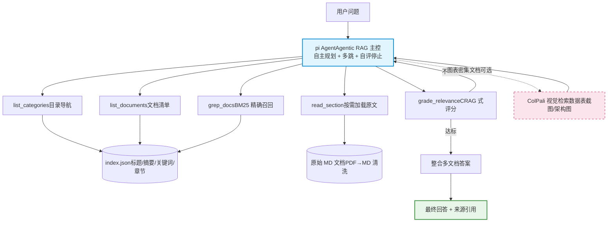

**分层落地**：

- **P0（主干）**：Agent 文件导航 + index.json + BM25 grep + read_section + grade_relevance。覆盖 80% 查询。
- **P1（质量）**：系统提示内嵌 Self-RAG 自评 + CRAG 重检循环，实现"多跳自我判断重试"。
- **P2（增强）**：对图表密集的数据表/产品介绍文档，挂载 ColPali 视觉检索作为 Agent 可选工具。
- **P3（远期可选）**：若未来多跳关系查询增多且语料增长，再评估混合检索或 GraphRAG——1000 份规模当前不需要。

---

## 七、一句话结论

你的"Agent 驱动检索 + 按目录分类 + 按需加载原文"方案，在 2026 年**不是边缘尝试，而是 coding agent 领域已被验证的主流模式**（Claude Code/Cursor/Devin 同款），有 `fs-explorer` 等开源参考实现，且在表格密集文档上实测反超向量 RAG。**以它为主干，BM25 做精确召回，ColPali 做图表可选增强，Self-RAG+CRAG 做自评重试**——这是针对你 1000 份结构化内部 PDF 的最优组合，无需引入沉重的向量库或知识图谱。

---

## 参考资料（2026 调研）

- LlamaIndex — *Did Filesystem Tools Kill Vector Search?*（2026.01，fs-explorer 开源）
- Subramanian et al. — *Keyword Search is All You Need*（2026.02，agentic 关键词 vs 向量 RAG 实测）
- *The Filesystem Is the Database*（2026.04，Mintlify/Turso/Box/ByteDance）
- *AI Agents Don't Need Vector Search Anymore*（2026，agent-as-retriever 趋势综述）
- ValueStreamAI — *AI Knowledge Management 2026*（GraphRAG 67%→81%→94% 基准）
- BigDataBoutique — *Multimodal RAG in 2026*（ColPali/ColQwen2.5 三路线对比）
- arXiv 2604.10167 — *Visual Late Chunking*（ColPali 多向量 SOTA）
- Atlan — *12 Advanced RAG Techniques*（Self-RAG/CRAG/Adaptive RAG 机制）
- DEV — *Self-RAG vs Adaptive RAG vs Corrective RAG*（控制层分层叠加）
- AkitaOnRails — *Is RAG Dead? Long Context, Grep*（长上下文 vs RAG 取舍）
- Andrej Karpathy — [llm-wiki.md gist](https://gist.github.com/karpathy/442a6bf555914893e9891c11519de94f)（LLM Wiki 方法论原始设计模式）
- nashsu/llm_wiki — https://github.com/nashsu/llm_wiki（Karpathy 原教旨桌面实现，GPL v3）
- garrytan/gbrain — https://github.com/garrytan/gbrain（YC company-brain 生产级实现，MIT）
- Jeremy Howard — [llms.txt 提案](https://llmstxt.org)（2024.09，网站为 LLM 提供 markdown 上下文，与 Karpathy wiki 思想同源）
