# 知识库检索系统方案全集与选型对比

> 面向：内部知识库智能体（业务人员对话查询）
> 语料规模：约 1000 份 PDF（数据产品接口文档/产品介绍、公司流程制度、数据表字段说明）
> 核心约束：**Agent 调用检索**（非工作流编排）、自托管、复杂问题多跳、自我判断重试
> 调研时间：2026 年 7 月（Tavily 联网调研）

---

## 一、先理清一个关键认知：检索方式 ≠ 检索架构

很多人把"RAG"等同于"向量检索 + LLM"，这是 2023 年的认知。2026 年的共识是：

> **RAG 是一个设计空间（design space），不是一个单一模式。** 不同业务问题需要不同检索策略。

检索方案可以从两个正交维度切分：

| 维度            | 含义                                                       |
| ------------- | -------------------------------------------------------- |
| **检索底座（去哪找）** | 向量库 / 关键词索引 / 知识图谱 / 文件系统目录 / 长上下文全量                     |
| **检索控制（怎么找）** | 静态流水线 / Self-RAG 反思 / CRAG 纠错 / Adaptive 路由 / Agent 自主规划 |

你的需求"Agent 驱动检索"属于**检索控制 = Agent 自主规划**那一层；而"按目录分类 + 按需加载原文"属于**检索底座 = 文件系统目录**。两者是组合关系，下面分两块展开。

---

## 二、检索底座方案全集（6 大类）

### 方案 1：向量检索（Vector / Dense Retrieval）— 传统 RAG

**原理**：文档切块 → embedding → 向量库（Qdrant/Milvus/pgvector）→ 查询时 top-K 余弦相似度召回。

> 本文档中的流程图使用 Mermaid 语法。**为兼容 GitHub / VS Code / Obsidian 等渲染器,所有图均遵循三条规则**:① `subgraph` 用英文 ID + 中文标题(`subgraph X [中文标题]`),不直接用中文做 ID;② 节点标签里的英文括号 `()` 改用全角 `（）` 或去掉,避免被解析成节点形状语法;③ 不在节点文本里内嵌 `[]`、`{}`、`()` 等会与 Mermaid 语法冲突的字符。若某图在你的环境仍不渲染,检查是否被旧版 mermaid-cli 渲染。

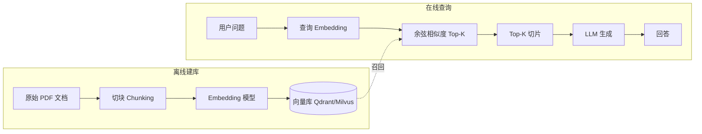

**优点**：成熟、生态完善、适合语义模糊查询（口语化提问 ↔ 文档术语）、可扩展到超大语料。

**致命缺陷（恰好命中你的痛点）**：

- 切片切断上下文：表格表头与数据行被分到不同 chunk，接口文档的字段说明与示例分离。
- 语义漂移：业务口语与文档术语对不上时召回偏差大。
- 阿里云 2026 测试显示：Dify 等工作流平台在表格/结构化文档上准确率低，主因就是切片 + 弱检索。

**适合**：非结构化长文、大规模（GB 级）语料、跨语言/同义查询。**不适合**：你这种表格密集的结构化内部文档作为唯一底座。

#### 知识体系建立与维护

**建立流程与原理**：① 文档清洗（PDF/Word/Excel→文本，表格转 markdown 表）→ ② **切块（Chunking）**——按固定 token 窗口（如 512 token，overlap 50）滑窗切，或按结构切（段落/标题）→ ③ 每块过 **embedding 模型**（如 bge-m3 / text-embedding-3）生成稠密向量 → ④ 向量 + 原文片段写入向量库（Qdrant/Milvus/pgvector），建 HNSW 索引。**原理**：把语义相近的文本映射到向量空间相近位置，靠余弦距离找"语义邻居"。建立是**一次性批处理**，~1000 份文档数小时内可跑完。

**维护流程与原理**：新增文档→同样切块+embedding→**增量写入**向量库（append-only，无需重建）。删除/更新文档→按 ID 删旧向量再插新向量（向量库需支持 upsert）。embedding 模型升级（如换更强模型）→**全量重算重灌**（成本高，需停服或灰度切换）。**原理痛点**：切块是无状态的，新文档不影响已有向量，但**无法自动发现跨文档矛盾/关联**——两份文档说同一字段不同值，向量库不会告诉你，矛盾要靠人 or LLM 单独查。维护是**纯增量、无自愈**，知识不"沉淀"成结构，每次查询仍从切片临时召回。

**维护成本**：中。embedding 计算 + 向量库运维；模型升级需全量重算。

---

### 方案 2：关键词检索（BM25 / Sparse）— Lexical

**原理**：倒排索引 + TF-IDF 打分，精确词项匹配。

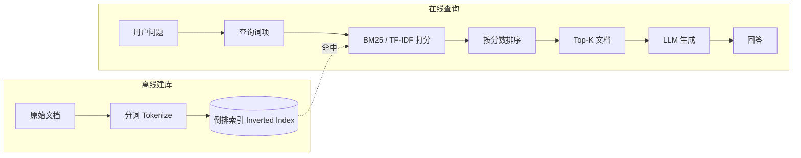

**优点**：精确、可解释、零训练成本、对专有名词/字段名/编号命中精准。2026 年实测：在 BlockchainSolana（精确术语匹配）数据集上 agentic 关键词检索达 **99.97%**。

**缺陷**：不理解同义/ paraphrase；纯 BM25 在语义模糊查询上召回不足。

**适合**：你的接口文档字段名、数据表列名、流程编号这类**精确术语**场景。**通常作为混合检索的一路**，而非单独使用。

#### 知识体系建立与维护

**建立流程与原理**：① 文档清洗为纯文本/markdown → ② **分词（Tokenize）**——中文需分词（jieba/HanLP）或字粒度，英文按空格+词干化 → ③ 建 **倒排索引（Inverted Index）**：词项 → 文档ID + 词频 + 位置。**原理**：TF-IDF/BM25 打分 = 词频（TF）× 逆文档频率（IDF）+ 文档长度归一化，**精确词项匹配**。建立是**确定性批处理**，无模型、无训练，~1000 份文档几分钟内可建完。

**维护流程与原理**：新增文档→分词后**增量插入倒排索引**（append）。删除/更新→删旧 posting list 条目再插新。**关键优势**：BM25 倒排是**可解释、可重建**的纯数据结构——索引坏了能从原文 100% 重建，无"模型漂移"。但 BM25 **不理解语义**：同义词/口语化查询召回不足（如用户问"接口怎么调"，文档写"调用方法"，BM25 召不回）。维护层面同样**无自愈、无知识沉淀**——它是个检索器，不是知识库，矛盾/关联要靠外层发现。

**维护成本**：低。纯脚本+倒排索引，无 GPU、无模型升级问题，可重复构建。

---

### 方案 3：混合检索 + 重排序（Hybrid + Rerank）— 2026 工程标配

**原理**：BM25（稀疏）+ 向量（稠密）双路召回 → RRF（Reciprocal Rank Fusion）融合 → Cross-Encoder 重排序（Cohere/Voyage/bge-reranker）。

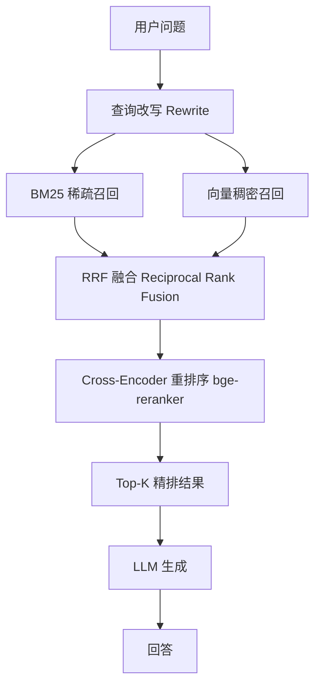

**优点**：兼顾精确匹配与语义理解；NDCG@3 提升约 +22；业界公认"如果你还在用 RAG，就该用混合检索"。

**缺陷**：仍是切片范式，未解决表格切断问题；需维护两套索引 + reranker。

**适合**：作为 Agent 的一个工具（`search_docs` 内部用混合检索），给 Agent 提供高质量候选。

#### 知识体系建立与维护

**建立流程与原理**：① 文档清洗+切块 → ② **并行建两套索引**：BM25 倒排（稀疏）+ embedding 向量库（稠密）→ ③ 可选建 Reranker（Cross-Encoder，如 bge-reranker）。**原理**：稀疏路管"精确术语命中"（字段名/编号），稠密路管"语义模糊匹配"（口语↔术语），RRF 把两路排名倒数加权融合，Cross-Encoder 再对候选对做精排。建立 = 方案1 + 方案2 的并集，需维护两套索引 + 一个 reranker 模型。

**维护流程与原理**：新增文档→**两套索引分别增量更新**（BM25 增倒排、向量库增向量），reranker 无状态不需更新。删除/更新→两套同步。**痛点**：① 两套索引的一致性维护（一份文档删了，两套都得删干净，否则"幽灵命中"）；② embedding 模型升级需向量库全量重算（BM25 不受影响）；③ 切块问题原样存在——表格仍可能被切断，混合只是提升召回质量，不解决切片损失。维护仍是**增量无自愈**，矛盾/关联靠外层。

**维护成本**：中高。两套索引 + reranker 推理（查询时每候选过 Cross-Encoder，有延迟），运维复杂度高于单底座。

---

### 方案 4：知识图谱检索（GraphRAG）— 结构化关系推理

**原理**：离线抽取实体/关系构建知识图谱 → 查询时子图遍历 → 转文本喂 LLM。

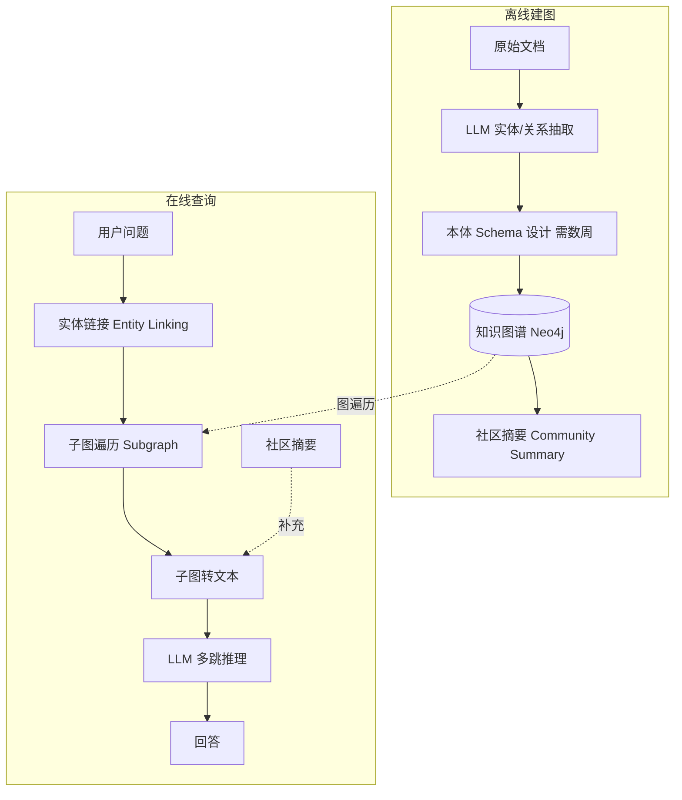

**优点**：多跳关系推理强（实体间连接）；2026 基准：向量 RAG 复杂多跳 ~67% → GraphRAG ~81% → Agentic GraphRAG ~94%。

**致命缺陷**：

- 需要数周本体建模（entity schema 设计）。
- 1000 份文档规模 ROI 极低——图谱构建/维护成本远超收益。
- 你的文档（接口/流程/数据表）关系相对扁平，图谱优势发挥不出来。

**适合**：欺诈检测、实体关系密集型研究。**不适合**：你当前规模与文档类型。可作为 P3 远期可选。

#### 知识体系建立与维护

**建立流程与原理**（最重的建立流程）：① **本体 Schema 设计**——人工定义实体类型/关系类型（数周，需领域专家），这是最贵的一步；② 文档清洗 → ③ **LLM 实体/关系抽取**（每份文档过 LLM 抽 `(实体, 关系, 实体)` 三元组，烧 token）→ ④ 三元组入图库（Neo4j）→ ⑤ **社区检测**（Louvain/Leiden）聚簇 → ⑥ LLM 为每个社区生成摘要。**原理**：把文档里的隐性关系显式化成图结构，查询时子图遍历做多跳推理，社区摘要提供全局视角。建立周期**数周**，成本高。

**维护流程与原理**：新增文档→LLM 抽三元组→**增量入图 + 触发局部社区重算**。**痛点**：① **本体演进痛**——实体/关系类型一改，历史数据要回填重抽（Schema 锁死 vs 演进矛盾）；② 三元组抽取**不可靠**（LLM 幻觉抽错关系），错关系污染图，需人工校验；③ 社区结构随数据增大会变，需定期重跑社区检测（全图重算，贵）；④ 矛盾检测反而是 GraphRAG 的强项——同一实体多条冲突关系可在图上显式暴露，但修要人工裁定。gbrain 的改进：用**零 LLM 调用的规则抽实体**（写页面时正则抽 typed edges），大幅降低抽取成本。

**维护成本**：极高。本体建模 + LLM 抽取 token + 图库运维 + 周期社区重算 + 人工校验。1000 份文档 ROI 低。

---

### 方案 5：长上下文全量注入（Long-Context / "RAG 已死"派）

**原理**：模型上下文已达 1M-2M token（Claude Opus 4.6 / Gemini 3.1 Pro），直接把相关文档全量塞进 prompt，不做检索。

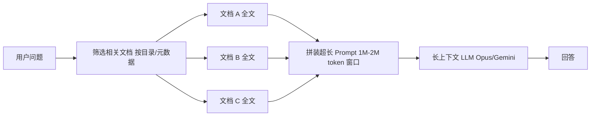

**优点**：零检索基础设施、零切片损失、全文上下文完整。
**缺陷**：成本高（每查询满窗 token）；1000 份文档不可能全塞；"lost in the middle"注意力衰减；无源追溯/审计。

**定位**：不是独立方案，而是**方案 6 的执行手段**——Agent 按需加载的文档进长上下文窗口供 LLM 推理。两者天然组合。

#### 知识体系建立与维护

**建立流程与原理**：① 文档清洗为 markdown（保持表格/结构）→ ② 按目录/元数据分类组织（如 `data_product/`、`process/`、`data_table/`）→ ③ **不建任何索引**——既不切块也不向量化，文档原文按目录躺在文件系统。**原理**：依赖现代 LLM 的超长上下文窗口（1M-2M token）一次性吞下相关文档全文，让模型"亲眼读全文"做推理，零切片损失、零检索基础设施。建立是**最轻的**：清洗 + 分类即可。

**维护流程与原理**：新增/更新文档→清洗后丢进对应目录，**无索引需更新**（这是最大优势——无"索引漂移/重算"问题）。查询时由 Agent（方案 6）或人工按目录筛选相关文档→拼装进长上下文。**痛点**：① **筛选是难点**——1000 份不可能全塞，必须靠目录/元数据/Agent 先筛出相关的少数几份（所以它必须配合方案 6，不能独立）；② **成本随加载量线性增长**——每次查询满窗 token，费用高；③ "lost in the middle"——超长上下文中间部分注意力衰减，关键信息放中段易漏；④ **无源追溯/审计结构**——全文塞进去，哪句来自哪份文档需模型自己标注引用（不如 wiki/ 页面的章节锚点精确）；⑤ 知识**不沉淀**——和方案1-4 一样是检索/注入器，不是知识库，矛盾/关联靠模型当场判断，不积累。

**维护成本**：建立极低（无索引）；但**运行成本高**（token），且无知识沉淀。适合作为方案 6 的执行手段，而非独立底座。

---

### 方案 6：LLM Wiki Agent（Agentic / Vectorless RAG）

> 方案名取自 Karpathy 的 "LLM Wiki" 方法论 + Agent 自主规划控制层。**框架无关**——L2 Agent 层不绑定任何具体 agent 框架，只以"Agent 自主规划 + 只读检索工具"的方式命名与实现。

**原理**：不给 Agent 配向量库，而是给一组文件系统/文档导航工具（`list_categories` / `list_documents` / `grep_docs` / `read_section` / `grade_relevance`），Agent 自主决定调什么、何时调、调几次，按需把原文档加载进上下文。底座是一棵 LLM 增量构建并维护的持久化 wiki（markdown 页面树 + `index.md` + `log.md`），知识编译一次、持续复利，而非每次查询从原文临时重推。

整体流程对应 llm_wiki 的 Ingest/Query/Lint 三大操作，落在本项目 L1（`l1_kb/` 包）。下面五段——**清洗、建索引、检索、更新、维护**——均与当前代码一一对应，末尾给出**用户问题来了的整体查询路径**。

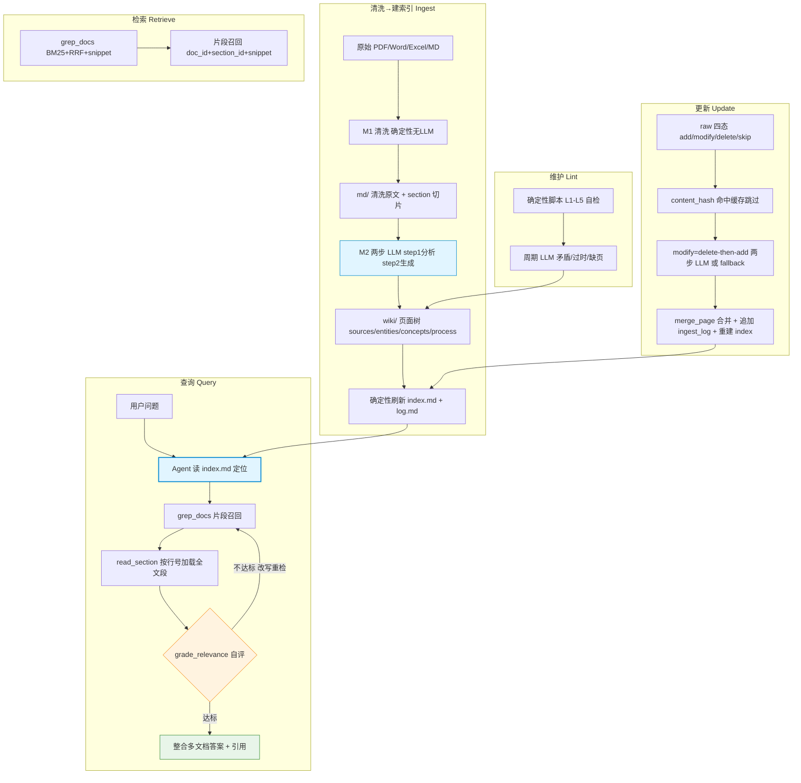

#### ① 清洗（Clean：raw → md，确定性、无 LLM）

**流程**（`ingest/clean.py` `clean_one`）：`raw_path` → `is_safe_path` 路径校验 → `make_doc_id` 派生稳定 ID → cleaner 分发清洗 → `section_splitter.split` 切 Section → 写 `md/{category}/{doc_id}.md`。

- **doc_id 派生**（`ingest/doc_id.py`，F1 稳定）：`doc_id = slugify(raw 相对路径) + "__" + sha256(文件字节)[:8]`。category 由 LLM 赋值会漂移，**不进 doc_id**（降为字段），故重分类不破坏引用；同路径内容变 → sha256 变 → 视为"修改"。
- **cleaner 分发**（`ingest/cleaners/dispatcher.py`）：按扩展名选——PDF（`pymupdf4llm`，退化表格 `pdfplumber` 兜底）/ Word（`pandoc gfm`）/ Excel（`pandas` 每 sheet 转完整 pipe 表，宽表 >20 列按 F4 拆分）/ MD（Setext 转 ATX 规范化）。未知扩展名 raise，编排层 warn 跳过。
- **section 切分**（`ingest/section_splitter.py`）：按 `#/##/###` 标题行切 Section，每个 Section 带 1-based `line_start/line_end` + `section_id`（s0/s1/…，重摄入稳定）。**section 是最小检索单元 = 索引单元 = 加载单元**（三层一致）。过长非表段（>200 行）按段落空行二次切分；**表格 Section 豁免**（表不可按空行切碎，否则字段说明断行）。
- **临时 category**：M1 无 LLM，category 由 raw 子目录第一段派生（`raw/data_table/order_detail.xlsx` → `data_table`），后续可由 M2 LLM 重分类迁移 md 路径（doc_id 不含 category，迁移不断链）。

**原理**：保留文档**全文 + 结构**，不切块、不向量化。表格的表头与数据行、字段说明与示例都留在同一份完整 markdown 内，规避了向量方案"切片切断上下文"的致命缺陷。

#### ② 建索引（Ingest：md → wiki，两步 LLM 编译）

> 对应 Karpathy "三层编译 raw→wiki→schema" 与 llm_wiki buildAnalysisPrompt/buildGenerationPrompt。本项目分 M2 两步 LLM 生成 + 确定性 index/log 刷新。

`ingest/wiki/ingest.py` `ingest_source` 单份摄入：读 md → `content_hash` → `check_cache`（**命中跳过两步 LLM**）→ `_two_step_llm`（LLM 可用）OR `build_fallback_pages`（不可用/失败）→ 逐页 `normalize_wiki_path` + `merge_page` → 写盘 → `rebuild_index` + `append_log` → `save_cache`。

- **step1 分析**（`llm/client.py` `chat_json`，`response_format=json_object`）：注入当前 `index.md`（判断实体是否已存在），返回结构化 JSON——`{entities[{name,slug,role,exists}], concepts[{name,slug,definition,exists}], processes[{name,slug,code,owner,steps[],upstream,downstream,exists}], summary, keywords}`。`exists` 标志用于避免重复生成已有页面。
- **step2 生成**（`chat_text`）：按 `---FILE: wiki/{sources|entities|concepts|process}/{slug}.md---` 块输出页面（process 目录是单数），`parse_file_blocks` 解析。frontmatter = `{type, title, created, updated, tags, related, sources}`；`related` 即 Karpathy `[[wikilink]]` 的工程化版（用裸 slug）。必产 1 张 source 摘要页，可选若干 entity/concept/process 页。
- **fallback**（LLM 失败时）：`build_fallback_pages` 确定性生成单页 `wiki/sources/{slug}.md`（M1 sections 拼接的标题 + 首段），保证不丢文档。
- **合并**（`ingest/wiki/merge.py` `merge_page`）：单源页（`sources == [当前源]`）→ 替换 body；多源页 → 追加段落并去重；frontmatter `UNION_FIELDS`（sources/tags/related）取并集、`LOCKED_FIELDS`（type/title/created）回填旧值；`validate_routing` 校验路径与 type 一致（容忍 `processes→process` 别名），不一致则 warn 丢弃。
- **确定性导航与日志**（`ingest/wiki/index_log.py`，无需 LLM）：`wiki/index.md`（按 frontmatter `type` 分组、组内按 title 排序、`- [[slug|title]]` 链接，原子 temp+rename 写入）+ `wiki/log.md`（append-only `## [YYYY-MM-DD] ingest | {identity}`）。
- **缓存**（`ingest/wiki/ingest_cache.py`）：`.cache/ingest-cache.json` 存 `source_identity → {hash, paths[]}`。命中条件 = hash 匹配 **且** 所有 written_paths 仍在磁盘（**ghost-page 感知**——某页被删则视为未摄入，重跑两步 LLM），支持中断后续灌。

**原理**：不切块、不向量化，保留文档**全文 + 结构**；`wiki/index.md` 是 Karpathy `index.md` 的落地版。**这是"知识编译一次"的落点**——实体/概念/流程页面、frontmatter、关联一次生成，反复复用，而非每次查询从原文临时重推。

#### ③ 检索（Retrieve：BM25 + RRF + snippet）

> 对应 llm_wiki 的 Query 检索段。本项目用纯关键词检索（向量库留 `VectorRetriever` 接口未启用），契约对 L2 透明。

- **entries 构建**（`cli/kb.py` `_wiki_entries`）：扫 `wiki/*.md`（排除 index/log/overview），对每页解析 frontmatter 取 title，再用 `section_splitter` 把 `title + body` 切成 Section，每个 Section 一条 entry = `{slug, section_id, title, body_text}`（title = `页面标题 / 章节标题`）。
- **BM25**（`retrieval/bm25.py`，rank-bm25 `BM25Okapi`，IDF + 文档长度归一）：corpus 文档文本 = `title + body_text`，`tokenize` 后建索引；查询时按词频命中过滤（小语料下 BM25Okapi IDF 可能为 0/负，故用词频判定是否召回而非 `score>0`），返回 `SearchHit{doc_id=slug, section_id, title, snippet, score, source="bm25"}`。
- **分词**（`retrieval/tokenizer.py`，F7）：`jieba.cut_for_search ∪ CJK 2-gram ∪ snake_case 复合词`，去重保序——兼顾中文分词、CJK 兜底、英文下划线术语（`order_id` 等不被 jieba 切散）。
- **RRF 融合**（`retrieval/base.py` `RRFFuser.fuse(k=60, top_k=10)`，吸收 llm_wiki RRF k=60）：`score=Σ 1/(k+rank_i)`，同 `(doc_id, section_id)` 取最高分合并。当前仅注册 BM25 → 单路直通（去重 + 截断），未来注册 `VectorRetriever` 即两路融合，契约不变。
- **snippet**（`retrieval/snippet.py` `make_snippet(md, line_start, line_end, max_chars=500)`）：按 1-based 行号切片，截断至 500 字——**片段而非全文**，低 token 成本快速定位候选章节。

**原理**：BM25 精确命中字段名/流程编号/术语，可解释、可重建、零训练；snippet 控制单次召回 token。检索返回的是"去哪找"的定位信号（doc_id + section_id + snippet），真正取全文由 Agent 的 `read_section` 按需触发——片段定位 + 全文理解，两段式既省 token 又保完整性。

#### ④ 更新（Update：增量三态编排 + 精准反向清理）

> 对应 llm_wiki 的增量 Ingest + Karpathy "一份资料可触及 10-15 个页面"。本项目 M3 落地了完整的 raw→wiki 增量闭环。

`ingest/incremental/ingest_flow.py` `run_incremental` 三态编排：

- **四态检测**（`change_detect.py` `detect_changes`）：扫 `raw/` 下支持扩展名文件，对比 `hash.json`（`{slug: {hash, path, ingested_at}}`）产出四集——**add**（无记录且存在）/ **modify**（有记录但 hash 变）/ **skip**（有记录 hash 不变）/ **delete**（hash.json 有记录但 raw 文件已不在）。
- **add / modify**（`_ingest_one`）：glob 找 md → `ingest_source` 摄入 → **事务提交：wiki/cache 写成功后才 `upsert_hash` + `append_ingest`**（hash 最后落盘 = 提交点，失败不污染 hash）。**modify = delete-then-add**：先 `purge_source(purge_md=False)` 清旧 wiki 页 + 旧 cache 条目（保留新 md 供重灌），再走 add。
- **delete**（`delete.py` `purge_source`，精准反向清理）：slug → 遍历 cache 反推匹配的 source_identity → 收集 `paths[]`（待删 wiki 页）→ 删 wiki 页 → 删 cache 条目 → 删 md → `remove_hash` → `rebuild_index`（无幽灵）。页面定位三层兜底：cache 反推（命中"旧 md 已删但 cache 条目仍在"的 modify 场景）→ 当前 md cache 条目补齐（常规 delete）→ `glob sources/{slug}__*.md` 兜底。
- **ingest_log**（`ingest_log.py`）：`knowledge_base/ingest_log.jsonl`，每行 `{ts, type, doc_id, action, source}`，记录 add/modify/delete/skipped/rebuild，append-only，可被 `grep` 解析。
- **`FlowSummary`** 暴露 `added/modified/deleted/skipped/failed/total/details`，便于 CI 统计与告警。
- **全量重建兜底**（`rebuild_all`）：清生成物（md/wiki/cache/hash/log）从 `raw/` 全量重建，幂等（raw 是真相源不动）——索引损坏时一键恢复，无需重跑 embedding。

**原理**：新增只追加新页面、不动已有；变更走 delete-then-add 精准替换；删除走 cache 反向定位无幽灵。hash.json + ingest-cache 双层缓存让增量摄入可中断续灌，不重复生成。事务以 hash 最后落盘为提交点，保证 raw 与 wiki 最终一致。

#### ⑤ 维护（Lint：确定性 L1-L5 + 周期 LLM 双层）

> 对应 llm_wiki 的 Lint 操作 + Karpathy "LLM 包揽枯燥维护"。**离线运维，非 Agent 工具**，不违反"仅查询不执行"硬约束。

**确定性脚本层**（`ingest/lint/checker.py` `run_lint`，便宜、可重复、CI 跑，复用 M2 frontmatter 解析，纯脚本不调 LLM）——L1-L5 五项自检：

| 项 | 级别 | 检查内容 |
| --- | --- | --- |
| **L1_FORMAT** | error | index.md/log.md 首行格式、ingest_log.jsonl 每行合法 JSON 含 ts/type、hash.json/ingest-cache.json 合法 JSON |
| **L2_GHOST / L2_MISSING** | error/warn | index.md 列出但磁盘无页（幽灵）/ 磁盘有页但 index 未列（遗漏） |
| **L3_ORPHAN** | warn | 非 source 页无 `related` 指向（孤儿页） |
| **L4_XREF** | warn | 两页 tags Jaccard ≥0.5 但无交叉引用（该连未连） |
| **L5_GAP** | info | 某 type 目录 0 页（知识缺口） |

产物 `lint_report.json` + 终端摘要 + 退码（`report.py`），CI 可门禁。

**周期 LLM 层**（贵、人工触发）：跨文档查矛盾（同一字段/流程编号不一致）、过时声明、缺失概念页、缺失交叉引用、数据缺口。**矛盾检测**靠这一层——比向量/BM25 强，因 wiki 有关联结构（`related` + `sources` 可追溯）。

**可重建性**：无模型漂移（不像 embedding 升级要全量重算）、无 GPU；坏了能从 `raw/` + 清洗脚本 100% 重建（`kb rebuild`）；`wiki/` 纯 markdown 可 git 版本控制、可 diff 审计。

#### 用户问题来了的整体查询路径（Query：Agent 自主规划多跳）

> 对应 llm_wiki 的 Query 操作。Agent 是控制层（怎么找），wiki 文件系统是底座（去哪找），两者在此交汇。

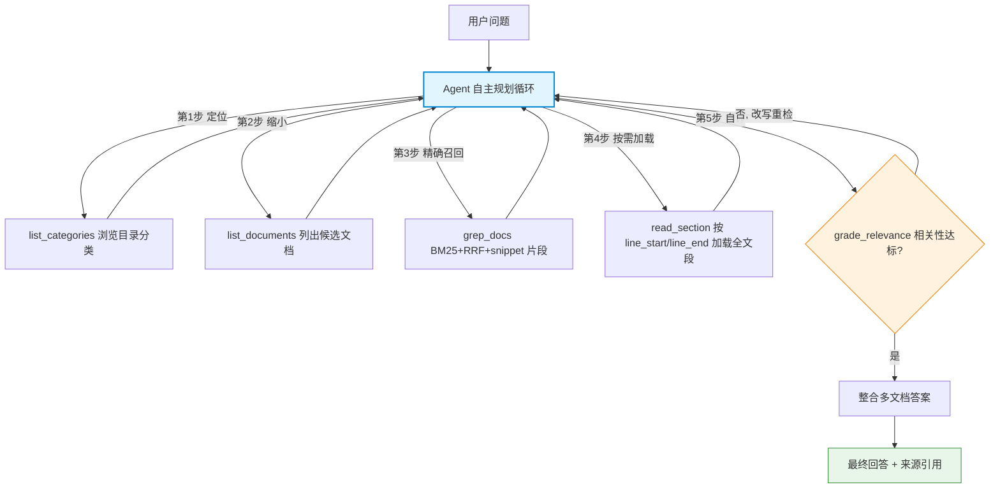

1. **定位**：Agent 先读 `wiki/index.md`（按 type 分组的页面目录），`list_categories`/`list_documents` 浏览分类与候选文档——靠 index 导航，不靠向量。
2. **精确召回**：`grep_docs` 用 BM25+RRF+snippet 召回片段（doc_id + section_id + ≤500 字 snippet），低 token 定位候选章节。
3. **按需加载**：`read_section` 按 `section.line_start/line_end` 加载该章节**完整原文**——表头与数据行、字段说明与示例**不再被切断**。
4. **自评**：`grade_relevance`（CRAG 式评分）判断是否信息充分。
5. **多跳重检**：不达标则改写查询/换文档/再 grep——把召回率从一次的概率事件变成**可迭代收敛的确定过程**（这正是"基于 Agent 非工作流"硬约束的技术内核）。
6. **整合**：信息充分后整合多文档答案，带来源引用返回。

**2026 年现状（核心结论）**：这是当前明确主流趋势，多个名字指同一模式——agent-as-retriever / agentic search / vectorless RAG / just-in-time context loading / tool-use retrieval。Claude Code、Cursor、Devin、Cline、Sourcegraph Amp 全部采用此模式，**都不把语料塞进向量库**。

**学术/实测背书**：

- LlamaIndex 官方 2026.01 实验 *"Did Filesystem Tools Kill Vector Search?"* + 开源 `fs-explorer`（工具集：read_file/grep_file_content/describe_dir_content/glob_paths/parse_file）。
- FinanceBench（表格密集财务文档）：agentic 关键词检索 30.40% **反超** 向量 RAG 24.24%。
- Vercel：加文件系统工具后砍掉 80% 专用工具，准确率反升。
- "The Filesystem Is the Database"（Mintlify/Turso/Box/ByteDance 共识）：文件系统是最古老最被验证的接口，agent 用它最自然。

**优点**：不切片、保留全文上下文、可解释、可多跳回溯、零向量库基础设施、知识结构化沉淀可复利。
**缺陷**：依赖 LLM 规划能力；token 消耗随加载文档增大（需配合长上下文模型 + 懒加载）；超大规模语料（GB 级）不如向量库。

**适合**：**正是你的场景**——1000 份结构化内部文档、按目录分类、多跳自评。

#### 5 个 L2 工具的真实支撑状态

| 工具                | L1 支撑                                  | 状态               |
| ----------------- | -------------------------------------- | ---------------- |
| `grep_docs`       | BM25+RRF+snippet 检索栈（`kb search`）      | ✅ 已实现（CLI）       |
| `read_section`    | `section_splitter` + `make_snippet` 原语 | 🟡 原语就绪，端点编排待 REST |
| `list_categories` | 目录结构 + index.md type 分组                | 🟡 待 REST 端点化      |
| `list_documents`  | `_collect_pages`（`index_log.py`）       | 🟡 待 REST 端点化      |
| `grade_relevance` | —                                      | L2 自评，非 L1 职责    |

> **结合现有代码说明**：L1 层（`l1_kb/` 包）已落地完整闭环——M1 清洗 + M2 两步 LLM 摄入生成 `wiki/` 页面树 + 确定性 `wiki/index.md`/`log.md` + M3 增量三态编排（add/modify/delete/skip）+ 精准反向清理 + L1-L5 确定性 lint + `rebuild_all` 全量重建兜底，经 `kb clean/ingest/index/lint/search/rebuild` CLI 验证。**REST 服务与 `read_section`/`list_*` 端点为待建**（原语均已就绪）。

**维护成本**：低到中。无向量库/GPU/图库；主要是 M2 两步 ingest 的 token + lint 脚本。wiki/ 纯 markdown 可重建、可 git 版本化。

---

## 三、检索控制层方案全集（Agent 如何调度检索）

这层决定"检索到的东西要不要信、要不要再找"。它们可以叠加在任意底座之上：

| 方案                        | 核心机制                                                  | 一句话定位               |
| ------------------------- | ----------------------------------------------------- | ------------------- |
| **Standard RAG**          | 固定流水线：检索→生成                                           | 基础，80% 生产系统仍在用      |
| **Self-RAG**              | 生成后自评（IsREL/IsSUP/IsUSE 反思 token），决定是否重检索/重生成         | 批判**答案**是否 grounded |
| **Corrective RAG (CRAG)** | 检索后先评估文档质量（Correct/Ambiguous/Incorrect），差则改写查询或回退 web | 批判**上下文**质量，修复检索失败  |
| **Adaptive RAG**          | 小分类器路由：简单问题跳过检索 / 中等单步 / 复杂多步                         | 按**查询复杂度**动态选路径     |
| **Agentic RAG**           | LLM 全自主规划：拆子任务、选工具、多步迭代、自评停止                          | **你的选型**，能力上限最高     |

### 控制层流程对比图

**Standard RAG**（固定流水线，无反馈）：

**Self-RAG**（生成后反思答案）：

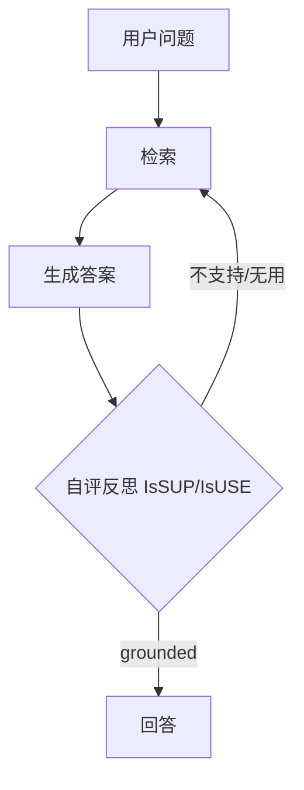

**Corrective RAG / CRAG**（检索后评估上下文）：

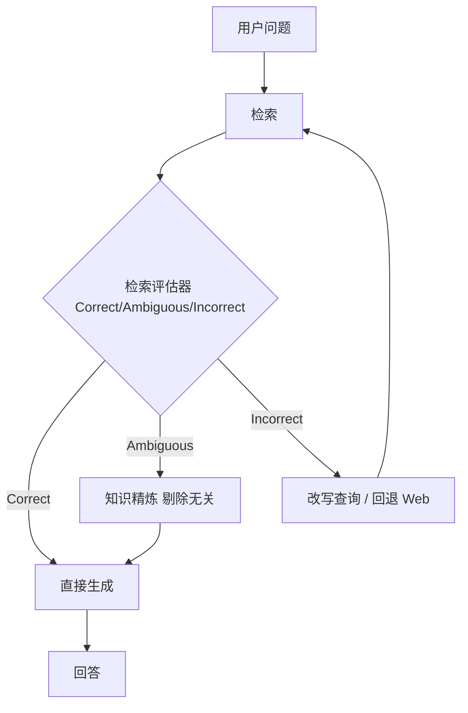

**Adaptive RAG**（按复杂度路由）：

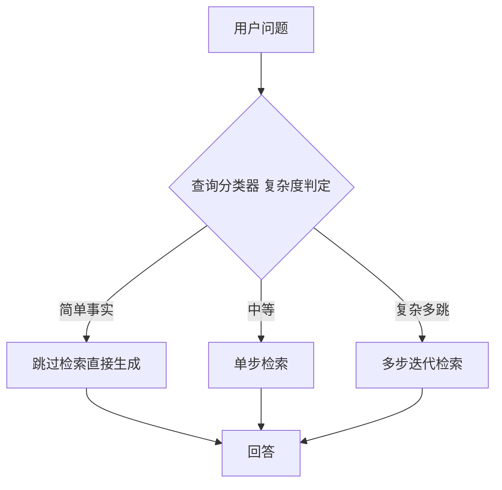

**Agentic RAG**（你的选型，全自主规划）：

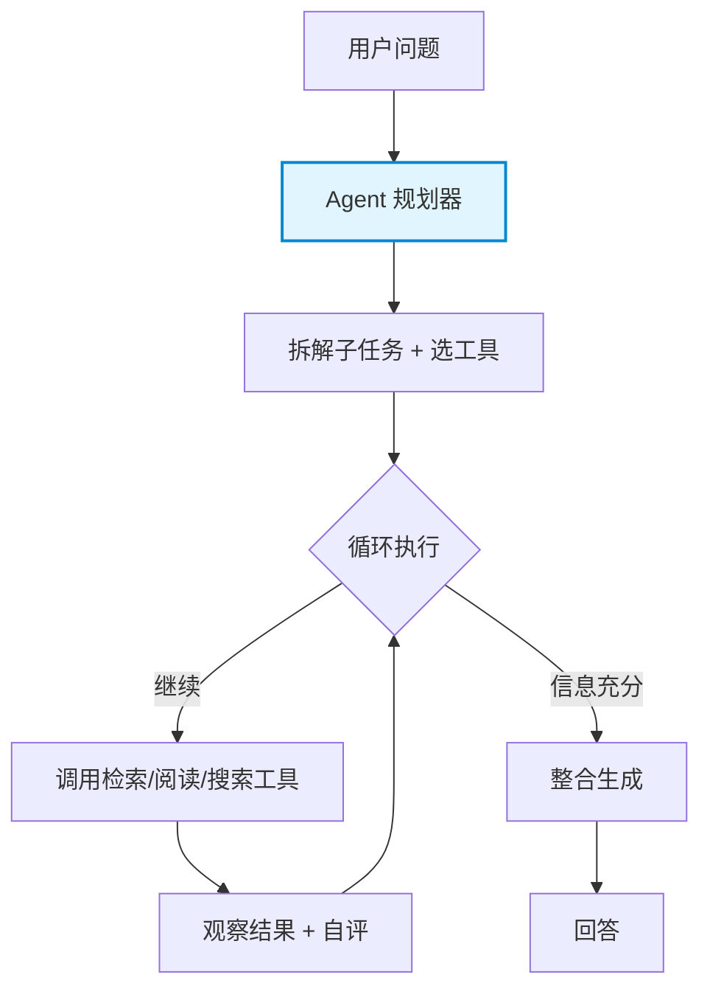

### 2026 成熟系统的分层叠加范式

**2026 成熟系统通常是分层叠加**（把上述控制层组合起来）：

你的"多跳 + 自我判断重试"需求 = **Agentic RAG 主控 + 内嵌 CRAG 式相关性评分 + Self-RAG 式答案自评**。这在 Agent 里通过工具（`grade_relevance`）+ 系统提示（自评停止条件）即可实现，无需额外框架。

### 3.x Agentic RAG 深入：片段检索 + 单篇全读 + 多次查询

Agentic RAG 作为我们的控制层主选，需要单独展开它相比传统工作流 RAG 的本质优势。核心是**两个检索粒度 + 一个迭代机制**：

**① 片段检索（`grep_docs`）**：BM25 关键词召回，返回 `doc_id + section_id + snippet`。snippet 按行号切片（≤500 字，`make_snippet`），**是片段，不是全文**——低 token 成本、快速定位候选章节。这一步解决"去哪找"。

**② 单篇内容全部检索（`read_section`）**：定位后按 `section.line_start/line_end` 加载该章节**完整原文**。表头与数据行、字段说明与示例**不再被切断**。"检索也是片段，但 Agent 可按需取全"——片段定位 + 全文理解，两段式既省 token 又保完整性。这一步解决"取多全"。

**③ 多次查询 > 工作流单次检索（核心论点）**：

| 维度       | 工作流 RAG（单次）              | Agentic RAG（多次迭代）                        |
| -------- | ------------------------ | ---------------------------------------- |
| 检索次数     | 一次，拼上下文即生成               | `grade_relevance` 自评，不达标则改写查询/换文档/再 grep |
| 召回上限     | **单次召回率即答案上限**，漏了就答错，无补救 | 多跳把召回率从一次的概率事件变成**可迭代收敛的确定过程**           |
| 错误恢复     | 无                        | 自评 → 重检循环，可跨文档补全                         |
| token 成本 | 低（一次）                    | 中（多次，但每次片段可控）                            |
| 适用       | 简单事实查询                   | 多跳、跨文档、需取全的结构化查询                         |

**本质区别**：单次检索的召回上限就是答案上限；Agent 多跳让"召回率"从一次的概率事件变成**可迭代收敛的确定过程**——这正是"基于 Agent 非工作流"硬约束（CLAUDE.md 第四节）的技术内核。工作流 RAG 召回不全只能答错，Agentic RAG 召回不全还能自我判断、改写重检直至取全。

**与方案 6 的关系**：Agentic RAG 是**控制层**（怎么找），方案 6 LLM Wiki Agent 文件系统导航是**底座层**（去哪找），两者组合 = "文件系统目录底座 × Agent 自主规划控制"（见 §1 关键认知）。grep_docs/read_section 这两个工具同时是方案 6 的工具集和 Agentic RAG 的检索原语，两层在此交汇。

---

## 四、Karpathy LLM Wiki 理念与两大开源实践

前面二、三节讲的是"检索底座"和"检索控制层"这两个**零件**。这一节讲两个把零件组装成**完整系统**的开源仓库——它们都源自同一个思想源头，但走向了截然不同的工程路线。对你"1000 份 PDF + Agent 驱动 + 企业自托管"的需求，这两个是现成可借鉴/可改造的参考实现。

### 4.0 思想源头：Karpathy 的 LLM Wiki 方法论

Andrej Karpathy（前 Tesla AI 总监、OpenAI 创始成员）在 2026 年发表的 [llm-wiki.md gist](https://gist.github.com/karpathy/442a6bf555914893e9891c11519de94f) 提出了一套用 LLM 构建知识库的设计模式。**核心理念一句话**：

> 传统 RAG 每次查询都从原始文档里"临时重新发现"知识，没有积累；Karpathy 主张让 LLM **增量构建并维护一个持久化的 Wiki**——知识编译一次、持续更新，而非每次重新推导。**Wiki 是一个会复利的产物（compounding artifact）。**

三个关键设计：

| 要素       | 说明                                                                                                                                                       |
| -------- | -------------------------------------------------------------------------------------------------------------------------------------------------------- |
| **三层架构** | 原始资料（不可变，只读）→ Wiki（LLM 生成的 markdown，LLM 拥有）→ Schema（CLAUDE.md/AGENTS.md，告诉 LLM 怎么结构化、怎么干活）                                                               |
| **三大操作** | **Ingest**（投入新资料→LLM 读、抽取、更新实体页/概念页/索引/日志，一份资料可触及 10-15 个页面）· **Query**（提问→LLM 搜相关页→带引用回答；好答案可回填进 Wiki）· **Lint**（定期健康检查：找矛盾、过时声明、孤儿页、缺失概念页、缺失交叉引用、数据缺口） |
| **角色分工** | 人类负责策展来源、提问、判断方向；**LLM 负责所有枯燥的维护工作**（摘要、交叉引用、归档、记账）——人类放弃 wiki 是因为维护成本增长快于价值，LLM 不嫌烦、不会忘、能一次改 15 个文件                                                     |

导航靠两个特殊文件：`index.md`（内容目录，LLM 答题前先读它找页面）+ `log.md`（时序操作记录，可被 `grep` 解析）。Karpathy 原话："Obsidian 是 IDE，LLM 是程序员，Wiki 是代码库。"

**关键洞察**：index.md 在中等规模（~100 份来源、~数百页）"出奇地好用"，**可以完全不需要 embedding RAG 基础设施**——这恰恰印证了你"按目录分类 + 按需加载原文"的直觉。

#### 4.0.1 建设原理：知识编译一次，而非每次重推

Karpathy 方法论的建设侧可归纳为四条原理，对应我们 L1 摄入 pipeline 的每一步：

1. **三层编译 `raw → wiki → schema`**：原始资料只读不可变；Wiki 由 LLM 生成的 markdown（实体页/概念页/流程页/来源页），LLM 拥有写权；Schema（CLAUDE.md）是"告诉 LLM 怎么结构化、怎么干活"的规约。三层解耦让"原料、知识、规则"各司其职。→ 对应 L1 的 `md/`（清洗原文）、`wiki/`（生成页面）、CLAUDE.md 约束。
2. **Ingest 六步**：① 投入新资料 → ② 检索相关已有页面 → ③ LLM 抽取/更新（实体/概念/流程/摘要/关键词）→ ④ 写回页面 → ⑤ 更新 `[[wikilink]]` 交叉引用 → ⑥ 刷新 `index.md`/`log.md`。一份资料可触及 10-15 个页面。→ 对应 L1 M2 两步 LLM（step1 分析 + step2 生成 `wiki/{sources,entities,concepts,process}/{slug}.md`）+ 确定性 `index.md`/`log.md` 刷新。
3. **结构化沉淀**：实体/概念/流程分目录 + frontmatter（type/related/sources），一次编译、持续复用，而非每次查询临时召回。→ 对应 L1 frontmatter `related` 字段。
4. **"编译一次而非每次重推"**：与传统 RAG 每次从原文临时切块召回的本质区别——知识在 Ingest 阶段就被结构化，Query 阶段只读取，不再重算。

#### 4.0.2 维护理念：LLM 维护成本近零，知识复利

维护侧四条理念，对应我们 L1 的 log/index/lint 体系：

1. **角色分工**：人类负责策展来源、提问、判断方向；**LLM 包揽所有枯燥的维护工作**（摘要、交叉引用、归档、记账）——人类放弃 wiki 是因为维护成本增长快于价值，LLM 不嫌烦、不会忘、能一次改 15 个文件。→ L1 摄入由 LLM 全自动，运维只需投料。
2. **Lint 混合体系**：确定性脚本查孤儿页/断裂 wikilink/frontmatter 缺失/格式（便宜可重复，CI 跑）+ 周期 LLM 查矛盾/过时/缺概念页（贵，人工触发）。两层互补：确定性兜底结构正确性，LLM 兜底语义正确性。→ 对应 L1 lint 计划。
3. **答案回填复利**：Query 答完把好结论回填进 Wiki，新知识持续累积，越用越准——这是 "compounding artifact" 的复利机制。Query 既是消费也是生产。
4. **维护成本近零**：无模型漂移（不像 embedding 模型升级要全量重算）、无 GPU；坏了能从 `raw/` + 清洗脚本 100% 重建；`wiki/` 纯 markdown 可 git 版本控制、可 diff 审计。→ L1 wiki/ 树天然满足。

### 4.1 两大开源实践对比

| 维度                | **llm_wiki**（nashsu）                                                                                                                               | **gbrain**（Garry Tan / YC）                                                                                                              |
| ----------------- | -------------------------------------------------------------------------------------------------------------------------------------------------- | --------------------------------------------------------------------------------------------------------------------------------------- |
| **与 Karpathy 关系** | ✅ **忠实实现**——README 明确致谢 Karpathy gist，三层架构/Ingest-Query-Lint/index.md/log.md/[[wikilink]] 全部照搬                                                     | ⚠️ **精神相近但独立**——自称"brain 层"，对标 YC 的 [company-brain RFS](https://www.ycombinator.com/rfs#company-brain)，不直接引用 Karpathy                   |
| **产品形态**          | 跨平台**桌面应用**（Tauri：Rust 后端 + React/Vite 前端，三栏布局）                                                                                                    | **CLI + MCP server**（无 GUI，Bun 运行时，配套轻量 admin 后台）                                                                                       |
| **知识库存储**         | **Markdown 文件**（Obsidian 兼容）+ YAML frontmatter + `[[wikilink]]`；文件即数据库                                                                             | **Postgres + pgvector 数据库**为主，markdown 仅作 git 版本控制的"人类策展层"（db_tracked），机器生成内容进 db_only                                                  |
| **检索底座**          | 关键词/向量 hybrid（**LanceDB**）+ 四信号知识图谱（直接链接/来源重叠/Adamic-Adar/类型亲和）+ Louvain 社区检测                                                                      | hybrid search（tsvector/BM25 + pgvector HNSW）+ RRF 融合 + **零 LLM 调用的实体图谱**（写页面时自动抽 `attended/works_at/invested_in` typed edges）           |
| **回答方式**          | 返回检索结果 + Agent 生成（Rust 后端 Chat Agent，工具调用）                                                                                                         | **Synthesis 层**——直接给"带引用的答案 + 明确指出 brain 还不知道什么"（gap analysis），而非返回 chunks                                                              |
| **Agent 能力**      | MCP server 暴露 **10 个工具**（status/projects/set_project/files/read_file/reviews/search/chat/graph/rescan）；本地 SKILL.md skills；Rust Chat Agent 自带工具调用循环 | **55 个 Claude Code 风格 skills**（ingest/query/maintain/enrich/citation-fixer/cron-scheduler…）；MCP op；24/7 daemon（"dream cycle"夜间整合记忆、修引用） |
| **多用户/企业**        | ❌ 单用户桌面应用，无权限隔离                                                                                                                                    | ✅ **多 source + per-user OAuth scope**，按登录隔离可见性，fuzz 测试零泄漏，明确支持 company brain                                                            |
| **自托管依赖**         | 云端 LLM API（任意 OpenAI 兼容端点）+ 桌面应用常驻；MCP 必须桌面应用运行                                                                                                    | Postgres/Supabase（或 PGLite 零配置）+ OpenAI embeddings API + LLM API；Docker 部署                                                              |
| **许可证**           | ⚠️ **GPL v3**（copyleft，二次修改分发需开源——对企业有传染性）                                                                                                         | ✅ **MIT**（企业友好，可闭源商用）                                                                                                                   |
| **成熟度/规模**        | v0.6.6，有测试，4 语言 README，活跃开发；个人知识库定位                                                                                                                | v0.32.x，**生产级**：作者自部署 146,646 页/24,585 人/5,339 公司/66 cron；严格 evals（BrainBench/LongMemEval，P@5 49.1%/R@5 97.9%）                          |

### 4.2 llm_wiki 流程

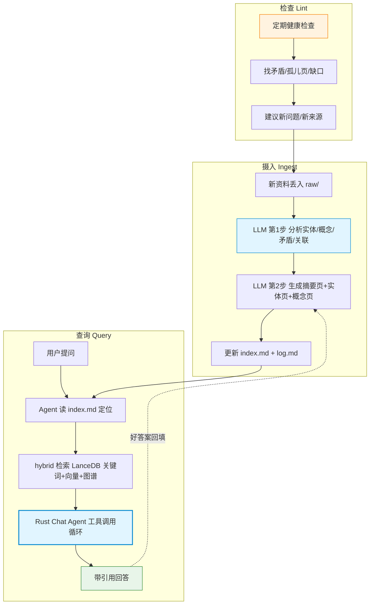

**llm_wiki 优势**：

- **Karpathy 原教旨**：三层架构 + Ingest/Query/Lint 完整闭环，markdown 文件即知识库，可读、可 git 版本控制、可 Obsidian 浏览。
- **index.md 导航**：中等规模无需向量库，与你"按目录分类"直觉一致。
- **MCP + Agent Skill 双接入**：既可作 Claude Code 的 MCP 工具，又有本地 skills。

**llm_wiki 劣势**：

- ⚠️ **GPL v3 许可证**——对企业是最大障碍：若二次开发并分发（含内部 SaaS 部署给多个业务部门），理论上需开源衍生作品。法务通常会卡。
- **桌面应用形态**：Tauri 桌面端，不是服务端部署；要给全公司业务人员用，需要每人装桌面应用或改造为 Web 服务——工程量大。
- **单用户**：无权限隔离，不适合多部门数据隔离（你的"数据产品/流程/数据表"可能涉不同密级）。
- MCP server 只是桌面 API 的代理，**必须桌面应用常驻运行**才能用，不适合服务器无头部署。

### 4.3 gbrain 流程

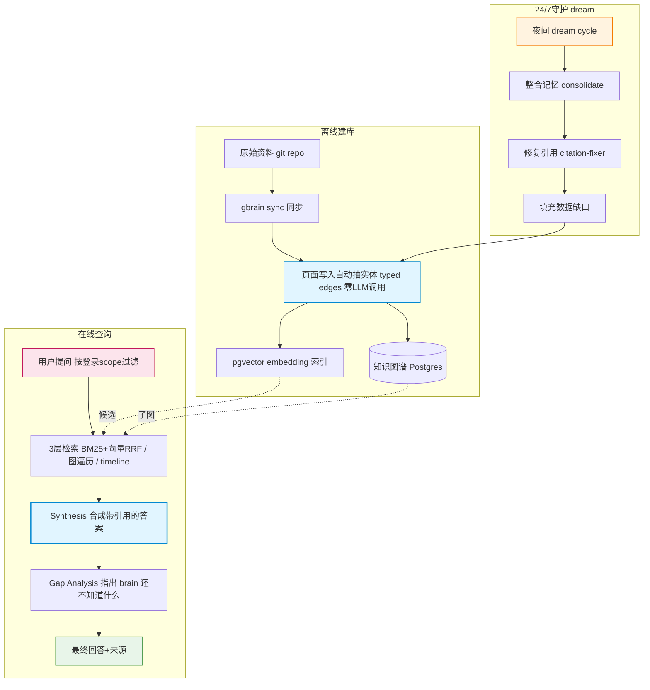

**gbrain 优势**：

- **企业级多用户**：per-user OAuth + source 隔离 + fuzz 测试零泄漏，天然支持你多部门数据隔离。
- **Synthesis + Gap Analysis**：不只返回 chunks，直接给答案并标注"知识缺口"——比纯检索更接近你要的"业务人员对话查询"。
- **零 LLM 调用图谱**：写页面时正则/规则抽实体关系，不烧 token，比 GraphRAG 的 LLM 抽取便宜得多。
- **24/7 dream cycle**：夜间自动整合、修引用、补缺口——知识库"自己保养"。
- **MIT 许可证**：企业可闭源商用，法务无压力。
- **生产验证**：14 万页实际跑通，evals 严格，P@5/R@5 有基准。
- **CLI + MCP 无头部署**：适合服务器，业务人员通过 Claude Code/Web 客户端访问。

**gbrain 劣势**：

- **重**：需 Postgres + pgvector（或 Supabase）+ OpenAI embeddings API + LLM API，基础设施和成本比纯文件方案高。
- **非 Karpathy 原教旨**：知识在数据库里，不是人眼可读的 markdown 文件目录，"可读性/可审计性"弱于 llm_wiki。
- **复杂度高**：55 个 skills、2MB CHANGELOG、364KB TODOS——学习曲线陡，二次定制门槛高。
- **依赖 OpenAI embeddings**：自托管若要完全离线，需换成自托管 embedding 模型（如 bge-m3），需改配置。
- **定位偏 CRM/人脉**：默认 typed edges（attended/works_at/invested_in）面向人-公司-交易，你的"接口文档/流程/数据表"需自定义本体。

### 4.4 如何应用到你的企业（1000 份 PDF 场景）

**结论先行**：两个都不建议"原样拿来用"，但**各取所长**最划算。

**路线 A（推荐）—— 以自建 Agent 为主干，借鉴两者理念，不绑定任一仓库**：

| 借鉴点                      | 来源                  | 落到你的系统                                                                                        |
| ------------------------ | ------------------- | --------------------------------------------------------------------------------------------- |
| 三层架构 + Ingest/Query/Lint | Karpathy / llm_wiki | PDF/Word/Excel→MD 清洗进 `md/`；LLM 两步生成 `wiki/` 实体/概念/流程/来源页；`wiki/index.md` 当目录；定期跑 lint 找矛盾/缺口 |
| `index.md` 导航 + 按需加载     | Karpathy / llm_wiki | 你的 `list_categories`/`list_documents`/`read_section` 工具就是这套；1000 份规模 index 够用                 |
| Gap Analysis + 答案带引用     | gbrain              | `grade_relevance` 工具 + 系统提示要求标注"未覆盖什么"                                                        |
| 权限隔离思路                   | gbrain              | 按目录/部门做 source 切分（data_product/process/data_table 各一源），Agent 查询前按用户身份限定可访问源                   |

**路线 B（次选）—— 直接基于 gbrain 改造**：若你接受 Postgres+pgvector 重基础设施，且需要多部门权限隔离，gbrain 是更省事的起点（MIT 许可、生产级、company-brain 教程现成）。需做：① 自定义本体（接口/字段/流程而非人/公司）；② embedding 换自托管模型；③ PDF→MD 摄入 pipeline 接你的 1000 份语料；④ 砍掉用不上的 CRM 类 skills。

**路线 C（不推荐）—— 直接用 llm_wiki**：GPL v3 + 桌面应用形态 + 单用户，三点都和你"企业自托管多业务部门"冲突。除非你的场景就是少数分析师的个人研究库，否则法务和部署都会卡。

**一句话**：Karpathy 的"持久化编译 wiki + LLM 维护"思想值得吸收，但具体实现上——**llm_wiki 太个人、许可证太重；gbrain 太重、定位偏 CRM**。你自建的 Agent + 文件系统导航主干（LLM Wiki Agent），恰好是两者之间最合身的中间路线（参考第五节推荐架构）。

---

## 五、方案选型对比总表

> 评分针对**你的场景**（1000 份结构化 PDF、Agent 调用、多跳自评、自托管）。⭐=契合度。

| 方案                 | 检索底座       | 表格/结构化准确率   | 多跳能力        | 自托管成本    | 实施复杂度    | Agent 可调用 | 契合度        |
| ------------------ | ---------- | ----------- | ----------- | -------- | -------- | --------- | ---------- |
| 向量检索               | 向量库        | ❌ 切片切断      | 中           | 中        | 中        | ✅         | ⭐⭐         |
| 关键词 BM25           | 倒排索引       | ✅ 精确术语      | 弱           | 低        | 低        | ✅         | ⭐⭐⭐        |
| 混合+Rerank          | 双索引        | 🟡 仍切片      | 中高          | 中高       | 中高       | ✅         | ⭐⭐⭐        |
| GraphRAG           | 知识图谱       | 🟡          | ✅ 最强        | 高        | 极高（数周建模） | ✅         | ⭐          |
| **LLM Wiki Agent** | **文件系统目录** | **✅ 全文不切片** | **✅ 可回溯多跳** | **低**    | **中**    | **✅ 原生**  | **⭐⭐⭐⭐⭐**  |
| 长上下文全量             | 无索引        | ✅           | 中           | 高（token） | 低        | —（执行手段）   | ⭐⭐⭐（配合方案6） |

**控制层叠加**（均 Agent 可调用，自托管友好）：

| 控制层             | 定位        | 是否纳入你的架构               |
| --------------- | --------- | ---------------------- |
| Standard RAG    | 基础流水线     | ❌ 太弱                   |
| Self-RAG        | 答案自评      | ✅ 系统提示内嵌               |
| CRAG            | 上下文评分+重检索 | ✅ `grade_relevance` 工具 |
| Adaptive RAG    | 查询路由      | ✅ Agent 分类即路由          |
| **Agentic RAG** | **自主规划**  | **✅ 主控（Agent）**        |

---

## 六、推荐架构（融合方案，非单选）

基于对比，你的最优解**不是单选某方案，而是以 LLM Wiki Agent 为主干、按需挂载其他底座作为工具**：

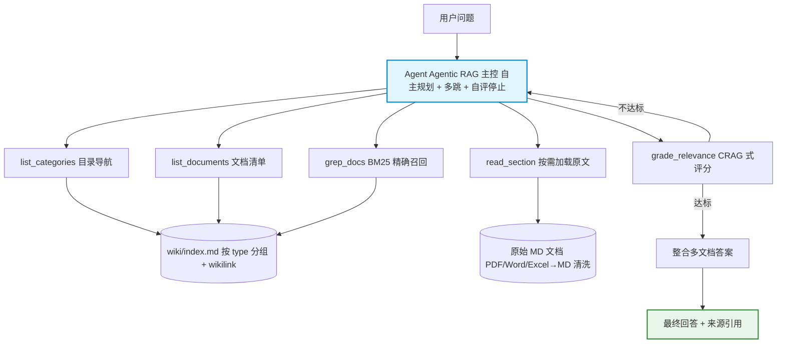

**分层落地**：

- **P0（主干）**：LLM Wiki Agent + `wiki/` 页面树 + `wiki/index.md` + BM25 grep + read_section + grade_relevance。覆盖 80% 查询。（L1 侧 M1 清洗 + M2 两步 LLM 摄入 + BM25/RRF/snippet 检索已落地，经 `kb search` CLI 验证。）
- **P1（质量）**：系统提示内嵌 Self-RAG 自评 + CRAG 重检循环，实现"多跳自我判断重试"。
- **P2（远期可选）**：若未来多跳关系查询增多且语料增长，再评估混合检索或 GraphRAG——1000 份规模当前不需要。

---

## 七、两份真实代码实现对比：从工作流 RAG 到 Agentic RAG 的演进

> 前面二～六节是**设计空间**的横向铺开（理论方案全集）。本节是**纵向落地**——把项目里实际跑起来的两份代码（`rag_agent_sdgft/` 向量库 Agent、`wiki_agent/` 目录 Agent）摆到一起，对照设计文档，看清"工作流 RAG → Agentic RAG"这一演进在代码上到底长什么样、还差什么。

### 7.1 演进脉络：为什么从向量库走向目录

最初版（`rag_agent_sdgft/`）走的是**经典向量 RAG**：文档切块 → embedding → Chroma → 余弦召回 → LLM 生成。这是 2023 年的默认姿势，也是绝大多数"RAG 教程"的样子。它已经是一个 Agent（ReAct 工具循环），但**底座是向量库 + 切片**，命中了 §2 方案 1 的两个致命缺陷——切片切断表格上下文、语义漂移导致业务口语与文档术语对不上。

演进版（`wiki_agent/`）把底座换成了**文件系统目录 + 整篇 markdown**：不切块、不向量化，BM25 在标题+关键词+摘要上做粗筛定位，命中后 `read_document` 把**整篇原文带行号**喂给 LLM。这正好对应 §2 方案 6 的"按目录分类 + 按需加载原文"直觉，也规避了切片损失。

> **一句话**：两版的**控制层都是 Agentic RAG**（LLM 自主多跳工具循环），区别在**底座**——向量库切片 vs 文件系统整篇。演进的本质是"把检索从『语义近邻切片召回』换成了『关键词定位 + 整篇加载』"，与本文档主推的方案 6 方向一致。

### 7.2 两份代码并排对比

| 维度                    | `rag_agent_sdgft/`（初始·向量库）                                       | `wiki_agent/`（演进·目录）                                                     |
| --------------------- | ---------------------------------------------------------------- | ------------------------------------------------------------------------ |
| **对应设计文档**            | §2 方案 1（向量检索）+ §3 Agentic RAG 控制层                                | §2 方案 6（LLM Wiki Agent）的**初始落地版**                                        |
| **检索底座**              | ChromaDB 向量库，`bge-small-zh-v1.5`（512 维，本地推理）                     | **无向量库**；BM25（rank-bm25 + jieba）over 标题+关键词+摘要                           |
| **检索单元**              | 500 字符切片，overlap 80（`chunk_size=500`）                            | **整篇文档不切片**；`read_document` 返回带行号全文                                      |
| **存储**                | `vector_store/chroma.sqlite3` + 每类目一个 collection                 | `wiki/index.json` + `wiki/catalog.json` + `wiki/<类目>/*.md`               |
| **类目隔离**              | 一个 Chroma collection 一个类目（api-doc/policy-doc/prd-excel）          | 文件目录分类，记录里带 `category` 字段，BM25 跨类目                                       |
| **Agent 工具**（4 个）     | `list_categories` / `list_documents` / `search` / `get_document` | `list_categories` / `list_documents` / `search_index` / `read_document`  |
| **`grade_relevance`** | ❌ 无                                                              | ❌ 无（自评靠系统提示，非工具）                                                         |
| **rerank / 查询改写**     | ❌ 无                                                              | ❌ 无                                                                      |
| **多跳/重试**             | 仅系统提示驱动（"可以多次检索，使用不同关键词"），无编码闸门                                  | 仅系统提示驱动（"自评：不足则继续检索"），无编码闸门                                              |
| **LLM**               | DeepSeek `deepseek-v4-flash`，temp 0.3                            | DeepSeek `deepseek-chat`，temp 0.2，含流式 `run_stream`                       |
| **引用格式**              | `[来源: doc_id (category)]`                                        | `[文档标题]`（行号可用于精确定位）                                                      |
| **会话**                | 多轮，保留最近 20 轮                                                     | 单次 `run()`（无跨轮历史）                                                        |
| **摄入**                | `ingest.py`+`kb.py` → Chroma；md/pypdf/openpyxl                   | `ingest.py`+`converters.py` → wiki/*.md + JSON 索引；md/pdfplumber/openpyxl |
| **自托管依赖**             | chromadb、sentence-transformers、modelscope（重）                     | rank-bm25、jieba、pdfplumber（轻，无 GPU 无模型）                                  |
| **测试**                | 无                                                                | `tests/test_kb.py`（9 项，pytest 或内置 runner）                                |

### 7.3 两版共同的关键缺口（对照设计文档）

两份代码**控制层都已是 Agentic RAG**，但都**缺了本文档主推架构里最关键的两个零件**——这也是"初始版"与"最终方案 6"之间的真实差距：

1. **没有 `grade_relevance` 工具（CRAG 式评分）**。设计文档（§3、§6）把"检索后自评 → 不达标改写重检"作为核心，要求由**工具**实现可编程的相关性闸门。两版代码都只把"自评"写进了**系统提示**（`rag_agent`："可以多次检索直到覆盖"；`wiki_agent`："自评：不足则继续检索"），靠 LLM 自觉，没有编码层面的分数阈值与强制重检循环。→ 这是"自我判断重试"硬约束尚未真正落地的地方。
2. **`wiki_agent` 还不是完整的方案 6**。方案 6 的底座是 Karpathy 式**持久化编译 wiki**：`wiki/` 是 LLM 两步生成的**实体页/概念页/流程页/来源页页面树** + `index.md`（按 type 分组导航）+ `log.md`（时序日志）+ frontmatter（type/related/sources 关联）。而 `wiki_agent/wiki/` 目前是**原始文档转出的 markdown + `index.json`/`catalog.json`**——是"清洗后的原文仓库"，**不是 LLM 编译的知识页面树**，没有 `index.md`/`log.md`、没有实体/概念页、没有 `related` 交叉引用、没有 lint。换言之，`wiki_agent` 落地了方案 6 的**检索控制 + 整篇加载**，但还没落地方案 6 的**知识编译沉淀**那一半（对应 `l1_kb/` 的 M2 两步 LLM 摄入）。

### 7.4 `rag_agent_sdgft/` 实现要点（向量库 Agent）

**检索栈**（`kb.py`）：`chromadb.PersistentClient(path="vector_store")`，每类目一个 collection；embedding 用 `SentenceTransformerEmbeddingFunction("BAAI/bge-small-zh-v1.5")`，本地推理，ModelScope 兜底下载。`search` 调 `coll.query(query_texts=[q], n_results=top_k)`，分数 = `1.0 - distance`；跨类目时每类取 top_k 再按分合并截断。

**切片**（`ingest.py` `chunk_text`）：固定字符滑窗，`chunk_size=500`、`chunk_overlap=80`、`step=420`。`.md` 直读、`.pdf` 用 pypdf 按页、`.xlsx` 用 openpyxl 把每行拍平成 ` | ` 连接、带 `=== Sheet: <name> ===` 标记。

**Agent 循环**（`agent.py` `CategoryRAGAgent.query`，86-140 行）：ReAct 风格，`max_iterations=20`，`tool_choice="auto"`；有 `tool_calls` 就逐个 dispatch 并把 JSON 结果作为 `role:"tool"` 回灌；无 `tool_calls` 即返回最终答案；到上限返回"已达最大推理轮次"。

**4 个工具**（`tools.py`，经 `ToolExecutor.execute` 分发）：

| 工具                | 参数                             | 返回                                                               |
| ----------------- | ------------------------------ | ---------------------------------------------------------------- |
| `list_categories` | —                              | `{categories:[{category, document_count, chunk_count}]}`         |
| `list_documents`  | `category`                     | `{document_ids:[...]}`                                           |
| `search`          | `query`, `category?`, `top_k?` | `{results:[{doc_id, chunk_id, category, text, score}]}`          |
| `get_document`    | `doc_id`                       | `{document:{doc_id, category, content, metadata:{chunk_count}}}` |

**设计取舍**：离线建库（`index_cli.py`，无需 API key）与在线查询解耦；空库时 `cli.py` 拒绝运行；conversation_history 截最近 20 轮。

**Agent 工作流**（`CategoryRAGAgent.query` ReAct 循环，最多 20 轮）：

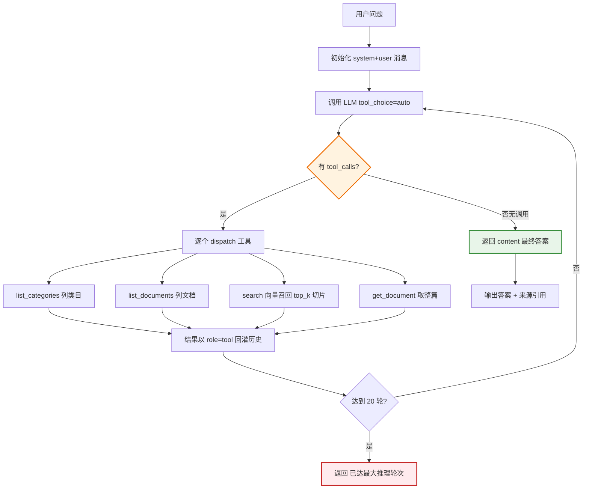

> 说明：图中"回灌 → 再问 LLM"即 ReAct 多跳循环；重试由系统提示驱动，无编码级 `grade_relevance` 闸门（命中 §7.3 缺口 1）。检索底座是 Chroma 向量库 + 500 字切片，故 `search` 召回的是切片而非整篇。

### 7.5 `wiki_agent/` 实现要点（目录 Agent · 方案 6 初始版）

**检索栈**（`kb_tools.py`）：**无 embedding、无向量库**。`_bm25_index()` 用 `BM25Okapi`，语料 = 每篇文档的 `_tokenize(标题 + " ".join(关键词) + 摘要)`（**不是全文**，全文由 `read_document` 按需取）；`_tokenize` 用 `jieba.cut` 并只留 `[一-龥A-Za-z0-9]`。BM25 索引 `lru_cache(maxsize=1)` 进程内缓存，`_invalidate_bm25()` 失效。`search_index` 对全量打分排序取 top_k（`score>0`），每条带 200 字摘要预览。

**整篇不切片**：`read_document` 直接读 `wiki/<类目>/<slug>.md`，返回**带行号全文**（`"{i}: {ln}"`）以支持精确引用。README 明确论证"为什么整篇不切片"——api-doc ~100 行、policy 150-700、prd 30-80，切片会把接口的请求参数/返回/枚拆散。

**4 个工具**（`agent.py` `TOOL_SPECS`，`_dispatch` 分发；`kb_tools.TOOLS` 注册表）：

| 工具                | 参数                  | 返回                                                                  |
| ----------------- | ------------------- | ------------------------------------------------------------------- |
| `list_categories` | —                   | `{categories:[{category, doc_count}]}`                              |
| `list_documents`  | `category?`         | `{documents:[{doc_id, title, source_file, line_count, headings}]}`  |
| `search_index`    | `query`, `top_k?=6` | `{results:[{doc_id, title, category, score, line_count, summary}]}` |
| `read_document`   | `doc_id`            | `{doc_id, title, category, line_count, content（带行号）}`               |

**系统提示**（`agent.py`，节选核心）：明确"基于工具的 Agent，自主规划，可多跳检索"——① `search_index` 用关键词定位；② `read_document` 读整篇确认；③ 一次不全就换关键词重试或读其他文档（多跳）；④ **自评：回答前确认是否已取到足够证据，不足则继续检索，不要臆造**；回答必须标 `[文档标题]` 引用，无信息时明说"知识库中未找到"。

**Agent 循环**（`agent.py` `run`，115-155 行）：`for _ in range(MAX_TOOL_ROUNDS)`（默认 20，`WIKI_MAX_TOOL_ROUNDS` 可调，`.env.example` 示例 8）；每轮 `chat.completions.create(tools=TOOL_SPECS, tool_choice="auto", temperature=0.2)`；无 `tool_calls` 即返回 `content`；到上限返回"已达到工具调用上限"。`run_stream` 把最终答案再以流式补发一遍。

**知识库结构**（`wiki_agent/wiki/`）：`index.json`（`DocRecord` 列表：`doc_id/title/category/source_file/wiki_file/line_count/summary/keywords`）+ `catalog.json`（`{类目:[{doc_id, title, source_file, line_count, headings}]}`，含各文档标题清单）+ `<类目>/*.md`（转换后的 markdown，带 widdershins 生成的 frontmatter）。**注意：没有 `index.md`、没有 `log.md`、没有实体/概念/流程页面树**——这是它区别于"完整方案 6"之处。

**摄入**（`ingest.py` `ingest()`，47-114 行）：`law/` → `wiki/<类目>/<slug>.md`，经 `converters.CONVERTERS`（md/pdf/xlsx）；`convert_pdf` 用正则跳过目录页、把"第X章/条/节"短行提升为 `###` 标题；`convert_xlsx` 限 200 行×20 列输出 markdown 表；每篇造 `DocRecord`（`build_summary` 取首 ~400 字、`extract_keywords` 取标题词 + jieba 高频 top-20），写 `index.json`+`catalog.json`。全量重建，秒级。**自包含**，不依赖 `l1_kb/` 或 `rag_agent_sdgft`。

**Agent 工作流**（`agent.py` `run` ReAct 循环，最多 `MAX_TOOL_ROUNDS` 轮，默认 20）：

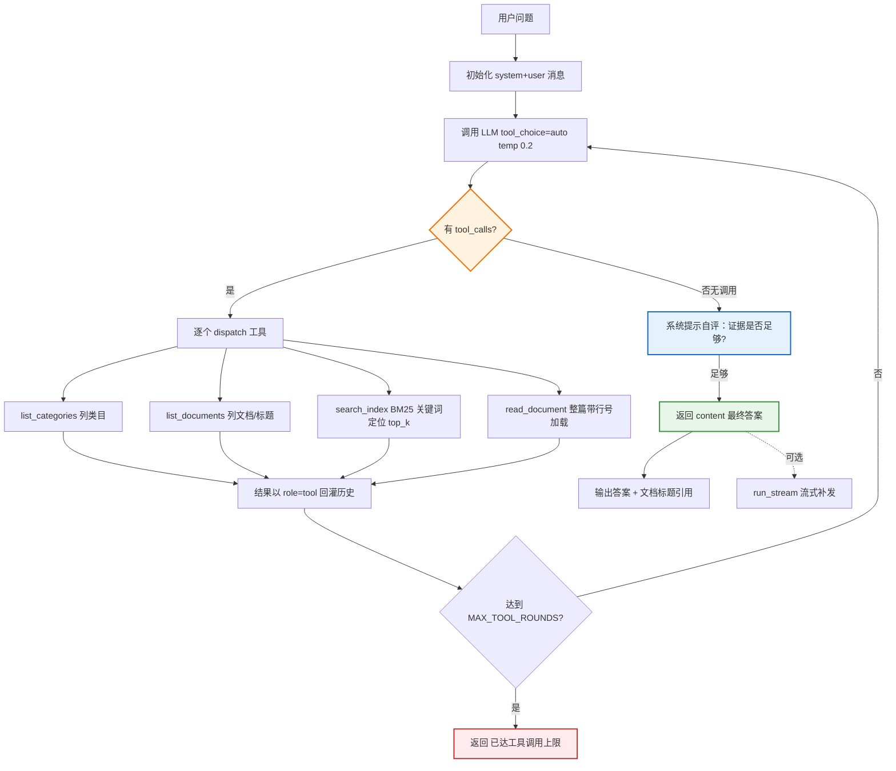

> 说明：与向量库版同构的 ReAct 多跳循环，差异在**检索底座**——`search_index` 走 BM25（标题+关键词+摘要）粗筛，`read_document` 走整篇带行号加载（不切片）。自评"证据是否足够"写在系统提示里，非编码闸门，故多跳收敛仍靠 LLM 自觉（命中 §7.3 缺口 1）。

### 7.6 演进结论与下一步

**结论**：`rag_agent_sdgft/` 是"**向量库 + Agentic 控制层**"的初始实现（对应方案 1 + Agentic RAG）；`wiki_agent/` 是"**文件系统目录 + 整篇加载 + Agentic 控制层**"的演进实现，**是方案 6 的初始落地版，但还不是完整方案 6**——它落地了方案 6 的"检索控制 + 按需加载原文"那一半，尚未落地"LLM 编译持久化 wiki 页面树 + index.md/log.md/lint"那一半。

**要把它推进到"最终方案 6"，还差三件事**（与 §6 推荐 P0/P1 对齐）：

1. **加 `grade_relevance` 工具 + 编码级重检闸门**——把"自评重试"从系统提示升级为可编程的 CRAG 式评分循环（命中 §3.x 核心论点：多次查询 > 单次检索）。这是"基于 Agent 非工作流"硬约束的技术内核。
2. **把 `wiki/` 从"原文仓库"升级为"编译知识页面树"**——接入 `l1_kb/` 的 M2 两步 LLM 摄入（step1 分析实体/概念/流程，step2 生成 `wiki/{sources,entities,concepts,process}/<slug>.md` + frontmatter `related`/`sources`），补 `index.md`（按 type 分组导航）与 `log.md`，让知识"编译一次、持续复利"而非每次查询从原文临时重推。
3. **补 lint 双层**——确定性脚本查孤儿页/断裂 wikilink/缺字段 + 周期 LLM 查跨文档矛盾/过时/缺口（方案 6 的维护侧，离线运维，不违反"仅查询不执行"硬约束）。

这三步完成后，`wiki_agent/` 即等于本文档推荐的"最终方案 6 = LLM Wiki Agent 主干 + Agentic RAG 控制层 + CRAG 自评重试"。

---

## 八、一句话结论

你的"Agent 驱动检索 + 按目录分类 + 按需加载原文"方案，在 2026 年**不是边缘尝试，而是 coding agent 领域已被验证的主流模式**（Claude Code/Cursor/Devin 同款），有 `fs-explorer` 等开源参考实现，且在表格密集文档上实测反超向量 RAG。**以 LLM Wiki Agent 为主干，BM25 做精确召回，Self-RAG+CRAG 做自评重试**——这是针对你 1000 份结构化内部 PDF 的最优组合，无需引入沉重的向量库或知识图谱。

---

## 参考资料（2026 调研）

- LlamaIndex — *Did Filesystem Tools Kill Vector Search?*（2026.01，fs-explorer 开源）
- Subramanian et al. — *Keyword Search is All You Need*（2026.02，agentic 关键词 vs 向量 RAG 实测）
- *The Filesystem Is the Database*（2026.04，Mintlify/Turso/Box/ByteDance）
- *AI Agents Don't Need Vector Search Anymore*（2026，agent-as-retriever 趋势综述）
- ValueStreamAI — *AI Knowledge Management 2026*（GraphRAG 67%→81%→94% 基准）
- Atlan — *12 Advanced RAG Techniques*（Self-RAG/CRAG/Adaptive RAG 机制）
- DEV — *Self-RAG vs Adaptive RAG vs Corrective RAG*（控制层分层叠加）
- AkitaOnRails — *Is RAG Dead? Long Context, Grep*（长上下文 vs RAG 取舍）
- Andrej Karpathy — [llm-wiki.md gist](https://gist.github.com/karpathy/442a6bf555914893e9891c11519de94f)（LLM Wiki 方法论原始设计模式）
- nashsu/llm_wiki — https://github.com/nashsu/llm_wiki（Karpathy 原教旨桌面实现，GPL v3）
- garrytan/gbrain — https://github.com/garrytan/gbrain（YC company-brain 生产级实现，MIT）
- Jeremy Howard — [llms.txt 提案](https://llmstxt.org)（2024.09，网站为 LLM 提供 markdown 上下文，与 Karpathy wiki 思想同源）

