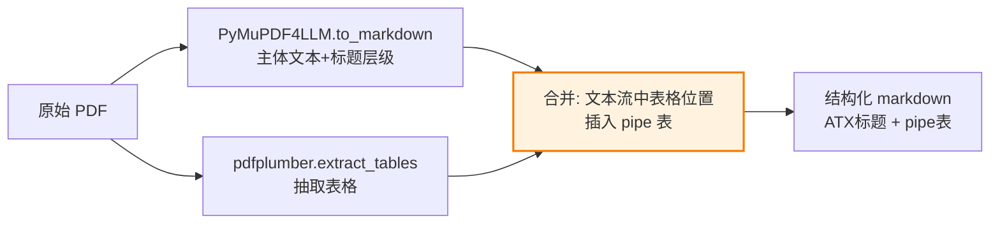
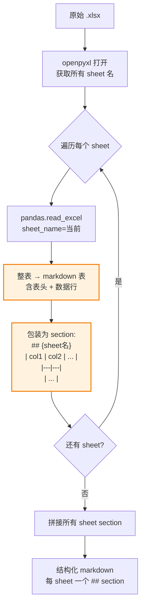
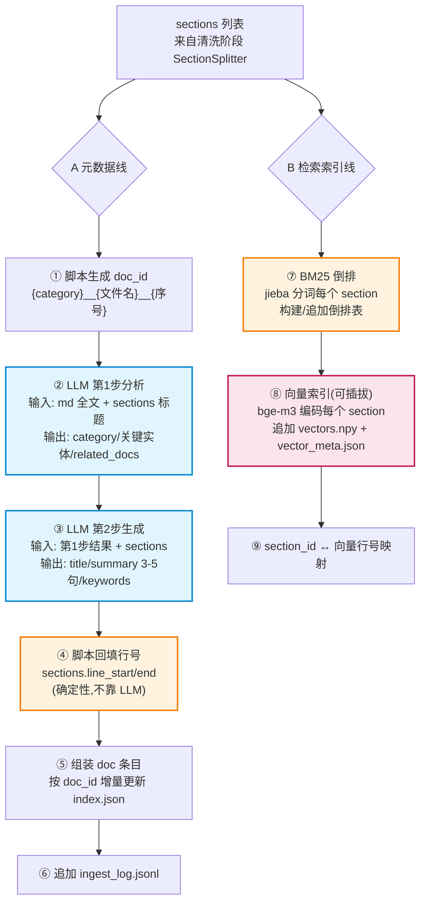

# P0｜自更新知识检索基础平台 PRD（评审稿）

> 项目：knowledge_agent（企业内部知识库 Agent）
> 阶段：P0｜L1 知识库层落地
> 产物：一个**自更新、可维护、可追溯**的知识检索基础平台
> 关联：[architecture_3layer.md](../../architecture_3layer.md)、[karpathy_wiki_selfbuild_research.md](../../karpathy_wiki_selfbuild_research.md)、[kb_retrieval_solutions.md](../../kb_retrieval_solutions.md)
> 日期：2026-07-30
> 文档定位：**会议评审用**，面向技术、产品、业务多方读者。前两章（摘要 + 名词速查）给非技术背景快速建立认知，后续章节给工程落地细节。建议评审会上按"摘要 → 名词速查 → 全局架构 → 切分/索引/查询/更新 → 验收 → 风险"顺序讲。

---

## 〇、评审摘要（30 秒抓全局）

**一句话**：我们要建一个"会自己更新、好维护、每一步都能查得到"的本地知识库检索地基——把公司约 1000 份 PDF/Word/Excel/Markdown 文档变成可对话查询的知识，让业务人员问一句就能拿到带出处的答案。

**痛点（为什么要做）**

1. 知识散落在 1000 份文档里，业务人员找信息靠人肉翻文件、问同事，慢且不准。
2. 传统做法是直接上"向量知识库"，但它有三大毛病：搜字段名/编号经常搜不到（精确词召回弱）、每次把整篇文档喂给大模型又慢又费钱、文档更新后知识库要么不更新要么得人工重灌。
3. 现有文档一直在变，知识库如果是一次性建好的"死库"，很快就过时。

**本方案怎么解决（一句话）**

- **检索更准**：用"关键词检索（BM25，抓精确词）+ 语义向量检索（抓意思）"两路互补融合，单路搜不到的，另一路补上。
- **更省更快**：把每篇文档切成"小段（section）"，检索只返回命中的那一段，不再把整篇喂给大模型——又快又省 token。
- **会自己更新**：文档一改，自动只重新处理改的那一份；原始文件永远不动，所有生成物都能一键重建。维护成本接近零。
- **全程可查**：每一份文档从原件到"被搜出来"的全过程都能追溯，不是黑盒。

**为什么不是直接上向量库**：向量库擅长"意思相近"，但企业知识里大量是字段名（`order_id`）、流程编号（`PRC-2024-003`）这类精确词，向量库经常搜不到。本方案关键词 + 向量双路融合，补上了这块盲区。

**P0 交付物**：一个能跑的检索地基 + 命令行工具 + 只读 API。本阶段不涉及对话界面和 AI 推理（那是 P1/P2）。

**本方案的一句话技术定位**：基于 Karpathy"LLM-Wiki"原理——知识编译一次、持续复利、维护成本近零。

> 评审决策点：① 是否认可"关键词+向量双路融合"优于纯向量库；② 是否认可"section 级召回+按需加载"的省成本思路；③ P0 范围是否合适（只做地基，不做对话）。详见文末「评审打勾清单」与「待决议问题」。

---

## 一、背景与动机

### 1.1 业务背景

公司内部积累了约 1000 份文档，主要分三类：

| 类别 | 内容 | 举例 |
| --- | --- | --- |
| **数据产品** | 接口文档、产品介绍 | "数据产品 A 的接口怎么调" |
| **流程制度** | 公司流程规范、制度文件 | "报销流程 PRC-2024-003 是什么" |
| **数据表字段说明** | 数据表的字段含义、类型 | "order_detail 表有哪些字段" |

业务人员的典型诉求是**对话式查询**：问一句自然语言，拿到带来源的答案。这需要一个能"准确找到相关段落"的检索地基。

### 1.2 痛点与现有方案的问题

直接套用常见的"向量知识库（RAG）"会有三个问题：

| 问题 | 表现 | 根因 |
| --- | --- | --- |
| **精确词搜不到** | 搜 `order_id`、`PRC-2024-003` 经常漏 | 纯向量靠"语义相近"，对精确符号/编号不敏感 |
| **又慢又费** | 每次把整篇文档喂给大模型 | 没有细粒度切分，返回粒度太粗 |
| **维护不了** | 文档更新后知识库过时或要人工重灌 | 缺乏自动增量更新机制 |

### 1.3 解决思路（对应三大痛点）

| 痛点 | 本方案对策 | 落到哪 |
| --- | --- | --- |
| 精确词搜不到 | BM25 关键词 + bge-m3 向量 **双路 RRF 融合** | §6 检索底座 |
| 又慢又费 | **section 级细粒度切分 + 按需加载**，只返回命中段 | §4 切分、§6.2 查询 |
| 维护不了 | **增量摄入 + 变更检测 + 可重建**，自动只处理变更 | §7 自更新 |

### 1.4 三大核心诉求（来自用户）

1. **可追溯**：能看到每份文档从 raw 到被检索命中的完整路径。
2. **可评估**：能验证检索是否准确、有效，并与普通向量知识库对比"更快、更准、更好用"。
3. **自维护**：后续更新与归纳自动化，不靠人盯。

### 1.5 为什么借鉴 Karpathy LLM-Wiki 原理

Karpathy（前特斯拉 AI 负责人）提出的 LLM-Wiki 方法论核心三条，恰好对应我们的诉求：

- **原始资料不可变 → 编译生成可重建**：原文不动，所有索引都是生成物，随时可重建 → 对应"可维护"。
- **知识编译一次、持续复利**：每次摄入只在已有基础上增量，越用越准 → 对应"自维护"。
- **Ingest（摄入）/ Query（查询）/ Lint（自检）三大操作**：清晰的离线/在线/检查分离 → 对应"可追溯、可评估"。

> 详见关联文档 `karpathy_wiki_selfbuild_research.md`。

---

## 二、名词速查（大白话 + 比喻，给非技术读者）

评审前先建立共同语言。下面用比喻把每个术语讲懂，后续章节不再重复解释。

| 术语 | 大白话 | 比喻 |
| --- | --- | --- |
| **raw（原件）** | 原始的 PDF/Word/Excel，永远不改 | 图书馆里的原版书，只读不写 |
| **md（清洗产物）** | 把原件转成统一格式的 markdown，保留表格 | 把原版书扫描成带目录的电子版 |
| **section（小段）** | 把一篇文档按标题切成的小段，是最小检索单位 | 书的"章节"，但切得更细，到小节级 |
| **index.json（目录）** | 全部文档的导航目录：标题、摘要、关键词、章节位置 | 图书馆的检索卡片柜 |
| **摄入（Ingest）** | 把一份新文档处理后加进知识库 | 新书入库：编目、上架、登记 |
| **BM25（关键词检索）** | 按词精确匹配打分的检索法 | 书后索引：查"order_id"精确翻到那一页 |
| **向量检索** | 按"意思相近"找的检索法 | "查这本书讲啥的"——按内容含义找 |
| **bge-m3** | 一个开源的中文语义向量模型，本地跑 | 一个会把文字变成"意思坐标"的翻译器 |
| **RRF（融合）** | 把两路检索结果按排名合成一路的方法 | 两个评委各打分，按综合排名取前十 |
| **倒排索引** | "词 → 出现在哪些段"的反查表 | 书后索引的反查表：词→页码 |
| **hash（哈希）** | 文件内容的指纹，变了就不同 | 文件的"身份证号"，内容一改就变 |
| **增量更新** | 只重新处理改过的那一份，不全量重来 | 图书馆只重新编目新进的那本书，不重排整个馆 |
| **可重建** | 所有生成物都能从 raw 一键重做 | 电子版丢了？拿原版书重新扫描一遍就行 |
| **Lint（自检）** | 脚本自动检查知识库有没有结构问题 | 馆员定期查：有没有孤儿书、断链、缺登记 |
| **可插拔** | 某个模块能装能拆，不影响其他 | 像插头，向量检索不装也能用关键词检索 |

**核心比喻串起来**：把 1000 份文档想象成一个图书馆——raw 是原版书（只读），md 是扫描电子版，index.json 是检索卡片柜，section 是书的章节。检索时先用"书后索引（BM25）"和"按意思找（向量）"两个方法各找一批，再由"评委（RRF）"综合排出最相关的几段，只把那几段给大模型读。新书入库（摄入）只编目那一本，电子版丢了能拿原版重扫（可重建）。

---

## 三、目标与范围

### 3.1 目标

构建一个**自更新、好维护、全链路可追溯**的本地化知识检索基础平台（L1），为后续 L2 Agent 提供只读检索 API。平台基于 Karpathy LLM-Wiki 原理：知识编译一次、持续复利、维护成本近零。

### 3.2 范围（P0 包含）

| 包含 | 不包含（留后续） |
| --- | --- |
| 文档清洗 pipeline（PDF/Word/Excel/MD → MD） | L2 pi Agent（P1） |
| index.json 生成（LLM 两步归纳） | L3 Open WebUI 集成（P2） |
| 检索底座（BM25 + 向量 RRF 融合，可插拔） | LLM rerank 重排（P1/P2） |
| 自更新闭环（增量摄入 + 变更检测 + Lint + 可重建） | 答案回填 wiki（P3 可选，需人工审核） |
| 只读 REST API + CLI | 周期 LLM Lint（矛盾/过时检测，P1） |
| 评估体系（vs 纯向量库对比） | 多用户权限隔离（P1） |

### 3.3 硬约束（来自 CLAUDE.md，不可违反）

1. **独立项目**：自包含，不依赖仓库其他文件夹。
2. **只读查询，不执行动作**：API/工具边界严格限定为查询/检索/读取，无写入/执行/外部调用端点。
3. **全部自托管**：数据、服务在公司内部运行，LLM 端点走公司内部 OpenAI 兼容服务，不依赖外部 SaaS。
4. **基于 Agent，非工作流**（L2 层，P1）：知识检索由 Agent 自主规划。
5. **框架 = pi**（L2 层，P1）。

> 注：硬约束 4/5 属于 L2，P0 只需保证 L1 提供稳定只读契约供 L2 调用。

### 3.4 技术栈决策汇总

| 决策项 | 结论 | 决策依据 |
| --- | --- | --- |
| L1 语言 | Python（FastAPI 服务 + 摄入脚本同语言） | 文档清洗库生态最成熟；摄入/服务复用清洗逻辑；L2 用 TS/pi 经 HTTP 解耦无影响 |
| 时序日志 | 保留 `ingest_log.jsonl`（append-only 文件态） | 零依赖、git 可追踪、自更新闭环依据；P0 不引入数据库 |
| index 生成 | LLM 两步生成（摘要/关键词/章节锚点/related_docs） | index 含金量直接决定 L2 召回质量；章节锚点是 read_section 前提 |
| 检索底座 | BM25(jieba) + bge-m3 向量 + RRF 融合 | BM25 抓精确词（字段名/编号），向量抓语义，互补 |
| 部署形态 | bge-m3 进程内嵌入，内存索引 + 文件持久化 | 1000 份规模内存够用；零外部服务；升级路径清晰（→LanceDB/Qdrant） |
| 运行设备 | CPU（无 GPU 依赖） | 部署门槛低；首次建索引慢可接受 |
| 清洗架构 | 统一 `BaseCleaner` 接口 + 按扩展名分发 | 统一抽象，易扩展 |
| Word 清洗 | Pandoc | 转 markdown 质量最好 |
| 检索粒度 | section 级 | 检索单元=索引单元=加载单元，三层一致 |
| 检索底座结构 | Retriever 接口 + 多实现 + RRF 融合器（可插拔） | 契约不变、内部可演进；P0 单路也能跑 |
| 自更新触发 | `kb watch` 文件监听 + `kb ingest`/`kb lint` 手动命令 | 自动化够用、可控 |

> ⚠️ **待修文档不一致**：`architecture_3layer.md` 第 16 行写"TypeScript/Node 服务"，本 PRD 明确为 Python/FastAPI；第 63 行 `assets/` 目录、第 235 行"多模态图片提取+视觉描述"应删除（无图片场景）。属已知待修，不阻塞 P0。

---

## 四、全局架构与检索流程

### 4.1 分层视图

平台分两条流水线：**离线摄入流水线**（生成知识产物）与**在线检索服务**（提供查询），共享 `knowledge_base/` 文件态存储。

```
┌─────────────────────────── 离线摄入流水线（自更新闭环）───────────────────────────┐
│                                                                                   │
│   raw/ ──变更检测──▶ Cleaner ──▶ md/ ──▶ IndexBuilder(LLM两步) ──▶ index.json    │
│        (文件监听)    (按类型分发)         (摘要/关键词/锚点/关联)                    │
│                                              │                                    │
│                                              ├──▶ 向量索引(vectors.npy)            │
│                                              └──▶ ingest_log.jsonl (append)       │
│                                                                                   │
│   Lint(确定性脚本) ──周期/手动──▶ lint_report.json (孤儿页/缺链接/格式/数据缺口)    │
└───────────────────────────────────────────────────────────────────────────────────┘
                                        │
                                        ▼ (共享文件态)
┌─────────────────────────── 在线检索服务（只读 REST + CLI）─────────────────────────┐
│                                                                                   │
│   /search ──▶ RRFFuser ──┬──▶ BM25Retriever ──▶ section 级候选                    │
│             (RRF融合)     └──▶ VectorRetriever ─▶ section 级候选  (可插拔,可缺)   │
│                          ──▶ top_k 结果(doc_id+section_id+snippet+score)          │
│                                                                                   │
│   /index /categories /documents /documents/{id} /health ──▶ index.json + md/      │
└───────────────────────────────────────────────────────────────────────────────────┘
```

### 4.2 检索路径全链路（可追溯核心）

每份文档从原件到被命中的完整坐标，全程可回溯到 raw 原件。这是平台区别于黑盒 RAG 的关键。

```
raw/order_detail.xlsx                      ← 唯一真相源(不可变)
  │  [清洗] PyMuPDF4LLM/pdfplumber/python-docx+Pandoc/openpyxl
  ▼
md/data_table/order_detail.md              ← 清洗产物(section 切分, 保留表格)
  │  [归纳] LLM 两步: 识别类型/实体/关联 → 生成摘要/关键词/锚点/related
  ▼
index.json::documents[doc_id]              ← 导航核心
  │  doc_id = data_table__order_detail__001
  │  sections = [{section_id, title, line_start, line_end}]
  │  related_docs = [...]
  │  [索引] BM25 倒排(over md sections) + 向量(bge-m3 over sections)
  ▼
检索索引 (section 级)                       ← 检索单元 = 索引单元 = 加载单元
  │  [查询] /search?q=order_id → RRF 融合 → top_k
  ▼
命中结果: doc_id + section_id + snippet + score
  │  [加载] /documents/{id}?section=s0 → 按行号切片返回该段
  ▼
CLI: kb search "order_id" → 命中段 + 来源路径 + 分数
```

**可追溯命令**：`kb trace <doc_id>` 打印该文档在管线各环节的状态（raw 存在性、md 生成时间、index 条目、向量就绪性、最近一次摄入/lint 记录）。

### 4.3 三大操作（Karpathy Ingest/Query/Lint 落地）

| Karpathy 操作 | 本项目落点 | 自动化程度 |
| --- | --- | --- |
| **Ingest** | 离线摄入流水线：变更检测→清洗→LLM两步→index/向量→log | `kb watch` 自动 / `kb ingest` 手动 |
| **Query** | 在线检索服务 `/search` + CLI | 在线实时 |
| **Lint** | 确定性脚本检查（P0）+ 周期 LLM 检查（P1） | `kb lint` 手动 / CI 跑 |

---

## 五、数据模型

全文件态，零数据库，git 可追踪。

```
l1_kb/
├── knowledge_base/                    # 数据(生成物 + 原件)
│   ├── raw/                           # 原始文档(不可变,只读,真相源)
│   │   ├── data_product/              # 数据产品:接口文档/产品介绍
│   │   ├── process/                   # 公司流程制度
│   │   └── data_table/                # 数据表字段说明
│   ├── md/                            # 文档→MD 清洗结果(保留表格/版式)
│   │   ├── data_product/{api_docs,intro}/
│   │   ├── process/
│   │   └── data_table/
│   ├── index.json                     # 全局目录(标题/摘要/关键词/章节锚点/related_docs)
│   ├── ingest_log.jsonl               # 摄入时序日志(append-only, 可 grep)
│   ├── hash.json                      # 变更检测:每份 raw 文档的哈希
│   ├── vectors.npy                    # section 向量(bge-m3, 内存加载+落盘)
│   ├── vector_meta.json               # 向量元数据(section_id ↔ 向量行号)
│   └── lint_report.json               # 最近一次 lint 报告
├── ingest/                            # 摄入脚本(python)
├── service/                           # 检索 API 服务(FastAPI)
└── cli/                               # CLI 工具
```

### 5.1 raw 不可变原则

- `raw/` 是唯一真相源，**LLM/服务只读不写**。
- `md/`、`index.json`、`vectors.npy`、`ingest_log.jsonl` 全是 raw 的**生成物**，可随时从 raw 重建（见 §7.4 可重建性）。

---

## 六、清洗 pipeline（文档 → MD → section 切分）

> **通俗讲**：这一步像"扫描入库"——把各种格式的原件（PDF/Word/Excel/MD）统一扫描成带目录的电子版（markdown），再按标题切成一个个"小段（section）"。切得细不细、表保不保得住，直接决定后面能不能搜得准。这是 P0 工程量最大的模块。

### 6.1 架构：BaseCleaner + 按扩展名分发 + SectionSplitter

```
clean(raw_path)
  │
  ▼
dispatcher(按扩展名) ──┬─ .pdf  ─▶ PdfCleaner
                      ├─ .docx ─▶ WordCleaner
                      ├─ .xlsx ─▶ ExcelCleaner
                      └─ .md   ─▶ MarkdownCleaner
  │
  ▼  各 Cleaner 输出: 统一 markdown 文本(带 ATX 标题层级 + pipe 表)
  │
  ▼
SectionSplitter.split(md_text) ──▶ [(section_id, title, line_start, line_end, level, body), ...]
  │  解析 # / ## / ### 标题行号, 按标题切块
  ▼
写入 md/{category}/{doc_id}.md  +  返回 sections 列表(供 IndexBuilder)
```

```python
class BaseCleaner:
    def to_markdown(self, raw_path: Path) -> str:
        """返回清洗后的 markdown: ATX 标题(#/##/###) + pipe 表格."""
        raise NotImplementedError

class PdfCleaner(BaseCleaner): ...      # PyMuPDF4LLM.to_markdown + pdfplumber.extract_tables 兜底
class WordCleaner(BaseCleaner): ...     # Pandoc 转换(docx→md, ATX标题+pipe表)
class ExcelCleaner(BaseCleaner): ...    # openpyxl+pandas: 每 sheet → 完整 markdown 表(## sheet名)
class MarkdownCleaner(BaseCleaner): ... # 原样保留(仅规范化标题层级)

CLEANERS = {".pdf": PdfCleaner, ".docx": WordCleaner, ".xlsx": ExcelCleaner, ".md": MarkdownCleaner}
```

### 6.2 各类型清洗要点与实现细节

#### 6.2.1 PDF（PdfCleaner）



- **主流程**：`PyMuPDF4LLM.to_markdown()` 负责正文与标题层级（它内部已处理分栏、阅读顺序）。
- **表格兜底**：PyMuPDF4LLM 对复杂表格可能转不全，用 `pdfplumber.extract_tables()` 抽取，转成 pipe 表后按页码+坐标回填到正文对应位置。
- **边界处理**：页眉页脚去重；跨页表格合并；空行压缩。
- **为什么两库并用**：PyMuPDF4LLM 文本强但表格弱，pdfplumber 表格强但不输出文本流，互补。

#### 6.2.2 Word（WordCleaner / Pandoc）


- **命令**：`pandoc input.docx -f docx -t gfm --wrap=none`（GitHub Flavored Markdown，原生支持 ATX 标题 + pipe 表）。
- **规范化**：Pandoc 偶尔输出 Setext 标题（下划线式），统一转 ATX（`#`）；确保表格为 pipe 格式。
- **依赖**：Pandoc 二进制（docker 镜像内 `apt install pandoc`）。

#### 6.2.3 Excel（ExcelCleaner）—— 重中之重



- **核心**：`pandas.read_excel(sheet_name=None)` 一次读全部 sheet，每个 sheet `df.to_markdown(index=False)` 转 pipe 表。
- **每 sheet = 一个 section**（对应决策）：`## {sheet名}` 作为标题，下面整张表。这样 `read_section(doc_id, sheet名)` 精准取一个表，BM25 既能召回表名也能召回字段名。
- **空 sheet 跳过**；合并单元格预处理（`fillna(method='ffill')`）。
- **为什么整表而非行**：行级上下文太碎、BM25 信号弱；整表保留字段名+类型+说明上下文，召回质量最高。

#### 6.2.4 Markdown（MarkdownCleaner）

原样保留，仅规范化标题层级（统一 ATX `#`），确保后续 SectionSplitter 能正确解析。

### 6.3 section 切分（SectionSplitter）—— 检索质量命脉

清洗产出的 markdown 按 `#`/`##`/`###` 标题切分。**section 是最小检索单元 = 索引单元 = 加载单元**（三层一致）。行号范围由脚本解析标题行号确定（确定性，不靠 LLM）。

```mermaid
flowchart LR
    MD[清洗后 markdown] --> PARSE[逐行扫描<br/>匹配 ^#{1,3}\s 标题正则]
    PARSE --> CUT[按标题行切块<br/>每块 = 一个 section]
    CUT --> ASSIGN[分配 section_id: s0, s1, s2...<br/>记录 line_start/line_end/level]
    ASSIGN --> OUT["sections = [<br/>  {s0, 'Sheet1:订单主表', 1, 48, 2},<br/>  {s1, 'Sheet2:明细', 49, 95, 2},<br/>  ...<br/>]"]
    style CUT fill:#e1f5ff,stroke:#0288d1,stroke-width:2px
```

**切分规则**：

1. 逐行扫描，正则 `^#{1,3}\s+(.+)` 匹配标题行，记录行号与层级。
2. 两个相邻标题行之间为一个 section：`line_start` = 标题行号，`line_end` = 下一个标题行号 - 1（末尾 section 到文件末）。
3. section 内容 = 标题 + 该段正文（含表格）。
4. **无标题文档兜底**：整篇作为一个 section `s0`。
5. **过长 section 兜底**：单个 section 超过 N 行（默认 200）时，按段落空行二次切分，避免单段过大稀释 BM25 信号。

**section_id 稳定**：按出现顺序 `s0/s1/...`，重摄入同一文档时顺序一致，保证向量索引行号稳定。

### 6.4 一个 Excel 文档的完整切分示例

输入 `order_detail.xlsx`（2 个 sheet），清洗 + 切分后 `md/data_table/order_detail.md`：

```markdown
## Sheet1: 订单主表
| order_id | order_status | amount | created_at |
|----------|--------------|--------|------------|
| string   | string       | decimal| datetime   |
| 订单唯一标识 | 订单状态 | 金额 | 创建时间 |

## Sheet2: 订单明细
| detail_id | order_id | product_name | qty |
|-----------|----------|--------------|-----|
| string    | string   | string       | int |
| 明细唯一标识 | 关联订单ID | 商品名称 | 数量 |
```

切分结果：2 个 section —— `s0`(行1-5, "Sheet1: 订单主表")、`s1`(行7-12, "Sheet2: 订单明细")。BM25 搜 `order_id` 命中 `s0` 和 `s1`（两表都有此字段），返回各自 snippet。

---

## 七、index.json schema

> **通俗讲**：index.json 就是整个知识库的"检索卡片柜"——每份文档一张卡片，写着标题、摘要、关键词、章节在哪几行、和谁有关联。大模型先翻卡片柜定位，再下钻读原文。卡片写得越准，后面找得越快。这一节讲卡片怎么自动生成（LLM 两步归纳）。

L1 导航核心,Agent 查询入口。LLM 两步归纳生成。

```json
{
  "version": "1.0",
  "indexed_at": "2026-07-30T00:00:00",
  "documents": [
    {
      "doc_id": "data_table__order_detail__001",
      "title": "订单明细表字段说明",
      "category": "data_table",
      "source_path": "raw/data_table/order_detail.xlsx",
      "md_path": "md/data_table/order_detail.md",
      "summary": "LLM 生成的 3-5 句摘要",
      "keywords": ["订单", "order_id", "字段说明"],
      "ingested_at": "2026-07-30",
      "sections": [
        {
          "section_id": "s0",
          "title": "Sheet1: 订单主表",
          "line_start": 1,
          "line_end": 48,
          "level": 2
        }
      ],
      "related_docs": ["data_table__order__002"]
    }
  ]
}
```

### 7.1 字段说明

| 字段 | 来源 | 说明 |
| --- | --- | --- |
| `doc_id` | 脚本生成 | `分类__文件名(去扩展名)__序号`;稳定 ID,增量更新依据 |
| `title` | LLM | 文档标题 |
| `category` | LLM 第1步 | data_product / process / data_table |
| `summary` | LLM 第2步 | 3-5 句摘要 |
| `keywords` | LLM 第2步 | 检索辅助 |
| `sections.line_start/end` | **脚本回填** | 解析 markdown 标题行号,LLM 不参与(避免数错行) |
| `related_docs` | LLM 第1步 | 关联文档 doc_id 列表(非 Obsidian wikilink) |
| `ingested_at` | 脚本 | 摄入时间戳 |

### 7.2 索引的每一步：从清洗产物到 index.json + 检索索引

> **通俗讲**：切好段之后，要给每段做两件事——① 给整篇文档写一张"卡片"（标题/摘要/关键词/关联，存进 index.json），让大模型能快速定位；② 给每段建检索索引：一边建"词→段"的反查表（BM25 倒排），一边算每段的"意思坐标"（向量）。这样后面查的时候既能按词精确找、又能按意思找。

索引分两条线并行产出：**(A) 结构化元数据线**（写入 index.json）与 **(B) 检索索引线**（BM25 倒排 + 向量）。两者都消费清洗阶段切好的 sections。下面是单份文档索引的完整步骤。



#### 7.2.1 元数据线（写 index.json）逐步

| 步 | 执行者 | 输入 | 产出 | 关键点 |
| --- | --- | --- | --- | --- |
| ① doc_id | 脚本 | raw 文件路径 | `{category}__{basename}__{seq}` | 稳定 ID，增量更新依据；seq 防同名 |
| ② LLM 第1步 | LLM | md 全文 + sections 标题列表 | `category` / 关键实体 / `related_docs` | related_docs 靠 LLM 跨文档语义关联，给出候选 doc_id |
| ③ LLM 第2步 | LLM | 第1步结果 + sections | `title` / `summary`(3-5句) / `keywords` | 摘要服务于 index 导航，关键词辅助检索 |
| ④ 行号回填 | 脚本 | md 文件 | `sections[].line_start/end` | **LLM 不碰行号**（会数错），脚本解析标题行号，确定性 |
| ⑤ 更新 index | 脚本 | 组装好的 doc 条目 | index.json 该条覆盖/追加 | 按 doc_id 增量：存在则覆盖，不存在则 append |
| ⑥ 记日志 | 脚本 | doc_id/title | ingest_log.jsonl 追加一行 | append-only，可 grep |

#### 7.2.2 检索索引线逐步

| 步 | 执行者 | 输入 | 产出 | 关键点 |
| --- | --- | --- | --- | --- |
| ⑦ BM25 倒排 | 脚本 | 各 section 的 body 文本 | 倒排表（term → section 列表 + 词频） | jieba 中文分词；每 section 一个文档单元；IDF 全库统计 |
| ⑧ 向量索引 | 脚本(可插拔) | 各 section 的 body 文本 | vectors.npy + vector_meta.json | bge-m3 编码；CPU；环境未装则跳过，不影响 BM25 |
| ⑨ 映射 | 脚本 | section_id + 向量行号 | vector_meta.json | section_id ↔ 向量行号，便于 read_section 反查 |

> **三单元一致性**：section 既是 BM25 的文档单元（步⑦），又是向量的编码单元（步⑧），又是 read_section 的加载单元。三者共享同一 section_id，无需额外对齐。

#### 7.2.3 LLM 两步归纳的 prompt 结构

```
第1步(分析) prompt:
  系统: 你是企业知识库编目员。
  输入: 文档 markdown 全文 + sections 标题列表
  任务: 输出 JSON {category, entities[], related_docs[]}
  约束: category ∈ {data_product, process, data_table};
        related_docs 给出疑似关联文档的 doc_id 候选(允许空)

第2步(生成) prompt:
  系统: 你是企业知识库编目员。
  输入: 第1步 JSON + sections 标题列表
  任务: 输出 JSON {title, summary(3-5句), keywords[3-8]}
  约束: summary 用于全局导航,要点到为止;keywords 含核心字段名/编号
```

两步分离的好处：第1步的 `related_docs` 依赖跨文档全局视野，可独立重跑；第2步纯文本归纳，单文档即可。任一步失败只重跑那一步，不波及另一路。

### 7.3 `/index` 端点

返回**全量** index.json（不过滤）。理由：index 价值在"一次读完全局导航",过滤破坏此用法。过滤由 L2 `list_documents` 工具负责。1000 份文档 index 约 几百KB~1MB,可一次返回。

---

## 八、检索底座（可插拔）

> **通俗讲**：检索就像图书馆找书——"书后索引（BM25 关键词）"按词精确找，"按意思找（向量）"按内容含义找，两个方法各找一批，再由"评委（RRF）"综合排出最相关的十段，只把那十段给大模型读。本节讲这套"找书"流程怎么走。

### 8.1 结构：Retriever 接口 + 多实现 + RRF 融合器

兑现 `architecture_3layer.md` 第 83 行"检索机制对 L2 透明、内部可演进、契约不变"。

```python
class Retriever(ABC):
    @abstractmethod
    def search(self, query: str, top_n: int) -> list[SearchHit]:
        """返回 section 级候选: {doc_id, section_id, snippet, score, source: 'bm25'|'vector'}"""

class BM25Retriever(Retriever):    # jieba 分词 + rank-bm25, over md sections
    ...

class VectorRetriever(Retriever):  # bge-m3 向量 + 余弦相似, over section 向量
    ...  # P0 可缺省:环境未就绪时不注册,/search 退化为单路 BM25

class RRFFuser:
    def fuse(self, results: list[list[SearchHit]], k=60, top_k=10) -> list[SearchHit]:
        """RRF: score = Σ 1/(k + rank_i); section 级去重(同 section 取最高分)"""
```

### 8.2 一次查询的完整流程（怎么查）

从 `/search?q=...` 进来到 section 级结果出去，全程毫秒级。这是平台"怎么查"的核心。

```mermaid
flowchart TD
    Q["/search?q=order_id&top_k=10"] --> PARSE[解析 q, top_k]
    PARSE --> FAN{注册了几路 Retriever?}

    FAN -->|BM25 路| BM1[jieba 分词 query]
    BM1 --> BM2[查 BM25 倒排表]
    BM2 --> BM3[各 section 打分<br/>BM25 = IDF·TF 归一化]
    BM3 --> BM4[取 top_n=50 section<br/>附 source='bm25']

    FAN -->|向量路(可插拔)| V1[bge-m3 编码 query]
    V1 --> V2[余弦相似 vs vectors.npy]
    V2 --> V3[取 top_n=50 section<br/>附 source='vector']

    BM4 --> RRF[RRFFuser.fuse]
    V3 --> RRF
    RRF --> DEDUP["section 级去重<br/>同 (doc_id, section_id) 取最高分"]
    DEDUP --> SCORE["重排:<br/>score = Σ 1/(k + rank_i)<br/>k=60"]
    SCORE --> TK[截断 top_k=10]
    TK --> SNIP[每条按 line_start/end<br/>从 md 切 snippet]
    SNIP --> OUT["返回 [{doc_id,section_id,title,snippet,score}]"]

    style RRF fill:#fff3e0,stroke:#f57c00,stroke-width:2px
    style DEDUP fill:#fff3e0,stroke:#f57c00,stroke-width:2px
    style SNIP fill:#e8f5e9,stroke:#388e3c,stroke-width:2px
```

**逐步说明**：

1. **解析**：从 query string 取 `q` 和 `top_k`（默认 10）。
2. **分发给各 Retriever**：注册了哪几路就并发跑哪几路。P0 只有 BM25 路；向量就绪后自动多一路。
3. **BM25 路**：jieba 分词 query → 查倒排表 → 各 section 打 BM25 分（IDF·TF 归一化）→ 取 top_n=50。
4. **向量路**：bge-m3 编码 query → 余弦相似对比 vectors.npy → 取 top_n=50。
5. **RRF 融合**：对每个候选，`score = Σ 1/(k + rank_i)`（k=60）。各路 rank 从 1 计。
6. **section 级去重**：同一 `(doc_id, section_id)` 在多路都命中时，只保留最高分项（RRF 已自然合并，去重是兜底）。同文档不同 section 可并存。
7. **截断 top_k**：取分数最高的 10 条。
8. **切 snippet**：每条按 `sections[].line_start/end` 从 `md/{doc}.md` 切出该段文本作为 snippet 返回。

> **关键**：返回的是 section 级片段而非整篇。L2 Agent 拿到片段判断是否够用；不够再 `read_section` 精准加载那一段原文。**少喂 LLM、少往返**——这是"更快更准更好用"的工程来源。

### 8.3 RRF 参数

| 参数 | 值 | 说明 |
| --- | --- | --- |
| k(平滑常数) | 60 | 业界标准 |
| 每路候选 top_n | 50 | 1000 份规模足够覆盖相关项 |
| 最终 top_k | 10(默认,`?top_k=` 可调) | Agent 多跳够用 |
| 去重粒度 | section 级 | 同一 section 只保留最高分;同文档多 section 可并存 |

### 8.4 P0 运行形态

- **测试/验证阶段**：仅 BM25 单路（向量环境未装），RRF 单路直通。**全局框架完整可跑**。
- **向量就绪后**：注册 VectorRetriever，自动变两路 RRF 融合。**不动 `/search` 外部契约**。

> 这满足用户"测试时不用装向量环境、先看全局"的诉求：框架完整,向量是可插入增强件。

### 8.5 为什么比普通向量库"更快更准更好用"

| 维度 | 普通向量库 | 本平台 | 优势来源 |
| --- | --- | --- | --- |
| 精确词召回 | 弱(字段名 order_id 未必与"订单ID"对齐) | **强**(BM25 精确匹配) | BM25 |
| 语义召回 | 强 | **强**(bge-m3) | 向量 |
| 综合 | 单路盲区 | **两路互补** | RRF 融合 |
| 返回粒度 | 整篇文档 | **section 级精准片段** | section 切分 |
| 下游成本 | LLM 啃全文 | **LLM 只读命中段** | read_section 按需加载 |

**核心优势不是检索算法本身,而是"section 级精准召回 + 按需加载"**：少喂给 LLM、少往返,端到端更快更准。详见 §10 评估体系验证。

---

## 九、自更新与维护（Karpathy 原理落地）

> **通俗讲**：这一节回答"文档变了怎么办"——答案是只重新处理改过的那一份，不推倒重来；原件永远不动，所有生成物丢了都能一键重建。就像图书馆只给新进的书编目，不重排整个馆；电子版丢了拿原版重扫即可。这是平台"会自己更新、好维护"的核心。

本章是平台"自更新、好维护"的核心,与检索能力并列为一等公民。基于 Karpathy 三层编译思想：raw 不可变 → 生成物可重建 → 维护近零。

### 9.1 三种更新场景与统一增量流程

后续更新分三类，但走同一条增量摄入流水线（只重处理变更的那一份，不全量重建）：

| 场景 | 触发 | 处理对象 |
| --- | --- | --- |
| **新增文档** | raw/ 放入新文件 | 该文件全流程索引 |
| **修改文档** | raw/ 中已有文件内容变了 | 该文件重清洗 + 重索引（覆盖旧条目） |
| **删除文档** | raw/ 中文件被移走 | 删除该 doc_id 的 index 条目 + 向量行 |

### 9.2 增量摄入完整流程（后续怎么更新）

```mermaid
flowchart TD
    START([更新触发: kb watch 监听到变更 / kb ingest 手动]) --> SCAN[扫描 raw/ 全目录]
    SCAN --> HASH[对每个 raw 文件算 sha256]
    HASH --> CMP{对比 hash.json}

    CMP -->|哈希不变| SKIP[跳过,不动]
    CMP -->|新文件(无记录)| ADD[标记: 新增]
    CMP -->|哈希变了| MOD[标记: 修改]
    CMP -->|record 有但文件没了| DEL[标记: 删除]

    ADD --> CLEAN[清洗: Cleaner.to_markdown + SectionSplitter]
    MOD --> CLEAN
    CLEAN --> WRITE_MD[写 md/{cat}/{doc_id}.md]
    WRITE_MD --> INDEX[索引: §5.2 全流程<br/>doc_id→LLM两步→行号回填→index]
    INDEX --> VEC[向量: bge-m3 编码 sections<br/>追加 vectors.npy + vector_meta]
    VEC --> UPD_HASH[更新 hash.json 该条]
    UPD_HASH --> LOG_ADD[ingest_log.jsonl 追加 ingest 行]

    DEL --> DEL_INDEX[删 index.json 该 doc 条目]
    DEL_INDEX --> DEL_VEC[删该 doc 的向量行<br/>重排 vector_meta]
    DEL_VEC --> DEL_MD[删 md/{cat}/{doc_id}.md]
    DEL_MD --> DEL_HASH[hash.json 删该条]
    DEL_HASH --> LOG_DEL[ingest_log.jsonl 追加 delete 行]

    LOG_ADD --> DONE([完成])
    LOG_DEL --> DONE

    style CMP fill:#e1f5ff,stroke:#0288d1,stroke-width:2px
    style CLEAN fill:#fff3e0,stroke:#f57c00,stroke-width:2px
    style INDEX fill:#fff3e0,stroke:#f57c00,stroke-width:2px
    style DEL_VEC fill:#fce4ec,stroke:#c2185b,stroke-width:2px
```

**关键点**：

- **变更检测是入口**：无论 watch 自动还是 ingest 手动，第一步都是扫 raw/ 算哈希、对比 hash.json。这是"只处理变更那一份"的依据。
- **新增/修改走同一路**：都是清洗→索引→向量→更新 hash→记日志。区别只在 index 更新时是 append 还是覆盖（按 doc_id 判定）。
- **删除是反向操作**：index 条目、向量行、md 文件、hash 记录、log 逐项清理。向量行删除后需重排 vector_meta 的行号映射。
- **不全量重建**：每次只动变更涉及的文档，1000 份库更新一份只花一份的时间。

### 9.3 变更检测（hash.json）

`hash.json` 记录每份 raw 文档的内容哈希，是增量更新的判据。

```json
{
  "data_table__order_detail__001": {
    "hash": "sha256:a3f9...",
    "path": "raw/data_table/order_detail.xlsx",
    "ingested_at": "2026-07-30T10:00:00"
  }
}
```

摄入时比对：哈希不变 → 跳过；变了或新增 → 重摄入；记录在但文件消失 → 删除。哈希基于文件字节内容（非元数据 mtime），避免 touch 但内容没变误触发。

### 9.4 Lint 自检（确定性脚本,P0）

| 检查项 | 方法 | 严重度 |
| --- | --- | --- |
| 孤儿页 | index.json 中无任何 related_docs 指向的文档 | warn |
| 缺交叉引用 | 两文档关键词高度重叠但互无 related_docs | warn |
| 格式校验 | ingest_log.jsonl 每行可 grep 解析;index.json schema 合法 | error |
| 数据缺口 | 某分类下文档数异常少(如 data_table 仅 3 份) | info |
| 向量一致性 | vector_meta.json 的 section_id 与 index.json sections 对齐 | error |

输出 `lint_report.json`,可 CI 跑。**周期 LLM Lint（矛盾/过时/缺概念页）放 P1**——P0 用确定性脚本即可抓住结构性问题。

### 9.5 可重建性（Karpathy "raw 是唯一真相源"兜底）

`md/`、`index.json`、`vectors.npy`、ingest_log.jsonl 全是 raw 的生成物。`kb rebuild` 可从 raw 完整重建所有生成物：


这是 Karpathy 原理的安全网：生成物损坏、schema 升级、清洗规则改了，都能一键从 raw 重建，不丢任何知识。hash.json 也一并重建。

### 9.6 自更新触发

| 方式 | 命令 | 场景 |
| --- | --- | --- |
| 文件监听(自动) | `kb watch` | 常驻监听 raw/ 变更,自动增量摄入 |
| 手动摄入 | `kb ingest <path>` | 指定文档/目录摄入 |
| 手动 Lint | `kb lint` | 触发确定性检查 |
| 全量重建 | `kb rebuild` | 生成物损坏/schema 升级时从 raw 重建 |

`kb watch` 用 watchdog 库监听 raw/ 文件系统事件（create/modify/move），事件触发后走 §7.2 流程。P0 也可只用手动 `kb ingest`，watch 是增强件。

### 9.7 ingest_log.jsonl 格式

append-only,每行一条,可 grep 解析。是变更时间线的唯一来源。

```json
{"ts": "2026-07-30T10:00:00", "type": "ingest", "doc_id": "data_table__order_detail__001", "title": "订单明细表字段说明", "action": "add"}
{"ts": "2026-07-30T10:05:00", "type": "ingest", "doc_id": "data_table__order_detail__001", "title": "订单明细表字段说明", "action": "modify"}
{"ts": "2026-07-30T11:00:00", "type": "delete", "doc_id": "process__old_flow__003"}
{"ts": "2026-07-30T11:30:00", "type": "lint", "issues": 3}
```

grep 示例：`grep '"type":"ingest"' ingest_log.jsonl | tail -5` 看最近 5 次摄入；`grep '"doc_id":"data_table__order_detail__001"'` 看某文档的全部变更史。

---

## 十、API 契约（只读 REST）

> **通俗讲**：这是 L1 对外开的一组"查询窗口"——只准查、不准改。L2 Agent（P1）和命令行都通过这套窗口取知识。窗口的形状（端点）定下后就不变，内部检索怎么升级都不影响调用方。

L2 调用入口。**全部只读,无写入/执行端点**(守硬约束)。

| 端点 | 方法 | 对应能力 | 返回 |
| --- | --- | --- | --- |
| `/categories` | GET | list_categories 浏览分类 | `[{id,name,doc_count}]` |
| `/documents?category=&kw=` | GET | list_documents 列候选文档 | `[{id,title,summary,path}]` |
| `/documents/{id}` | GET | read_document / read_section(支持 `?section=`) | markdown 全文/章节 |
| `/search?q=&top_k=` | GET | grep_docs 混合检索 | `[{doc_id,section_id,title,snippet,score}]` |
| `/index` | GET | 取全量 index.json | index 对象 |
| `/health` | GET | 健康检查 | `{status,doc_count,indexed_at,vector_ready}` |
| `/trace/{doc_id}` | GET | 文档检索路径全链路 | `{raw_exists,md_path,indexed,vector_ready,logs}` |

**契约稳定性**：`/search` 内部从 BM25 升级为 BM25+向量+RRF,端点不变,L2 无感。

---

## 十一、CLI

> **通俗讲**：命令行工具 `kb` 是给开发/运维直接操作知识库的入口——检索、读文档、摄入新书、自检、重建。也是 P0 验收的主要抓手：用 `kb search` 验证搜得准不准。

### 11.1 命令

```bash
kb categories                                    # 列分类
kb documents --category data_table               # 列文档
kb search "order_id" [--top_k 10]                # 检索(核心验收)
kb read <doc_id> [--section <section_id>]        # 读文档/章节
kb index                                         # 打印 index 概览
kb trace <doc_id>                                # 打印检索路径全链路
kb ingest <path>                                 # 手动摄入
kb watch                                         # 监听 raw/ 自动增量摄入
kb lint                                          # 跑确定性 Lint
kb rebuild                                       # 从 raw 全量重建
```

### 11.2 输出格式

`kb search` 每条结果：

```
[#1] score=0.0312  data_table__order_detail__001 / s0
     Sheet1: 订单主表
     | order_id | string | 订单唯一标识 |
     [md: md/data_table/order_detail.md:1-48]
```

---

## 十二、评估体系（vs 纯向量库对比）

> **通俗讲**：光说"更快更准"不算数，要拿数据比。本节用同一批测试问题，分别在本平台和纯向量库上跑，量化对比准确率、召回率、速度、成本。让评审看到实打实的数字，不是嘴上说的。

验证"更快、更准、更好用"。可量化对比,不嘴上说。

### 12.1 对比对象

同等条件下的**纯向量库**（bge-m3 + 余弦相似,文档级返回）。

> **分阶段说明**：P0 测试阶段不装向量环境,只用 BM25 单路跑通框架（见 §8.4、§13）。§12 的完整对比评估在**向量环境就绪后**运行;P0 验收（§13）只要求 BM25 路通过,不依赖向量。这样"先看全局框架"与"最终量化对比"分两步,互不阻塞。

### 12.2 指标

| 维度 | 指标 | 测法 | 预期本平台 vs 纯向量库 |
| --- | --- | --- | --- |
| 准确率 | top_k 内命中正确 section 比例 | 标注用例集 | **≥** (两路互补) |
| 召回率 | 该命中的有没有漏 | 标注用例集 | **≥** |
| 精确词召回 | 字段名/编号 top_5 命中率 | 精确词用例 | **>** (BM25 主场) |
| 查询延迟 | 单次查询 ms | 计时 | 单路 BM25 最快;两路略慢但毫秒级 |
| 下游 token | 返回内容 token 数 | 统计 | **<** (section 级 vs 全文) |

### 12.3 核心优势论断（待验收验证）

> "更快更准更好用"的核心**不是检索算法本身,而是 section 级精准召回 + 按需加载**：少喂 LLM、少往返,端到端更快;BM25 补精确词盲区,更准。

### 12.4 评估脚本

`kb eval`：跑标注用例集,输出对比报告（本平台 vs 纯向量库各项指标）。

---

## 十三、验收

### 13.1 验收数据

采用 **合成样本 + 真实数据复验** 两步：

1. **合成样本**（不阻塞）：造 5-10 份合成文档（含字段说明表/流程编号/语义近义词），跑通三类用例。证明 pipeline 机制正确。
2. **真实数据复验**：用户提供真实文档后,换数据复验质量。

### 13.2 验收用例（合成样本阶段）

| 用例 | 查询 | 期望 | 验证能力 |
| --- | --- | --- | --- |
| 精确词召回 | `kb search "order_id"` | top_5 命中含 order_id 字段的 section,snippet 含该字段行 | BM25 精确召回(P0 硬指标) |
| 流程编号召回 | `kb search "PRC-2024-003"` | top_5 命中含该编号的流程文档 section | BM25 精确召回(P0 硬指标) |
| 语义召回 | `kb search "订单状态"` | top_5 命中含"交易进展/订单状态"的 section(未必有原词) | 向量语义召回(向量就绪后) |

**通过判据**：前两类（精确召回）top_5 命中正确 section 为 P0 必过项;第三类在向量就绪后验证。

### 13.3 P0 完成判定

- [ ] 清洗 pipeline 四类文档正确转 MD(表格/标题层级保留)
- [ ] index.json schema 合法,LLM 两步归纳生成
- [ ] `/search` BM25 单路可跑,返回 section 级结果
- [ ] 检索底座可插拔结构就位(VectorRetriever 预留)
- [ ] 增量摄入 + 变更检测 + Lint + 可重建 全部可用
- [ ] `kb trace` 能打印文档全链路
- [ ] 合成样本三类用例通过(精确召回必过)
- [ ] API 全部只读,无写入/执行端点

---

## 十四、业务价值与预期收益

> **通俗讲**：为什么要花精力做这个地基？因为它解决的是"找知识"这件高频但低效的事，一次建成持续受益。

### 14.1 直接价值

| 价值点 | 说明 | 受益方 |
| --- | --- | --- |
| **找得准** | 字段名/编号等精确词不再漏搜（BM25 补盲区） | 业务人员 |
| **找得快** | section 级返回，少喂大模型、少往返，端到端更快 | 业务人员、成本 |
| **省成本** | 只把命中段喂给 LLM，token 消耗显著下降 | 运维/成本 |
| **不会过时** | 文档改了自动增量更新，知识库始终是最新 | 全员 |
| **可追溯** | 每条答案都能查到出自哪份文档哪一段 | 合规、业务人员 |
| **低维护** | 原件不动、生成物可重建，维护成本近零 | 运维 |

### 14.2 与纯向量库的量化预期（待 §12 评估验证）

| 维度 | 预期效果 |
| --- | --- |
| 精确词召回 | **显著优于**纯向量库（BM25 主场） |
| 综合准确率 | **不低于**纯向量库（两路互补） |
| 下游 token 成本 | **明显低于**（section 级 vs 全文） |
| 维护人力 | **近零**（自动增量 + 可重建） |

### 14.3 战略价值

- **为 P1/P2 铺路**：P0 是地基，契约一定，L2 Agent / L3 UI 可并行设计。
- **知识资产化**：散落文档变成结构化、可查、可追溯的企业知识资产。
- **可演进**：检索内部可从 BM25→混合→挂更先进模型，对外契约不变，投资不浪费。

---

## 十五、风险与缓解

> **通俗讲**：把可能踩的坑提前摆出来，每个都给出应对办法，让评审心里有底。

| # | 风险 | 影响 | 概率 | 缓解措施 |
| --- | --- | --- | --- | --- |
| R1 | **PDF 表格清洗不完整**（复杂表格丢字段） | 数据表/接口文档召回不准 | 中 | PyMuPDF4LLM + pdfplumber 双库互补；§12 评估兜底；真实数据复验 |
| R2 | **LLM 归纳质量不稳**（摘要/分类偶发偏差） | index 导航不准 | 中 | 两步分离可独立重跑；Lint 检查；人工抽检 |
| R3 | **CPU 建向量索引慢**（1000 份首次建库耗时长） | 首次部署等待久 | 中 | 一次性成本，后续增量；向量可插拔，P0 可先不装 |
| R4 | **section 切分过粗/过细** | 召回精度受影响 | 中 | 过长 section 二次切分兜底；§12 用例验证调参 |
| R5 | **LLM 端点不可用**（内部服务波动） | 摄入流程卡住 | 低 | 摄入可重试/补跑；查询不依赖 LLM（纯检索） |
| R6 | **真实数据与合成样本差异大** | 验收通过但真实效果打折 | 中 | 合成样本只验机制，真实数据复验为正式验收 |
| R7 | **文档量大增长超 1000 份** | 内存索引吃紧 | 低 | 升级路径清晰：内存→LanceDB/Qdrant，契约不变 |

> 评审关注点：R1（PDF 表格）和 R3（CPU 速度）是两个最现实的工程风险，都有明确缓解路径，不阻塞 P0 落地。

---

## 十六、里程碑与时间线

> **通俗讲**：P0 分四个阶段推进，每阶段都有可独立验证的产物，不憋大招。

| 阶段 | 产物 | 验证方式 | 依赖 |
| --- | --- | --- | --- |
| **M1 清洗 pipeline** | 四类文档→MD + section 切分 | 造 5-10 份合成文档，检查 MD 质量（表格/标题保留） | 无 |
| **M2 索引 + 检索底座** | index.json 生成 + BM25 单路检索 | `kb search` 精确词召回用例通过 | M1 |
| **M3 自更新闭环** | 增量摄入 + 变更检测 + Lint + 可重建 | 改一份文档验证只重处理那一份；`kb rebuild` 验证 | M2 |
| **M4 API + 评估** | 只读 REST API + CLI + 评估脚本 | API 全只读；评估报告对比纯向量库 | M2、M3 |

> M1~M4 串行依赖，每阶段产出可独立 demo。P0 完成后进入 P1（L2 Agent）。

---

## 十七、评审打勾清单

> 评审会议用：逐项确认是否认可。每项可勾"通过 / 待商榷 / 否决"。

**方案层面**

- [ ] 认可"BM25 + 向量双路 RRF 融合"优于纯向量库（§8）
- [ ] 认可"section 级召回 + 按需加载"的省成本思路（§8.2、§8.5）
- [ ] 认可"raw 不可变 + 生成物可重建"的自维护模式（§9）
- [ ] 认可 Karpathy LLM-Wiki 原理作为方法论基础（§1.5）

**范围层面**

- [ ] 认可 P0 只做 L1 检索地基，不含 L2 对话/L3 界面（§3.2）
- [ ] 认可 P0 可先不装向量环境、BM25 单路跑通框架（§8.4）
- [ ] 认可合成样本验机制 + 真实数据复验质量的两步验收（§13.1）

**风险层面**

- [ ] 认可 R1（PDF 表格清洗）有双库互补 + 评估兜底
- [ ] 认可 R3（CPU 建索引慢）为一次性成本、有升级路径

---

## 十八、待决议问题（会上需拍板）

> 这些是评审上需要明确答复的开放问题，影响后续实现。

| # | 问题 | 倾向方案 | 需要谁定 |
| --- | --- | --- | --- |
| Q1 | LLM 端点具体用公司内部哪个服务（base URL / key / model）？ | 走公司内部 OpenAI 兼容服务 | 评审 + 运维 |
| Q2 | P0 是否需要同时落地向量环境，还是先 BM25 单路？ | 倾向先 BM25 单路，向量作为可插拔件后续补 | 评审 |
| Q3 | 1000 份真实文档何时能提供，用于真实数据复验？ | M1 合成样本先跑通，真实数据到位后复验 | 业务方 |
| Q4 | `kb watch` 文件自动监听是否纳入 P0，还是 P0 只用手动 `kb ingest`？ | 倾向 P0 手动 ingest 为主，watch 作增强件 | 评审 |
| Q5 | 章节锚点/related_docs 的 LLM 归纳是否需要人工抽检比例？ | 倾向 Lint + 抽检 5% | 评审 + 业务 |
| Q6 | 部署形态：docker-compose 还是裸机？ | 倾向 docker-compose（含 Pandoc 依赖） | 评审 + 运维 |

---

## 十九、一句话总结

P0 交付一个**自更新、可维护、可追溯**的本地化知识检索基础平台：raw 不可变 + LLM 两步归纳生成 index + BM25/向量 RRF 可插拔检索 + 增量摄入/Lint/可重建自维护闭环 + 全链路可追溯 + 评估对比体系。它不是一次性建好的死库,而是按 Karpathy 原理持续复利、维护成本近零的活地基——为 P1 L2 Agent 提供稳定只读契约。
